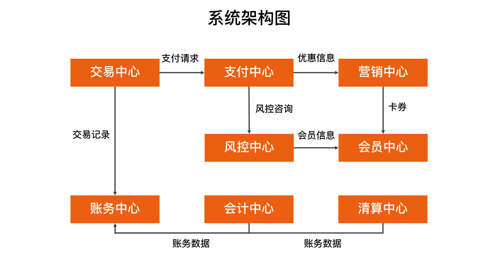
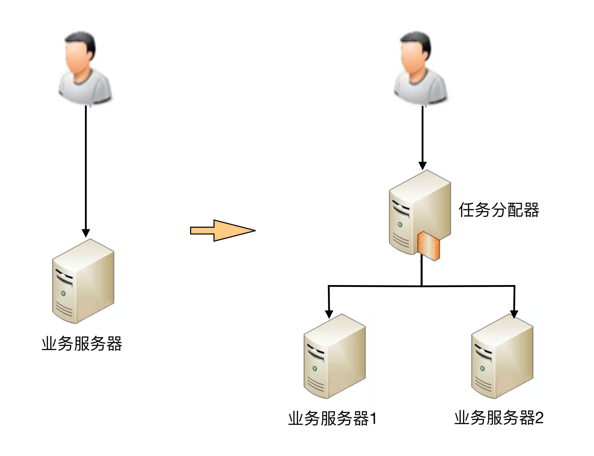
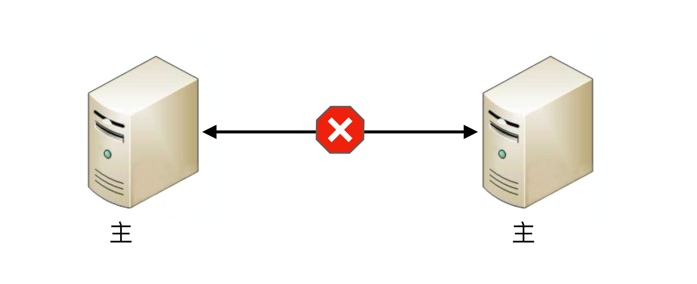
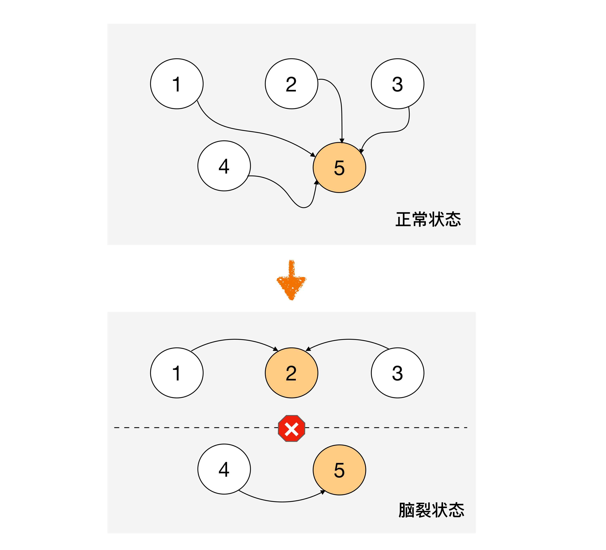
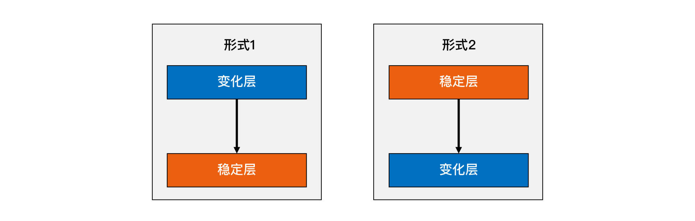

# 课程介绍

## 目录

> 极客时间的专栏《[从 0 开始学架构](https://time.geekbang.org/column/intro/100006601)》，作者：李运华(网名“华仔”，前阿里资深技术专家（P9）)
>
> 2018 年发布，2020年更新内容
>
> 作者经历：电信业务和移动互联网>蚂蚁国际，从事更加复杂的支付业务,参与了一个海外钱包从 0 到 1 的建设过程>2020 年,授课《大厂晋升指南》和《架构实战营》

```bash
# 0 开篇词
开篇词 | 照着做，你也能成为架构师！ 

# 1 基础架构
01 | 架构到底是指什么？ 
02 | 架构设计的历史背景 
03 | 架构设计的目的 
04 | 复杂度来源：高性能 
05 | 复杂度来源：高可用
06 | 复杂度来源：可扩展性
07 | 复杂度来源：低成本、安全、规模
08 | 架构设计三原则
09 | 架构设计原则案例
10 | 架构设计流程：识别复杂度
11 | 架构设计流程：设计备选方案
12 | 架构设计流程：评估和选择备选方案
13 | 架构设计流程：详细方案设计

# 2 高性能架构模式
14 | 高性能数据库集群：读写分离
15 | 高性能数据库集群：分库分表
16 | 高性能NoSQL
17 | 高性能缓存架构
18 | 单服务器高性能模式：PPC与TPC
19 | 单服务器高性能模式：Reactor与Proactor
20 | 高性能负载均衡：分类及架构
21 | 高性能负载均衡：算法

# 3 高可用架构模式
22 | 想成为架构师，你必须知道CAP理论
23 | 想成为架构师，你必须掌握的CAP细节
24 | FMEA方法，排除架构可用性隐患的利器
25 | 高可用存储架构：双机架构
26 | 高可用存储架构：集群和分区
27 | 如何设计计算高可用架构？
28 | 业务高可用的保障：异地多活架构
29 | 异地多活设计4大技巧
30 | 异地多活设计4步走
31 | 如何应对接口级的故障？

# 4 可扩展架构模式
32 | 可扩展架构的基本思想和模式
33 | 传统的可扩展架构模式：分层架构和SOA
34 | 深入理解微服务架构：银弹 or 焦油坑？
35 | 微服务架构最佳实践 - 方法篇
36 | 微服务架构最佳实践 - 基础设施篇
37 | 微内核架构详解

# 5 架构实战
38 | 架构师应该如何判断技术演进的方向？
39 | 互联网技术演进的模式
40 | 互联网架构模板：“存储层”技术
41 | 互联网架构模板：“开发层”和“服务层”技术
42 | 互联网架构模板：“网络层”技术
43 | 互联网架构模板：“用户层”和“业务层”技术
44 | 互联网架构模板：“平台”技术
45 | 架构重构内功心法第一式：有的放矢
46 | 架构重构内功心法第二式：合纵连横
47 | 架构重构内功心法第三式：运筹帷幄
48 | 再谈开源项目：如何选择、使用以及二次开发？
49 | 谈谈App架构的演进
50 | 架构实战：架构设计文档模板
51 | 如何画出优秀的软件系统架构图？

# 6 特别放送
架构专栏特别放送 | “华仔，放学别走！”第1期
架构专栏特别放送 | “华仔，放学别走！” 第2期
如何高效地学习开源项目 | “华仔，放学别走！” 第3期
架构师成长之路 | “华仔，放学别走！” 第4期
架构师必读书单 | “华仔，放学别走！” 第5期
新书首发 | 《从零开始学架构》
致「从0开始学架构」专栏订阅用户
第二季回归 | 照着做，你也能顺利晋升！
加餐｜单服务器高性能模式性能对比
加餐｜扒一扒中台皇帝的外衣
加餐｜业务架构实战营开营了
ChatGPT来临，架构师何去何从？

# 7 结束语
结束语 | 坚持，成就你的技术梦想
```


## 开篇词

> 几个架构设计相关的特性

1、架构设计的思维和程序设计的思维差异很大。

**架构设计的关键思维是判断和取舍，程序设计的关键思维是逻辑和实现**。

2、架构设计没有体系化的培训和训练机制。

3、程序员对架构设计的理解存在很多误区。


这个专栏涵盖作者的整套架构设计方法论和架构实践，主要包括以下内容。

- **架构基础**：我会先介绍架构设计的本质、历史背景和目的，然后从复杂度来源以及架构设计的原则和流程来详细介绍架构基础。
- **高性能架构模式**：我会从存储高性能、计算高性能方面，介绍几种设计方案的典型特征和应用场景。
- **高可用架构模式**：我会介绍 CAP 原理、FMEA 分析方法，分析常见的高可用存储架构和高可用计算架构，并给出一些设计方法和技巧。
- **可扩展架构模式**：我会介绍可扩展模式及其基本思想，分析一些常见架构模式。
- **架构实战**：我会将理论和案例结合，帮助你落地前面提到的架构原则、架构流程和架构模式。

通过本专栏的学习，你会收获：

- 清楚地理解架构设计相关的概念、本质、目的，避免架构师在实践过程中把握不住重点、分不清主次，眉毛胡子一把抓，导致架构设计变形或者“四不像” 。
- 掌握通用的架构设计原则，无论是何种业务或技术，架构师在判断和选择的时候有一套方法论可以参考，避免架构设计举棋不定，或者拍脑袋式设计。
- 掌握标准的架构设计流程，即使是刚开始做架构设计的新手，也能够按照步骤一步一步设计出合适的架构，避免某些步骤缺失导致错误的架构设计。
- 深入理解已有的架构模式，做到能够根据架构特点快速挑选合适的模式完成架构设计，或者在已有的模式上进行创新，或者将已有的模式组合出新的架构。
- 掌握架构演进和开源系统使用的一些技巧。


## 结束语


# 基础架构

## 01 | 架构到底是指什么？

### 指什么

以下这些问题，你能够准确地回答吗？

1. 微信有架构，微信的登录系统也有架构，微信的支付系统也有架构，当我们谈微信架构时，到底是在谈什么架构？
2. Linux 有架构，MySQL 有架构，JVM 也有架构，使用 Java 开发、MySQL 存储、跑在 Linux 上的业务系统也有架构，应该关注哪个架构呢？
3. 架构和框架是什么关系？有什么区别？


要想准确地理解架构的定义，关键就在于把三组容易混淆的概念梳理清楚：

1. 系统与子系统
2. 模块与组件
3. 框架与架构

#### 系统与子系统

我们先来看维基百科定义的“系统”：

> 系统泛指由一群有关联的个体组成，根据某种规则运作，能完成个别元件不能单独完成的工作的群体。它的意思是“总体”“整体”或“联盟”。

我来提炼一下里面的关键内容。

1. **关联**：系统是由一群有关联的个体组成的，没有关联的个体堆在一起不能成为一个系统。例如，把一个发动机和一台 PC 放在一起不能称之为一个系统，把发动机、底盘、轮胎、车架组合起来才能成为一台汽车。
2. **规则**：系统内的个体需要按照指定的规则运作，而不是单个个体各自为政。规则规定了系统内个体分工和协作的方式。例如，汽车发动机负责产生动力，然后通过变速器和传动轴，将动力输出到车轮上，从而驱动汽车前进。
3. **能力**：系统能力与个体能力有本质的差别，系统能力不是个体能力之和，而是产生了新的能力。例如，汽车能够载重前进，而发动机、变速器、传动轴、车轮本身都不具备这样的能力。


我们再来看子系统的定义：

> 子系统也是由一群有关联的个体所组成的系统，多半会是更大系统中的一部分。

其实，子系统的定义和系统定义是一样的，只是观察的角度有差异，一个系统可能是另外一个更大系统的子系统。

按照这个定义，系统和子系统比较容易理解，我们以微信为例来做一个分析：

1. 微信本身是一个系统，包含聊天、登录、支付、朋友圈等子系统。
2. 朋友圈这个系统又包括动态、评论、点赞等子系统。
3. 评论这个系统可能又包括防刷子系统、审核子系统、发布子系统、存储子系统。
4. 评**论审核子系统不再包含业务意义上的子系统，而是包括各个模块或者组件**，这些模块或者组件本身也是另外一个维度上的系统。例如，MySQL、Redis 等是存储系统，但不是业务子系统。

现在，我们可以回答第一个问题了。一个系统的架构，只包括**顶层**这一个层级的架构，而不包括下属子系统层级的架构。


#### 模块与组件

我们来看看这两者在维基百科上的定义：

> 软件模块（Module）是一套一致而互相有紧密关连的软件组织。它分别包含了程序和数据结构两部分。现代软件开发往往利用模块作为合成的单位。模块的接口表达了由该模块提供的功能和调用它时所需的元素。模块是可能分开被编写的单位。这使它们可再用和允许人员同时协作、编写及研究不同的模块。
>
> 软件组件（Component）定义为自包含的、可编程的、可重用的、与语言无关的软件单元，软件组件可以很容易被用于组装应用程序中。

其实，**模块和组件都是系统的组成部分，只是从不同的角度拆分系统而已**。

从业务逻辑的角度来拆分系统后，得到的单元就是“模块”；从物理部署的角度来拆分系统后，得到的单元就是“组件”。划分模块的主要目的是职责分离；划分组件的主要目的是单元复用。

其实，“组件”的英文 Component 也可翻译成中文的“零件”一词。“零件”更容易理解一些，它是一个物理的概念，并且具备“独立且可替换”的特点。

以一个最简单的网站系统来为例。假设我们要做一个学生信息管理系统，这个系统从逻辑的角度来拆分，可以分为“登录注册模块”“个人信息模块”和“个人成绩模块”；从物理的角度来拆分，可以拆分为 Nginx、Web 服务器和 MySQL。


现在，我们可以回答第二个问题了。如果你是业务系统的架构师，首先需要思考怎么从业务逻辑的角度把系统拆分成一个个模块**角色**，其次需要思考怎么从物理部署的角度把系统拆分成组件**角色，**例如选择 MySQL 作为存储系统。但是对于 MySQL 内部的体系架构（Parser、Optimizer、Caches&Buffers 和 Storage Engines 等），你其实是可以不用关注的，也不需要在你的业务系统架构中展现这些内容。


#### 框架与架构

框架是一整套开发规范，架构是某一套开发规范下的具体落地方案，包括各个模块之间的**组合关系**以及它们协同起来完成功能的**运作规则**。


参考维基百科上框架与架构的定义，来解释两者的区别。

> 软件框架（Software framework）通常指的是为了实现某个业界标准或完成特定基本任务的软件组件规范，也指为了实现某个软件组件规范时，提供规范所要求之基础功能的软件产品。

我来提炼一下其中关键部分：

1. 框架是**组件规范**：例如，MVC 就是一种最常见的开发规范，类似的还有 MVP、MVVM、J2EE 等框架。
2. 框架提供基础功能的产品：例如，Spring MVC 是 MVC 的开发框架，除了满足 MVC 的规范，Spring 提供了很多基础功能来帮助我们实现功能，包括注解（@Controller 等）、Spring Security、Spring JPA 等很多基础功能。


> 软件架构指软件系统的“基础结构”，创造这些基础结构的准则，以及对这些结构的描述。

单纯从定义的角度来看，框架和架构的区别还是比较明显的：**框架关注的是“规范”，架构关注的是“结构”**。

框架的英文是 Framework，架构的英文是 Architecture，Spring MVC 的英文文档标题就是“Web MVC framework”

用不同的角度或者维度，可以将系统划分为不同的结构：

从业务逻辑的角度分解，“学生管理系统”的架构是：


从物理部署的角度分解，“学生管理系统”的架构是：


从开发规范的角度分解，“学生管理系统”可以采用标准的 MVC 框架来开发，因此架构又变成了 MVC 架构：


这些“架构”，都是“学生管理系统”正确的架构，只是从不同的角度来分解而已，这也是 IBM 的 RUP 将软件架构视图分为著名的“**4+1 视图**”的原因。


### 重新定义架构：4R 架构

#### Rank

参考维基百科的定义，再结合自己的一些理解和思考，作者将软件架构重新定义为：**软件架构指软件系统的顶层（Rank）结构，它定义了系统由哪些角色（Role）组成，角色之间的关系（Relation）和运作规则（Rule）。**


第一个 R，Rank。它是指软件架构是分层的，对应“系统”和“子系统”的分层关系。通常情况下，我们只需要关注某一层的架构，最多展示相邻两层的架构，而不需要把每一层的架构全部糅杂在一起。无论是架构设计还是画架构图，都应该采取“**自顶向下，逐步细化**”的方式。以微信为例，Rank 的含义如下所示：


注：L0\L1\L2 指层级，一个 L0 往下可以分解多个 L1，一个 L1 可以往下分解多个 L2，以此类推，一般建议不超过 5 层（L0~L4）


#### Role

第二个 R，Role。它是指软件系统包含哪些角色，每个角色都会负责系统的一部分功能。架构设计最重要的工作之一就是将系统拆分为多个角色。最常见的微服务拆分其实就是将整体复杂的**业务系统**按照业务领域的方式，拆分为多个微服务，每个微服务就是系统的一个角色。

#### Relation

第三个 R，Relation。它是指软件系统的角色之间的关系，对应到架构图中其实就是连接线，角色之间的关系不能乱连，任何关系最后都需要代码来实现，包括连接方式（HTTP、TCP、UDP 和串口等）、数据协议（JSON、XML 和二进制等）以及具体的接口等。


#### Rule

第四个 R，Rule。它是指软件系统角色之间如何协作来完成系统功能。我们在前面解读什么是“系统”的时候提到过：系统能力不是个体能力之和，而是产生了新的能力。那么这个新能力具体如何完成的呢？具体哪些角色参与了这个新能力呢？这就是 Rule 所要表达的内容。在架构设计的时候，核心的业务场景都需要设计 Rule。


在实际工作中，为了方便理解，Rank、Role 和 Relation 是通过系统架构图来展示的，而 Rule 是通过系统序列图（System Sequence Diagram）来展示的。

我们以一个简化的支付系统为例，支付系统架构图如下所示：



“扫码支付”这个核心场景的系统序列图如下所示：


## 02 | 架构设计的历史背景

### 机器语言（1940 年之前）

最早的软件开发使用的是“**机器语言**”，直接使用二进制码 0 和 1 来表示机器可以识别的指令和数据。例如，在 8086 机器上完成“s=768+12288-1280”的数学运算，机器码如下：

```
101100000000000000000011
000001010000000000110000
001011010000000000000101
```

归纳一下，机器语言的主要问题是三难：**太难写、太难读、太难改**！


### 汇编语言（20 世纪 40 年代）

为了解决机器语言编写、阅读、修改复杂的问题，**汇编语言**应运而生。汇编语言又叫“**符号语言**”，用**助记符**代替机器指令的操作码，用地址符号（Symbol）或标号（Label）代替指令或操作数的地址。

例如，为了完成“将寄存器 BX 的内容送到 AX 中”的简单操作，汇编语言和机器语言分别如下。

```
机器语言：1000100111011000
汇编语言：mov ax,bx
```

汇编语言虽然解决了机器语言读写复杂的问题，但本质上还是**面向机器**的，因为写汇编语言需要我们精确了解计算机底层的知识。例如，CPU 指令、寄存器、段地址等底层的细节。

这对于程序员来说同样很复杂，因为程序员需要将现实世界中的问题和需求按照机器的逻辑进行翻译。例如，对于程序员来说，在现实世界中面对的问题是 4 + 6 = ？。而要用汇编语言实现一个简单的加法运算，代码如下：

```
.section .data
  a: .int 10
  b: .int 20
  format: .asciz "%d\n"
.section .text
.global _start
_start:
  movl a, %edx　　
  addl b, %edx　　
  pushl %edx
  pushl $format
  call printf
  movl $0, (%esp)
  call exit
```

除了编写本身复杂，还有另外一个复杂的地方在于：不同 CPU 的汇编指令和结构是不同的。


### 高级语言（20 世纪 50 年代）

为了解决汇编语言的问题，计算机前辈们从 20 世纪 50 年代开始又设计了多个**高级语言**，

最初的高级语言有下面几个，并且这些语言至今还在特定的领域继续使用。

- ortran：1955 年，名称取自”FORmula TRANslator”，即公式翻译器，由约翰·巴科斯（John Backus）等人发明。
- LISP：1958 年，名称取自”LISt Processor”，即枚举处理器，由约翰·麦卡锡（John McCarthy）等人发明。
- Cobol：1959 年，名称取自”Common Business Oriented Language”，即通用商业导向语言，由葛丽丝·霍普（Grace Hopper）发明。


为什么称这些语言为“高级语言”呢？原因在于这些语言让程序员不需要关注机器底层的低级结构和逻辑，而只要关注具体的问题和业务即可。

还是 4 + 6=？这个加法为例，如果用 LISP 语言实现，只需要简单一行代码即可：

```
(+ 4 6)
```

除此以外，通过编译程序的处理，高级语言可以被编译为适合不同 CPU 指令的机器语言。程序员只要写一次程序，就可以在多个不同的机器上编译运行，无须根据不同的机器指令重写整个程序。

（一次编写，多次编译，到处运行）


### 第一次软件危机与结构化程序设计（20 世纪 60 年代~20 世纪 70 年代）

20 世纪 60 年代中期开始爆发了第一次软件危机，典型表现有软件质量低下、项目无法如期完成、项目严重超支等，因为软件而导致的重大事故时有发生。例如，1963 年美国（http://en.wikipedia.org/wiki/Mariner_1）的水手一号火箭发射失败事故，就是因为一行 FORTRAN 代码错误导致的。


软件危机最典型的例子莫过于 IBM 的 **System/360 的操作系统**开发。佛瑞德·布鲁克斯（Frederick P. Brooks, Jr.）作为项目主管，率领 2000 多个程序员夜以继日地工作，共计花费了 5000 人一年的工作量，写出将近 100 万行的源码，总共投入 5 亿美元，是美国的“曼哈顿”原子弹计划投入的 1/4。尽管投入如此巨大，但项目进度却一再延迟，软件质量也得不到保障。布鲁克斯后来基于这个项目经验而总结的《**人月神话**》一书，成了畅销的软件工程书籍。


为了解决问题，在 1968、1969 年连续召开两次著名的 NATO 会议，会议正式创造了“软件危机”一词，并提出了针对性的解决方法“**软件工程**”。


差不多同一时间，“结构化程序设计”作为另外一种解决软件危机的方案被提了出来。艾兹赫尔·戴克斯特拉（Edsger Dijkstra）于 1968 年发表了著名的《GOTO 有害论》论文，引起了长达数年的论战，并由此产生了**结构化程序设计方法**。同时，第一个结构化的程序语言 Pascal 也在此时诞生，并迅速流行起来。


结构化程序设计的主要特点是抛弃 goto 语句，采取“自顶向下、逐步细化、模块化”的指导思想。结构化程序设计本质上还是一种面向过程的设计思想，但通过“自顶向下、逐步细化、模块化”的方法，将软件的复杂度控制在一定范围内，从而从整体上降低了软件开发的复杂度。结构化程序方法成为了 20 世纪 70 年代软件开发的潮流。


### 第二次软件危机与面向对象（20 世纪 80 年代）

随着硬件的快速发展，业务需求越来越复杂，以及编程应用领域越来越广泛，第二次软件危机很快就到来了。


第二次软件危机的根本原因还是在于软件生产力远远跟不上硬件和业务的发展。第一次软件危机的根源在于软件的“逻辑”变得非常**复杂**，而第二次软件危机主要体现在软件的**“扩展”**变得非常复杂。

在这种背景下，**面向对象的思想**开始流行起来。

面向对象的思想并不是在第二次软件危机后才出现的，早在 1967 年的 Simula 语言中就开始提出来了，但第二次软件危机促进了面向对象的发展。**面向对象真正开始流行是在 20 世纪 80 年代，主要得益于 C++ 的功劳，后来的 Java、C# 把面向对象推向了新的高峰。到现在为止，面向对象已经成为了主流的开发思想。**


### 软件架构的历史背景

虽然早在 20 世纪 60 年代，戴克斯特拉这位上古大神就已经涉及软件架构这个概念了，但软件架构真正流行却是从 20 世纪 90 年代开始的，由于在 Rational 和 Microsoft 内部的相关活动，软件架构的概念开始越来越流行了。

卡内基·梅隆大学的玛丽·肖（Mary Shaw）和戴维·加兰（David Garlan）对软件架构做了很多研究，他们在 1994 年的一篇文章《软件架构介绍》（An Introduction to Software Architecture）中写到：

> “When systems are constructed from many components, the organization of the overall system-the software architecture-presents a new set of design problems.”


简单翻译一下：随着软件系统规模的增加，计算相关的算法和数据结构不再构成主要的设计问题；当系统由许多部分组成时，整个系统的组织，也就是所说的“软件架构”，导致了一系列新的设计问题。

这段话很好地解释了“软件架构”为何先在 Rational 或者 Microsoft 这样的大公司开始逐步流行起来。因为只有大公司开发的软件系统才具备较大规模，而只有规模较大的软件系统才会面临软件架构相关的问题，例如：

- 系统规模庞大，内部耦合严重，开发效率低；
- 系统耦合严重，牵一发动全身，后续修改和扩展困难；
- 系统逻辑复杂，容易出问题，出问题后很难排查和修复。

软件架构的出现有其历史必然性。20 世纪 60 年代第一次软件危机引出了“结构化编程”，创造了“模块”概念；20 世纪 80 年代第二次软件危机引出了“面向对象编程”，创造了“对象”概念；到了 20 世纪 90 年代“软件架构”开始流行，创造了“组件”概念。我们可以看到，“模块”“对象”“组件”本质上都是对达到一定规模的软件进行拆分，差别只是在于随着软件的复杂度不断增加，拆分的粒度越来越粗，拆分的层次越来越高。


## 03 | 架构设计的目的

### 架构设计的误区

关于架构设计的目的，常见的误区有：

- 因为架构很重要，所以要做架构设计

这是一句正确的废话，架构是很重要，但架构为何重要呢？


例如：不做架构设计系统就跑不起来么？

其实不然，很多朋友尤其是经历了创业公司的朋友可能会发现，公司的初始产品可能没有架构设计，大伙撸起袖子简单讨论一下就开始编码了，根本没有正规的架构设计过程，而且也许产品开发速度还更快，上线后运行也还不错。


例如：做了架构设计就能提升开发效率么？

也不尽然，实际上有时候最简单的设计开发效率反而是最高的，架构设计毕竟需要投入时间和人力，这部分投入如果用来尽早编码，项目也许会更快。


例如：设计良好的架构能促进业务发展么？

好像有一定的道理，例如设计高性能的架构能够让用户体验更好，但反过来想，我们照抄微信的架构，业务就能达到微信的量级么？肯定不可能，不要说达到微信的量级，达到微信的 1/10 做梦都要笑醒了。


不是每个系统都要做架构设计吗

这其实是知其然不知其所以然，系统确实要做架构设计，但还是不知道为何要做架构设计，反正大家都要做架构设计，所以做架构设计肯定没错。

这样的架构师或者设计师很容易走入生搬硬套业界其他公司已有架构的歧路，美其名曰“参考”“微改进”。一旦强行引入其他公司架构后，很可能会发现架构水土不服，或者运行起来很别扭等各种情况，最后往往不得不削足适履，或者不断重构，甚至无奈推倒重来。


公司流程要求系统开发过程中必须有架构设计

与此答案类似还有因为“架构师总要做点事情”，所以要做架构设计，其实都是舍本逐末。


为了高性能、高可用、可扩展，所以要做架构设计

能够给出这个答案，说明已经有了一定的架构经历或者基础，毕竟确实很多架构设计都是冲着高性能、高可用……等“高 XX”的目标去的。

但往往持有这类观点的架构师和设计师会给项目带来巨大的灾难，这绝不是危言耸听，而是很多实际发生的事情，为什么会这样呢？因为这类架构师或者设计师不管三七二十一，不管什么系统，也不管什么业务，上来就要求“高性能、高可用、高扩展”，结果就会出现架构设计复杂无比，项目落地遥遥无期，团队天天吵翻天……等各种让人抓狂的现象，费尽九牛二虎之力将系统整上线，却发现运行不够稳定，经常出问题，出了问题很难解决，加个功能要改 1 个月……等各种继续让人抓狂的事件。


### 架构设计的真正目的

从之前分享的架构设计的历史背景，可以看到，整个软件技术发展的历史，其实就是一部与**“复杂度”**斗争的历史，架构的出现也不例外。

答案：**架构设计的主要目的是为了解决软件系统复杂度带来的问题**。


首先，遵循这条准则能够让“新手”架构师**心中有数，而不是一头雾水**。

明确了“架构设计是为了解决软件复杂度”原则后，就很好回答下面一些问题。

- “这么多需求，从哪里开始下手进行架构设计呢？”

——通过熟悉和理解需求，识别系统复杂性所在的地方，然后针对这些复杂点进行架构设计。


- “架构设计要考虑高性能、高可用、高扩展……这么多高 XX，全部设计完成估计要 1 个月，但老大只给了 1 周时间”

——架构设计并不是要面面俱到，不需要每个架构都具备高性能、高可用、高扩展等特点，而是要识别出复杂点然后有针对性地解决问题。


- “业界 A 公司的架构是 X，B 公司的方案是 Y，两个差别比较大，该参考哪一个呢？”

——理解每个架构方案背后所需要解决的复杂点，然后才能对比自己的业务复杂点，参考复杂点相似的方案。


其次，遵循这条准则能够让“老鸟”架构师**有的放矢，而不是贪大求全**。

一些“老鸟”架构师，为了证明自己的技术牛，可能会陷入贪大求全的焦油坑而无法自拔。例如：

“我们的系统一定要做到每秒 TPS 10 万”。【TPS 是指每秒事务处理量（Transactions Per Second）。在计算机系统中，TPS 是衡量系统处理能力的指标之一，表示系统每秒能够处理的事务数量。事务可以是数据库的读写操作、网络请求、交易处理等。】

——如果系统的复杂度不是在性能这部分，TPS 做到 10 万并没有什么用。


“淘宝的架构是这么做的，我们也要这么做”。

——淘宝的架构是为了解决淘宝业务的复杂度而设计的，淘宝的业务复杂度并不就是我们的业务复杂度，绝大多数业务的用户量都不可能有淘宝那么大。


“Docker 现在很流行，我们的架构应该将 Docker 应用进来”。

——Docker 不是万能的，只是为了解决资源重用和动态分配而设计的，如果我们的系统复杂度根本不是在这方面，引入 Docker 没有什么意义。


### 简单的复杂度分析案例

假设我们需要设计一个大学的学生管理系统，其基本功能包括登录、注册、成绩管理、课程管理等。当我们对这样一个系统进行架构设计的时候，首先应识别其复杂度到底体现在哪里。

**性能**：一个学校的学生大约 1 ~ 2 万人，学生管理系统的访问频率并不高，平均每天单个学生的访问次数平均不到 1 次，因此性能这部分并不复杂，存储用 MySQL 完全能够胜任，缓存都可以不用，Web 服务器用 Nginx 绰绰有余。

**可扩展性**：学生管理系统的功能比较稳定，可扩展的空间并不大，因此可扩展性也不复杂。

**高可用**：学生管理系统即使宕机 2 小时，对学生管理工作影响并不大，因此可以不做负载均衡，更不用考虑异地多活这类复杂的方案了。但是，如果学生的数据全部丢失，修复是非常麻烦的，只能靠人工逐条修复，这个很难接受，因此需要考虑**存储高可靠**，这里就有点复杂了。我们需要考虑多种异常情况：机器故障、机房故障，针对机器故障，我们需要设计 MySQL 同机房主备方案；针对机房故障，我们需要设计 MySQL 跨机房同步方案。

**安全性**：学生管理系统存储的信息有一定的隐私性，例如学生的家庭情况，但并不是和金融相关的，也不包含强隐私（例如玉照、情感）的信息，因此安全性方面只要做 3 个事情就基本满足要求了：Nginx 提供 ACL （Access Control List）控制【在 Nginx 中，你可以使用 `allow` 和 `deny` 指令来配置 ACL。这些指令可以在 `http`、`server` 或 `location` 块中使用，以便在不同的层级上进行访问控制。】、用户账号密码管理、数据库访问权限控制。

**成本**：由于系统很简单，基本上几台服务器就能够搞定，对于一所大学来说完全不是问题，可以无需太多关注。


还有其他方面，如果有兴趣，你可以自行尝试去分析。通过我上面的分析，可以看到这个方案的主要复杂性体现在存储可靠性上，需要保证异常的时候，不要丢失所有数据即可（丢失几个或者几十个学生的信息问题不大），对应的架构如下：	


学生管理系统虽然简单，但麻雀虽小五脏俱全，基本上能涵盖软件系统复杂度分析的各个方面，而且绝大部分技术人员都曾经自己设计或者接触过类似的系统，如果将这个案例和自己的经验对比，相信会有更多的收获。


## 04 | 复杂度来源：高性能

软件系统中高性能带来的复杂度主要体现在两方面，一方面是**单台计算机内部为了高性能带来的复杂度**；另一方面是**多台计算机集群为了高性能带来的复杂度**。


### 单机复杂度

计算机内部复杂度最关键的地方就是**操作系统**。计算机性能的发展本质上是由硬件发展驱动的，尤其是 **CPU** 的性能发展。著名的“摩尔定律”表明了 CPU 的处理能力每隔 18 个月就翻一番；而将硬件性能充分发挥出来的关键就是操作系统，所以操作系统本身其实也是跟随硬件的发展而发展的，操作系统是软件系统的运行环境，操作系统的复杂度直接决定了软件系统的复杂度。


操作系统和性能最相关的就是**进程**和**线程**。


**最早的计算机其实是没有操作系统的**，只有输入、计算和输出功能，用户输入一个指令，计算机完成操作，大部分时候计算机都在等待用户输入指令，这样的处理性能很显然是很低效的，因为人的输入速度是远远比不上计算机的运算速度的。


为了解决手工操作带来的低效，**批处理操作系统**应运而生。批处理简单来说就是先把要执行的指令预先写下来（写到纸带、磁带、磁盘等），形成一个指令清单，这个指令清单就是我们常说的“任务”，然后将任务交给计算机去执行，批处理操作系统负责读取“任务”中的指令清单并进行处理，计算机执行的过程中无须等待人工手工操作，这样性能就有了很大的提升。

批处理程序大大提升了处理性能，但有一个很明显的缺点：计算机一次只能执行一个任务，如果某个任务需要从 I/O 设备（例如磁带）读取大量的数据，在 I/O 操作的过程中，CPU 其实是空闲的，而这个空闲时间本来是可以进行其他计算的。


为了进一步提升性能，人们发明了“**进程**”，用进程来对应一个任务，每个任务都有自己独立的内存空间，进程间互不相关，由操作系统来进行调度。此时的 CPU 还没有多核和多线程的概念，为了达到多进程并行运行的目的，采取了**分时**的方式，即把 CPU 的时间分成很多片段，每个片段只能执行某个进程中的指令。虽然从操作系统和 CPU 的角度来说还是串行处理的，但是由于 CPU 的处理速度很快，从用户的角度来看，感觉是多进程在并行处理。

多进程虽然要求每个任务都有独立的内存空间，进程间互不相关，但从用户的角度来看，两个任务之间能够在运行过程中就进行通信，会让任务设计变得更加灵活高效。否则如果两个任务运行过程中不能通信，只能是 A 任务将结果写到存储，B 任务再从存储读取进行处理，不仅效率低，而且任务设计更加复杂。为了解决这个问题，**进程间通信**的各种方式被设计出来了，包括管道、消息队列、信号量、共享存储等。


多进程让多任务能够并行处理任务，但本身还有缺点，**单个进程内部只能串行处理**，而实际上很多进程内部的子任务并不要求是严格按照时间顺序来执行的，也需要并行处理。例如，一个餐馆管理进程，排位、点菜、买单、服务员调度等子任务必须能够并行处理，否则就会出现某个客人买单时间比较长（比如说信用卡刷不出来），其他客人都不能点菜的情况。为了解决这个问题，人们又发明了**线程**，线程是进程内部的子任务，但这些子任务都**共享同一份进程数**据。为了保证数据的正确性，又发明了**互斥锁机制**。有了多线程后，操作系统调度的最小单位就变成了线程，而进程变成了操作系统分配资源的最小单位。


多进程多线程虽然让多任务并行处理的性能大大提升，但本质上还是分时系统，并不能做到时间上真正的并行。解决这个问题的方式显而易见，就是让**多个 CPU 能够同时执行计算任务**，从而实现真正意义上的多任务并行。目前这样的解决方案有 3 种：**SMP（Symmetric Multi-Processor，对称多处理器结构）**、NUMA（Non-Uniform Memory Access，非一致存储访问结构）、MPP（Massive Parallel Processing，海量并行处理结构）。其中 SMP 是我们最常见的，目前流行的多核处理器就是 SMP 方案。


操作系统发展到现在，如果我们要完成一个高性能的软件系统，需要考虑如多进程、多线程、进程间通信、多线程并发等技术点，而且这些技术**并不是最新的就是最好的，也不是非此即彼的选择**。在做架构设计的时候，需要花费很大的精力来结合业务进行分析、判断、选择、组合，这个过程同样很复杂。举一个最简单的例子：Nginx 可以用多进程也可以用多线程，JBoss 采用的是多线程；**Redis 采用的是单进程**，Memcache 采用的是多线程，这些系统都实现了高性能，但内部实现差异却很大。


### 集群的复杂度

虽然计算机硬件的性能快速发展，但和业务的发展速度相比，还是小巫见大巫了，尤其是进入互联网时代后，业务的发展速度远远超过了硬件的发展速度。例如：

- 2016 年“双 11”支付宝每秒峰值达 12 万笔支付。
- 2017 年春节微信红包收发红包每秒达到 76 万个。

要支持支付和红包这种复杂的业务，单机的性能无论如何是无法支撑的，必须采用机器集群的方式来达到高性能。例如，支付宝和微信这种规模的业务系统，后台系统的机器数量都是万台级别的。

通过大量机器来提升性能，并不仅仅是增加机器这么简单，让多台机器配合起来达到高性能的目的，是一个复杂的任务，针对常见的几种方式简单分析一下。

#### 1、任务分配

任务分配的意思是指每台机器都可以处理完整的业务任务，不同的任务分配到不同的机器上执行。



从图中可以看到，1 台服务器演变为 2 台服务器后，架构上明显要复杂多了，主要体现在：

- 需要增加一个任务分配器，这个分配器可能是硬件网络设备（例如，F5、交换机等），可能是软件网络设备（例如，LVS），也可能是负载均衡软件（例如，Nginx、HAProxy），还可能是自己开发的系统。选择合适的任务分配器也是一件复杂的事情，需要综合考虑性能、成本、可维护性、可用性等各方面的因素。
- 任务分配器和真正的业务服务器之间有连接和交互（即图中任务分配器到业务服务器的连接线），需要选择合适的连接方式，并且对连接进行管理。例如，连接建立、连接检测、连接中断后如何处理等。
- 任务分配器需要增加分配算法。例如，是采用轮询算法，还是按权重分配，又或者按照负载进行分配。如果按照服务器的负载进行分配，则业务服务器还要能够上报自己的状态给任务分配器。

上面这个架构只是最简单地增加 1 台**业务机器**，我们假设单台业务服务器每秒能够处理 5000 次业务请求，那么这个架构理论上能够支撑 10000 次请求，实际上的性能一般按照 8 折计算，大约是 8000 次左右。

如果我们的性能要求继续提高，假设要求每秒提升到 10 万次，上面这个架构会出现什么问题呢？是不是将业务服务器增加到 25 台就可以了呢？显然不是，因为随着性能的增加，**任务分配器**本身又会成为性能瓶颈，当业务请求达到每秒 10 万次的时候，单台任务分配器也不够用了，任务分配器本身也需要扩展为多台机器，这时的架构又会演变成这个样子。


这个架构比 2 台业务服务器的架构要复杂，主要体现在：

- 任务分配器从 1 台变成了多台（对应图中的任务分配器 1 到任务分配器 M），这个变化带来的复杂度就是需要将不同的用户分配到不同的任务分配器上（即图中的虚线“用户分配”部分），常见的方法包括 DNS 轮询、智能 DNS、CDN（Content Delivery Network，内容分发网络）、GSLB 设备（Global Server Load Balance，全局负载均衡）等。
- 任务分配器和业务服务器的连接从简单的“1 对多”（1 台任务分配器连接多台业务服务器）变成了“多对多”（多台任务分配器连接多台业务服务器）的网状结构。
- 机器数量从 3 台扩展到 30 台（一般任务分配器数量比业务服务器要少，这里我们假设业务服务器为 25 台，任务分配器为 5 台），状态管理、故障处理复杂度也大大增加。


上面这两个例子都是以业务处理为例，实际上“任务”涵盖的范围很广，**可以指完整的业务处理，也可以单指某个具体的任务**。例如，“存储”“运算”“缓存”等都可以作为一项任务，因此存储系统、运算系统、缓存系统都可以按照任务分配的方式来搭建架构。此外，“任务分配器”也并不一定只能是物理上存在的机器或者一个独立运行的程序，也可以是嵌入在其他程序中的算法，例如 Memcache 的集群架构。


#### 2、任务分解

通过任务分配的方式，我们能够突破单台机器处理性能的瓶颈，通过增加更多的机器来满足业务的性能需求，但如果业务本身也越来越复杂，单纯只通过任务分配的方式来扩展性能，收益会越来越低。例如，业务简单的时候 1 台机器扩展到 10 台机器，性能能够提升 8 倍（需要扣除机器群带来的部分性能损耗，因此无法达到理论上的 10 倍那么高），但如果业务越来越复杂，1 台机器扩展到 10 台，性能可能只能提升 5 倍。造成这种现象的主要原因是业务越来越复杂，单台机器处理的性能会越来越低。为了能够继续提升性能，我们需要采取第二种方式：**任务分解**。

继续以上面“任务分配”中的架构为例，“业务服务器”如果越来越复杂，我们可以将其拆分为更多的组成部分，我以微信的后台架构为例。


通过上面的架构示意图可以看出，微信后台架构从逻辑上将各个子业务进行了拆分，包括：接入、注册登录、消息、LBS、摇一摇、漂流瓶、其他业务（聊天、视频、朋友圈等）。

通过这种任务分解的方式，能够把原来大一统但复杂的业务系统，拆分成小而简单但需要多个系统配合的业务系统。从业务的角度来看，任务分解既不会减少功能，也不会减少代码量（事实上代码量可能还会增加，因为从代码内部调用改为通过服务器之间的接口调用），那为何通过任务分解就能够提升性能呢？

主要有几方面的因素：

- **简单的系统更加容易做到高性能**

系统的功能越简单，影响性能的点就越少，就更加容易进行有针对性的优化。而系统很复杂的情况下，首先是比较难以找到关键性能点，因为需要考虑和验证的点太多；其次是即使花费很大力气找到了，修改起来也不容易，因为可能将 A 关键性能点提升了，但却无意中将 B 点的性能降低了，整个系统的性能不但没有提升，还有可能会下降。

- **可以针对单个任务进行扩展**

当各个逻辑任务分解到独立的子系统后，整个系统的性能瓶颈更加容易发现，而且发现后只需要针对有瓶颈的子系统进行性能优化或者提升，不需要改动整个系统，风险会小很多。以微信的后台架构为例，如果用户数增长太快，注册登录子系统性能出现瓶颈的时候，只需要优化登录注册子系统的性能（可以是代码优化，也可以简单粗暴地加机器），消息逻辑、LBS 逻辑等其他子系统完全不需要改动。

既然将一个大一统的系统分解为多个子系统能够提升性能，那是不是划分得越细越好呢？例如，上面的微信后台目前是 7 个逻辑子系统，如果我们把这 7 个逻辑子系统再细分，划分为 100 个逻辑子系统，性能是不是会更高呢？

其实不然，这样做性能不仅不会提升，反而还会下降，最主要的原因是如果系统拆分得太细，为了完成某个业务，系统间的调用次数会呈指数级别上升，而系统间的调用通道目前都是通过网络传输的方式，性能远比系统内的函数调用要低得多。我以一个简单的图示来说明。


从图中可以看到，当系统拆分 2 个子系统的时候，用户访问需要 1 次系统间的请求和 1 次响应；当系统拆分为 4 个子系统的时候，系统间的请求次数从 1 次增长到 3 次；假如继续拆分下去为 100 个子系统，为了完成某次用户访问，系统间的请求次数变成了 99 次。

为了描述简单，我抽象出来一个最简单的模型：假设这些系统采用 IP 网络连接，理想情况下一次请求和响应在网络上耗费为 1ms，业务处理本身耗时为 50ms。我们也假设系统拆分对单个业务请求性能没有影响，那么系统拆分为 2 个子系统的时候，处理一次用户访问耗时为 51ms；而系统拆分为 100 个子系统的时候，处理一次用户访问耗时竟然达到了 149ms。


虽然系统拆分可能在某种程度上能提升业务处理性能，但提升性能也是有限的，不可能系统不拆分的时候业务处理耗时为 50ms，系统拆分后业务处理耗时只要 1ms，因为最终决定业务处理性能的还是业务逻辑本身，业务逻辑本身没有发生大的变化下，理论上的性能是有一个上限的，系统拆分能够让性能逼近这个极限，但无法突破这个极限。因此，**任务分解带来的性能收益是有一个度的，并不是任务分解越细越好**，而对于架构设计来说，如何把握这个粒度就非常关键了。


## 05 | 复杂度来源：高可用

参考维基百科，先来看看高可用的定义。

> 系统**无中断**地执行其功能的能力，代表系统的可用性程度，是进行系统设计时的准则之一。

这个定义的关键在于“**无中断**”，但恰好难点也在“无中断”上面，因为无论是单个硬件还是单个软件，都不可能做到无中断，硬件会出故障，软件会有 bug；硬件会逐渐老化，软件会越来越复杂和庞大……

除了硬件和软件本质上无法做到“无中断”，外部环境导致的不可用更加不可避免、不受控制。例如，断电、水灾、地震，这些事故或者灾难也会导致系统不可用，而且影响程度更加严重，更加难以预测和规避。

所以，系统的高可用方案五花八门，但万变不离其宗，本质上都是通过“**冗余**”来实现高可用。


### 计算高可用

这里的“计算”指的是业务的逻辑处理。计算有一个特点就是**无论在哪台机器上进行计算，同样的算法和输入数据，产出的结果都是一样的**，所以将计算从一台机器迁移到另外一台机器，对业务并没有什么影响。既然如此，计算高可用的复杂度体现在哪里呢？以最简单的单机变双机为例进行分析。先来看一个单机变双机的简单架构示意图。


你可能会发现，这个双机的架构图和上期“高性能”讲到的双机架构图是一样的，因此复杂度也是类似的，具体表现为：

- 需要增加一个任务分配器，选择合适的任务分配器也是一件复杂的事情，需要综合考虑性能、成本、可维护性、可用性等各方面因素。
- 任务分配器和真正的业务服务器之间有连接和交互，需要选择合适的连接方式，并且对连接进行管理。例如，连接建立、连接检测、连接中断后如何处理等。
- 任务分配器需要增加分配算法。例如，**常见的双机算法有主备、主主**，主备方案又可以细分为**冷备、温备、热备**。


上面这个示意图只是简单的双机架构，我们再看一个复杂一点的高可用集群架构。


这个高可用集群相比双机来说，分配算法更加复杂，可以是 1 主 3 备、2 主 2 备、3 主 1 备、4 主 0 备，具体应该采用哪种方式，需要结合实际业务需求来分析和判断，并不存在某种算法就一定优于另外的算法。例如，ZooKeeper 采用的就是 1 主多备，而 Memcached 采用的就是全主 0 备。


### 存储高可用

对于需要存储数据的系统来说，整个系统的高可用设计关键点和难点就在于“存储高可用”。存储与计算相比，有一个本质上的区别：**将数据从一台机器搬到到另一台机器，需要经过线路进行传输**。线路传输的速度是毫秒级别，同一机房内部能够做到几毫秒；分布在不同地方的机房，传输耗时需要几十甚至上百毫秒。例如，从广州机房到北京机房，稳定情况下 ping **延时**大约是 50ms，不稳定情况下可能达到 1s 甚至更多。

延迟意味着整个系统在某个时间点上，数据肯定是不一致的。按照“**数据 + 逻辑 = 业务**”这个公式来套的话，数据不一致，即使逻辑一致，最后的业务表现就不一样了。

以最经典的银行储蓄业务为例，假设用户的数据存在北京机房，用户存入了 1 万块钱，然后他查询的时候被路由到了上海机房，北京机房的数据没有同步到上海机房，用户会发现他的余额并没有增加 1 万块。想象一下，此时用户肯定会背后一凉，马上会怀疑自己的钱被盗了，然后赶紧打客服电话投诉，甚至打 110 报警，即使最后发现只是因为传输延迟导致的问题，站在用户的角度来说，这个过程的体验肯定很不好。


除了物理上的传输速度限制，传输线路本身也存在可用性问题，**传输线路可能中断、可能拥塞、可能异常（错包、丢包）**，并且传输线路的故障时间一般都特别长，短的十几分钟，长的几个小时都是可能的。例如，2015 年支付宝因为光缆被挖断，业务影响超过 4 个小时；2016 年中美海底光缆中断 3 小时等。在传输线路中断的情况下，就意味着存储无法进行同步，在这段时间内整个系统的数据是不一致的。

综合分析，无论是正常情况下的传输延迟，还是异常情况下的传输中断，都会导致系统的数据在某个时间点或者时间段是不一致的，而数据的不一致又会导致业务问题；但如果完全不做冗余，系统的整体高可用又无法保证，所以**存储高可用的难点不在于如何备份数据，而在于如何减少或者规避数据不一致对业务造成的影响**。

分布式领域里面有一个著名的 CAP 定理，从理论上论证了存储高可用的复杂度。也就是说，存储高可用不可能同时满足“一致性、可用性、分区容错性”，最多满足其中两个，这就要求我们在做架构设计时结合业务进行取舍。


### 高可用状态决策

无论是计算高可用还是存储高可用，其基础都是“**状态决策**”，即系统需要能够判断当前的状态是正常还是异常，如果出现了异常就要采取行动来保证高可用。如果状态决策本身都是有错误或者有偏差的，那么后续的任何行动和处理无论多么完美也都没有意义和价值。但在具体实践的过程中，恰好存在一个本质的矛盾：**通过冗余来实现的高可用系统，状态决策本质上就不可能做到完全正确**。下面基于几种常见的决策方式进行详细分析。

### 1、独裁式

独裁式决策指的是存在一个独立的决策主体，我们姑且称它为“决策者”，负责收集信息然后进行决策；所有冗余的个体，我们姑且称它为“上报者”，都将状态信息发送给决策者。


独裁式的决策方式不会出现决策混乱的问题，因为只有一个决策者，但问题也正是在于只有一个决策者。当决策者本身故障时，整个系统就无法实现准确的状态决策。如果决策者本身又做一套状态决策，那就陷入一个递归的死循环了。

### 2、协商式

协商式决策指的是两个独立的个体通过交流信息，然后根据规则进行决策，**最常用的协商式决策就是主备决策**。

其实就是抢占成为主机？


这个架构的基本协商规则可以设计成：

- 2 台服务器启动时都是备机。
- 2 台服务器建立连接。
- 2 台服务器交换状态信息。
- 某 1 台服务器做出决策，成为主机；另一台服务器继续保持备机身份。

协商式决策的架构不复杂，规则也不复杂，其难点在于，如果两者的信息交换出现问题（比如主备连接中断），此时状态决策应该怎么做。

- 如果备机在连接中断的情况下认为主机故障，那么备机需要升级为主机，但实际上此时主机并没有故障，那么系统就出现了两个主机，这与设计初衷（1 主 1 备）是不符合的。





- 如果备机在连接中断的情况下不认为主机故障，则此时如果主机真的发生故障，那么系统就没有主机了，这同样与设计初衷（1 主 1 备）是不符合的。


- 如果为了规避连接中断对状态决策带来的影响，可以增加更多的连接。例如，双连接、三连接。这样虽然能够降低连接中断对状态带来的影响（注意：只能降低，不能彻底解决），但同时又引入了这几条连接之间信息取舍的问题，即如果不同连接传递的信息不同，应该以哪个连接为准？实际上这也是一个无解的答案，无论以哪个连接为准，在特定场景下都可能存在问题。


综合分析，协商式状态决策在某些场景总是存在一些问题的。


### 3、民主式

民主式决策指的是多个独立的个体通过**投票**的方式来进行状态决策。例如，ZooKeeper 集群在选举 leader 时就是采用这种方式。


民主式决策和协商式决策比较类似，其基础都是独立的个体之间交换信息，每个个体做出自己的决策，然后按照“**多数取胜**”的规则来确定最终的状态。不同点在于民主式决策比协商式决策要复杂得多，ZooKeeper 的选举算法 ZAB，绝大部分人都看得云里雾里，更不用说用代码来实现这套算法了。


除了算法复杂，民主式决策还有一个**固有的缺陷：脑裂**。

这个词来源于医学，指人体左右大脑半球的连接被切断后，左右脑因为无法交换信息，导致各自做出决策，然后身体受到两个大脑分别控制，会做出各种奇怪的动作。例如：当一个脑裂患者更衣时，他有时会一只手将裤子拉起，另一只手却将裤子往下脱。脑裂的根本原因是，原来统一的集群因为连接中断，造成了两个独立分隔的子集群，每个子集群单独进行选举，于是选出了 2 个主机，相当于人体有两个大脑了。




从图中可以看到，正常状态的时候，节点 5 作为主节点，其他节点作为备节点；当连接发生故障时，节点 1、节点 2、节点 3 形成了一个子集群，节点 4、节点 5 形成了另外一个子集群，这两个子集群的连接已经中断，无法进行信息交换。按照民主决策的规则和算法，两个子集群分别选出了节点 2 和节点 5 作为主节点，此时整个系统就出现了两个主节点。这个状态违背了系统设计的初衷，两个主节点会各自做出自己的决策，整个系统的状态就混乱了。


**为了解决脑裂问题，民主式决策的系统一般都采用“投票节点数必须超过系统总节点数一半”规则来处理。**

如图中那种情况，节点 4 和节点 5 形成的子集群总节点数只有 2 个，没有达到总节点数 5 个的一半，因此这个子集群不会进行选举。这种方式虽然解决了脑裂问题，但同时降低了系统整体的可用性，即如果系统不是因为脑裂问题导致投票节点数过少，而真的是因为节点故障（例如，节点 1、节点 2、节点 3 真的发生了故障），此时系统也不会选出主节点，整个系统就相当于宕机了，尽管此时还有节点 4 和节点 5 是正常的。


综合分析，无论采取什么样的方案，状态决策都不可能做到任何场景下都没有问题，但完全不做高可用方案又会产生更大的问题，如何选取适合系统的高可用方案，也是一个复杂的分析、判断和选择的过程。

小结


## 06 | 复杂度来源：可扩展性

**可扩展性是指，系统为了应对将来需求变化而提供的一种扩展能力**，当有新的需求出现时，系统不需要或者仅需要少量修改就可以支持，无须整个系统重构或者重建。

由于软件系统固有的多变性，新的需求总会不断提出来，因此可扩展性显得尤其重要。在软件开发领域，面向对象思想的提出，就是为了解决可扩展性带来的问题；后来的设计模式，更是将可扩展性做到了极致。得益于设计模式的巨大影响力，几乎所有的技术人员对于可扩展性都特别重视。

设计具备良好可扩展性的系统，有两个基本条件：

1. **正确预测变化**
2. **完美应对变化**


### 预测变化

理想是美好的，现实却是复杂的。有一句谚语：“唯一不变的是变化。”如果按照这个标准去衡量，架构师每个设计方案都要考虑可扩展性，例如：

- 架构师准备设计一个简单的后台管理系统，当架构师考虑用 MySQL 存储数据时，是否要考虑后续需要用 Oracle 来存储？
- 当架构师设计用 HTTP 做接口协议时，是否要考虑要不要支持 ProtocolBuffer？
- 甚至更离谱一点，架构师是否要考虑 VR 技术对架构的影响从而提前做好可扩展性？


如果每个点都考虑可扩展性，架构师会不堪重负，架构设计也会异常庞大且最终无法落地。但架构师也不能完全不做预测，否则可能系统刚上线，马上来新的需求就需要重构，这同样意味着前期很多投入的工作量也白费了。

同时，“预测”这个词，本身就暗示了不可能每次预测都是准确的。如果预测的事情出错，我们期望中的需求迟迟不来，甚至被明确否定，那么基于预测做的架构设计就没什么作用，投入的工作量也就白费了。

综合分析，预测变化的复杂性在于：

1. 不能每个设计点都考虑可扩展性。
2. 不能完全不考虑可扩展性。
3. 所有的预测都存在出错的可能性。


### 2 年法则

那么我们设计架构的时候要怎么办呢？根据以往的职业经历和思考，作者提炼出一个“2 年法则”供你参考：**只预测 2 年内的可能变化，不要试图预测 5 年甚至 10 年后的变化。**


当然，你可能会有疑问：为什么一定是 2 年呢？有的行业变化快，有的行业变化慢，不应该是按照行业特点来选择具体的预测周期吗？

理论上来说确实如此，但实际操作的时候你会发现，如果你要给出一个让大家都信服的行业预测周期，其实是很难的。

我之所以说要预测 2 年，是因为变化快的行业，你能够预测 2 年已经足够了；而变化慢的行业，本身就变化慢，预测本身的意义不大，预测 5 年和预测 2 年的结果是差不多的。所以“2 年法则”在大部分场景下都是适用的。


### 应对变化

假设架构师经验非常丰富，目光非常敏锐，看问题非常准，所有的变化都能准确预测，是否意味着可扩展性就很容易实现了呢？也没那么理想！因为预测变化是一回事，采取什么方案来应对变化，又是另外一个复杂的事情。即使预测很准确，如果方案不合适，则系统扩展一样很麻烦。

#### 方案一：提炼出“变化层”和“稳定层”

第一种应对变化的常见方案是：**将不变的部分封装在一个独立的“稳定层”，将“变化”封装在一个“变化层”**（也叫“适配层”）。这种方案的核心思想是通过变化层来**隔离变化**。



无论是变化层依赖稳定层，还是稳定层依赖变化层都是可以的，需要根据具体业务情况来设计。

如果系统需要支持 XML、JSON、ProtocolBuffer 三种接入方式，那么最终的架构就是“形式 1”架构；如果系统需要支持 MySQL、Oracle、DB2 数据库存储，那么最终的架构就变成了“形式 2”的架构了。


无论采取哪种形式，通过剥离变化层和稳定层的方式应对变化，都会带来两个主要的复杂性相关的问题。

1. 变化层和稳定层如何拆分？

对于哪些属于变化层，哪些属于稳定层，很多时候并不是像前面的示例（不同接口协议或者不同数据库）那样明确，不同的人有不同的理解，导致架构设计评审的时候可能吵翻天。


  2.变化层和稳定层之间的接口如何设计？

对于稳定层来说，接口肯定是越稳定越好；但对于变化层来说，在有差异的多个实现方式中找出共同点，并且还要保证当加入新的功能时，原有的接口不需要太大修改，这是一件很复杂的事情，所以接口设计同样至关重要。


例如，MySQL 的 REPLACE INTO 和 Oracle 的 MERGE INTO 语法和功能有一些差异，那么存储层如何向稳定层提供数据访问接口呢？是采取 MySQL 的方式，还是采取 Oracle 的方式，还是自适应判断？如果再考虑 DB2 的情况呢？


#### 方案二：提炼出“抽象层”和“实现层”

第二种常见的应对变化的方案是：**提炼出一个“抽象层”和一个“实现层”**。如果说方案一的核心思想是通过变化层来隔离变化，那么方案二的核心思想就是通过实现层来**封装变化**。

因为抽象层的接口是稳定的不变的，我们可以基于抽象层的接口来实现统一的处理规则，而实现层可以根据具体业务需求定制开发不同的实现细节，所以当加入新的功能时，只要遵循处理规则然后修改实现层，增加新的实现细节就可以了，无须修改抽象层。


方案二典型的实践就是设计模式和规则引擎。考虑到绝大部分技术人员对设计模式都非常熟悉，我以设计模式为例来说明这种方案的复杂性。

下面是设计模式的“装饰者”模式的类关系图。


图中的 Component 和 Decorator 就是抽象出来的规则，这个规则包括几部分：

1. Component 和 Decorator 类。
2. Decorator 类继承 Component 类。
3. Decorator 类聚合了 Component 类。

这个规则一旦抽象出来后就固定了，不能轻易修改。例如，把规则 3 去掉，就无法实现装饰者模式的目的了。

装饰者模式相比传统的继承来实现功能，确实灵活很多。例如，《设计模式》中装饰者模式的样例“TextView”类的实现，用了装饰者之后，能够灵活地给 TextView 增加额外更多功能，包括可以增加边框、滚动条和背景图片等。这些功能上的组合不影响规则，只需要按照规则实现即可。

但装饰者模式相对普通的类实现模式，明显要复杂多了。本来一个函数或者一个类就能搞定的事情，现在要拆分成多个类，而且多个类之间必须按照装饰者模式来设计和调用。

> 补充：快餐例子的装饰者模式


代码如下：

```java
//快餐接口
public abstract class FastFood {
    private float price;
    private String desc;

    public FastFood() {
    }

    public FastFood(float price, String desc) {
        this.price = price;
        this.desc = desc;
    }

    public void setPrice(float price) {
        this.price = price;
    }

    public float getPrice() {
        return price;
    }

    public String getDesc() {
        return desc;
    }

    public void setDesc(String desc) {
        this.desc = desc;
    }

    public abstract float cost();  //获取价格
}

//炒饭
public class FriedRice extends FastFood {

    public FriedRice() {
        super(10, "炒饭");
    }

    public float cost() {
        return getPrice();
    }
}

//炒面
public class FriedNoodles extends FastFood {

    public FriedNoodles() {
        super(12, "炒面");
    }

    public float cost() {
        return getPrice();
    }
}

//配料类
public abstract class Garnish extends FastFood {

    private FastFood fastFood;//快餐对象

    public FastFood getFastFood() {
        return fastFood;
    }

    public void setFastFood(FastFood fastFood) {
        this.fastFood = fastFood;
    }

    public Garnish(FastFood fastFood, float price, String desc) {
        super(price,desc);
        this.fastFood = fastFood;
    }
}

//鸡蛋配料
public class Egg extends Garnish {

    public Egg(FastFood fastFood) {
        super(fastFood,1,"鸡蛋");
    }

    public float cost() {
        return getPrice() + getFastFood().getPrice();
    }

    @Override
    public String getDesc() {
        return super.getDesc() + getFastFood().getDesc();
    }
}

//培根配料
public class Bacon extends Garnish {

    public Bacon(FastFood fastFood) {

        super(fastFood,2,"培根");
    }

    @Override
    public float cost() {
        return getPrice() + getFastFood().cost();
    }

    @Override
    public String getDesc() {
        return super.getDesc() + getFastFood().cost();
    }
}

//测试类
public class Client {
    public static void main(String[] args) {
        //点一份炒饭
        FastFood food = new FriedRice();
        //花费的价格
        System.out.println(food.getDesc() + " " + food.cost() + "元");

        System.out.println("========");
        //点一份加鸡蛋的炒饭
        FastFood food1 = new FriedRice();

        food1 = new Egg(food1);
        //花费的价格
        System.out.println(food1.getDesc() + " " + food1.cost() + "元");

        System.out.println("========");
        //点一份加培根的炒面
        FastFood food2 = new FriedNoodles();
        food2 = new Bacon(food2);
        //花费的价格
        System.out.println(food2.getDesc() + " " + food2.cost() + "元");
    }
}
```


规则引擎和设计模式类似，都是通过灵活的设计来达到可扩展的目的，但“灵活的设计”本身就是一件复杂的事情，不说别的，光是把 23 种设计模式全部理解和备注，都是一件很困难的事情。


### 1 写 2 抄 3 重构原则

那么，我们在实际工作中具体如何来应对变化呢？Martin Fowler 在他的经典书籍《重构》中给出一个“Rule of three”的原则，原文是“Three Strikes And You Refactor”，中文一般翻译为“事不过三，三则重构”。


而我将其翻译为“1 写 2 抄 3 重构”，也就是说你不要一开始就考虑复杂的可扩展性应对方法，而是等到第三次遇到类似的实现的时候再来重构，重构的时候采取隔离或者封装的方案。


举个最简单的例子，假设你们的创新业务要对接第三方钱包，按照这个原则，就可以这样做：

- **1 写**：最开始你们选择了微信钱包对接，此时不需要考虑太多可扩展性，直接快速对照微信支付的 API 对接即可，因为业务是否能做起来还不确定。
- **2 抄**：后来你们发现业务发展不错，决定要接入支付宝，此时还是可以不考虑可扩展，直接把原来微信支付接入的代码拷贝过来，然后对照支付宝的 API，快速修改上线。
- **3 重构**：因为业务发展不错，为了方便更多用户，你们决定接入银联云闪付，此时就需要考虑重构，参考设计模式的模板方法和策略模式将支付对接的功能进行封装。


## 07 | 复杂度来源：低成本、安全、规模

### 低成本

当我们的架构方案只涉及几台或者十几台服务器时，一般情况下成本并不是我们重点关注的目标，但如果架构方案涉及几百上千甚至上万台服务器，成本就会变成一个非常重要的架构设计考虑点。

当我们设计“高性能”“高可用”的架构时，通用的手段都是增加更多服务器来满足“高性能”和“高可用”的要求；而低成本正好与此相反，我们需要减少服务器的数量才能达成低成本的目标。因此，低成本本质上是与高性能和高可用冲突的，所以低成本很多时候不会是架构设计的首要目标，而是**架构设计的附加约束**。

低成本给架构设计带来的主要复杂度体现在，**往往只有“创新”才能达到低成本目标**。这里的“创新”既包括开创一个全新的技术领域（这个要求对绝大部分公司太高），也包括引入新技术，如果没有找到能够解决自己问题的新技术，那么就真的需要自己创造新技术了。

类似的新技术例子很多，我来举几个。

- NoSQL（Memcache、Redis 等）的出现是为了解决关系型数据库无法应对高并发访问带来的访问压力。
- 全文搜索引擎（Sphinx、Elasticsearch、Solr）的出现是为了解决关系型数据库 like 搜索的低效的问题。
- Hadoop 的出现是为了解决传统文件系统无法应对海量数据存储和计算的问题。

再来举几个业界类似的例子。

- Facebook 为了解决 PHP 的低效问题，刚开始的解决方案是 HipHop PHP，可以将 PHP 语言翻译为 C++ 语言执行，后来改为 HHVM，将 PHP 翻译为字节码然后由虚拟机执行，和 Java 的 JVM 类似。
- 新浪微博将传统的 Redis/MC + MySQL 方式，扩展为 Redis/MC + SSD Cache + MySQL 方式，SSD Cache 作为 L2 缓存使用，既解决了 MC/Redis 成本过高，容量小的问题，也解决了穿透 DB 带来的数据库访问压力（来源：http://www.infoq.com/cn/articles/weibo-platform-archieture ）。
- Linkedin 为了处理每天 5 千亿的事件，开发了高效的 Kafka 消息系统。
- 其他类似将 Ruby on Rails 改为 Java、Lua + redis 改为 Go 语言实现的例子还有很多。

无论是引入新技术，还是自己创造新技术，都是一件复杂的事情。引入新技术的主要复杂度在于需要去熟悉新技术，并且将新技术与已有技术结合起来；创造新技术的主要复杂度在于需要自己去创造全新的理念和技术，并且新技术跟旧技术相比，需要有质的飞跃。


相比来说，创造新技术复杂度更高，因此一般中小公司基本都是靠引入新技术来达到低成本的目标；而大公司更有可能自己去创造新的技术来达到低成本的目标，因为大公司才有足够的资源、技术和时间去创造新技术。


### 安全

安全本身是一个庞大而又复杂的技术领域，并且一旦出问题，对业务和企业形象影响非常大。例如：

- 2016 年雅虎爆出史上最大规模信息泄露事件，逾 5 亿用户资料在 2014 年被窃取。
- 2016 年 10 月美国遭史上最大规模 DDoS 攻击，东海岸网站集体瘫痪。
- 2013 年 10 月，为全国 4500 多家酒店提供网络服务的浙江慧达驿站网络有限公司，因安全漏洞问题，致 2 千万条入住酒店的客户信息泄露，由此导致很多敲诈、家庭破裂的后续事件。

正因为经常能够看到或者听到各类安全事件，所以大部分技术人员和架构师，对安全这部分会多一些了解和考虑。

从技术的角度来讲，安全可以分为两类：一类是功能上的安全，一类是架构上的安全。

#### 功能安全

例如，常见的 XSS 攻击、CSRF 攻击、SQL 注入、Windows 漏洞、密码破解等，本质上是因为系统实现有漏洞，黑客有了可乘之机。黑客会利用各种漏洞潜入系统，这种行为就像小偷一样，黑客和小偷的手法都是利用系统或家中不完善的地方潜入，并进行破坏或者盗取。因此形象地说，**功能安全其实就是“防小偷”**。


从实现的角度来看，功能安全更多地是和具体的编码相关，与架构关系不大。现在很多开发框架都内嵌了常见的安全功能，能够大大减少安全相关功能的重复开发，但框架只能预防常见的安全漏洞和风险（常见的 XSS 攻击、CSRF 攻击、SQL 注入等），无法预知新的安全问题，而且框架本身很多时候也存在漏洞（例如，流行的 Apache Struts2 就多次爆出了调用远程代码执行的高危漏洞，给整个互联网都造成了一定的恐慌）。所以功能安全是一个逐步完善的过程，而且往往都是在问题出现后才能有针对性的提出解决方案，我们永远无法预测系统下一个漏洞在哪里，也不敢说自己的系统肯定没有任何问题。换句话讲，功能安全其实也是一个“攻”与“防”的矛盾，只能在这种攻防大战中逐步完善，不可能在系统架构设计的时候一劳永逸地解决。


#### 架构安全

如果说功能安全是“防小偷”，那么**架构安全就是“防强盗”**。强盗会直接用大锤将门砸开，或者用炸药将围墙炸倒；小偷是偷东西，而强盗很多时候就是故意搞破坏，对系统的影响也大得多。因此架构设计时需要特别关注架构安全，尤其是互联网时代，理论上来说系统部署在互联网上时，全球任何地方都可以发起攻击。


传统的架构安全主要依靠**防火墙**，防火墙最基本的功能就是隔离网络，通过将网络划分成不同的区域，制定出不同区域之间的**访问控制策略**来控制不同信任程度区域间传送的数据流。例如，下图是一个典型的银行系统的安全架构。


从图中你可以看到，整个系统根据不同的分区部署了多个防火墙来保证系统的安全。


防火墙的功能虽然强大，但性能一般，所以在传统的银行和企业应用领域应用较多。但在互联网领域，防火墙的应用场景并不多。因为互联网的业务具有海量用户访问和高并发的特点，防火墙的性能不足以支撑；尤其是互联网领域的 DDoS 攻击，轻则几 GB，重则几十 GB。

2016 年知名安全研究人员布莱恩·克莱布斯（Brian Krebs）的安全博客网站遭遇 DDoS 攻击，攻击带宽达 665Gbps，是目前在网络犯罪领域已知的最大的拒绝服务攻击。这种规模的攻击，如果用防火墙来防，则需要部署大量的防火墙，成本会很高。例如，中高端一些的防火墙价格 10 万元，每秒能抗住大约 25GB 流量，那么应对这种攻击就需要将近 30 台防火墙，成本将近 300 万元，这还不包括维护成本，而这些防火墙设备在没有发生攻击的时候又没有什么作用。也就是说，如果花费几百万元来买这么一套设备，有可能几年都发挥不了任何作用。


就算是公司对钱不在乎，一般也不会堆防火墙来防 DDoS 攻击，因为 DDoS 攻击最大的影响是大量消耗机房的出口总带宽。不管防火墙处理能力有多强，当出口带宽被耗尽时，整个业务在用户看来就是不可用的，因为用户的正常请求已经无法到达系统了。防火墙能够保证内部系统不受冲击，但用户也是进不来的。对于用户来说，业务都已经受到影响了，至于是因为用户自己进不去，还是因为系统出故障，用户其实根本不会关心。


**基于上述原因，互联网系统的架构安全目前并没有太好的设计手段来实现，更多地是依靠运营商或者云服务商强大的带宽和流量清洗的能力，较少自己来设计和实现**。


### 规模

很多企业级的系统，既没有高性能要求，也没有双中心高可用要求，也不需要什么扩展性，但往往我们一说到这样的系统，很多人都会脱口而出：这个系统好复杂！为什么这样说呢？关键就在于这样的系统往往功能特别多，逻辑分支特别多。特别是有的系统，发展时间比较长，不断地往上面叠加功能，后来的人由于不熟悉整个发展历史，可能连很多功能的应用场景都不清楚，或者细节根本无法掌握，面对的就是一个黑盒系统，看不懂、改不动、不敢改、修不了，复杂度自然就感觉很高了。


**规模带来复杂度的主要原因就是“量变引起质变”**，当数量超过一定的阈值后，复杂度会发生质的变化。常见的规模带来的复杂度有：


1、**功能越来越多**，导致系统复杂度指数级上升


例如，某个系统开始只有 3 大功能，后来不断增加到 8 大功能，虽然还是同一个系统，但复杂度已经相差很大了，具体相差多大呢？

我以一个简单的抽象模型来计算一下，假设系统间的功能都是两两相关的，系统的复杂度 = 功能数量 + 功能之间的连接数量，通过计算我们可以看出：

- 3 个功能的系统复杂度 = 3 + 3 = 6
- 8 个功能的系统复杂度 = 8 + 28 = 36

可以看出，具备 8 个功能的系统的复杂度不是比具备 3 个功能的系统的复杂度多 5，而是多了 30，**基本是指数级增长的**，主要原因在于随着系统功能数量增多，功能之间的连接呈指数级增长。下图形象地展示了功能数量的增多带来了复杂度。


2、**数据越来越多**，系统复杂度发生质变

与功能类似，系统数据越来越多时，也会由量变带来质变，最近几年火热的“大数据”就是在这种背景下诞生的。大数据单独成为了一个热门的技术领域，主要原因就是数据太多以后，传统的数据收集、加工、存储、分析的手段和工具已经无法适应，必须应用新的技术才能解决。

目前的大数据理论基础是 Google 发表的三篇大数据相关论文，其中 Google File System 是大数据文件存储的技术理论，Google Bigtable 是列式数据存储的技术理论，Google MapReduce 是大数据运算的技术理论，这三篇技术论文各自开创了一个新的技术领域。


即使我们的数据没有达到大数据规模，数据的增长也可能给系统带来复杂性。最典型的例子莫过于使用关系数据库存储数据，**以 MySQL 为例**，MySQL 单表的数据因不同的业务和应用场景会有不同的最优值，但不管怎样都肯定是有一定的**限度的，一般推荐在 5000 万行左右**。如果因为业务的发展，单表数据达到了 10 亿行，就会产生很多问题，例如：

- 添加索引会很慢，可能需要几个小时，这几个小时内数据库表是无法插入数据的，相当于业务停机了。
- 修改表结构和添加索引存在类似的问题，耗时可能会很长。
- 即使有索引，索引的性能也可能会很低，因为数据量太大。
- 数据库备份耗时很长。
- ……

因此，当 MySQL 单表数据量太大时，我们必须考虑将单表拆分为多表，这个拆分过程也会引入更多复杂性，例如：

- 拆表的规则是什么？

以用户表为例：是按照**用户 id** 拆分表，还是按照用户注册时间拆表？


- 拆完表后查询如何处理？

以用户表为例：假设按照用户 id 拆表，当业务需要查询学历为“本科”以上的用户时，要去很多表查询才能得到最终结果，怎么保证性能？


小结

## 08 | 架构设计三原则

### 合适原则


### 简单原则


### 演化原则


## 09 | 架构设计原则案例

- 淘宝
- 手机 QQ
- 小结


## 10 | 架构设计流程：识别复杂度

- 架构设计第 1 步：识别复杂度
- 识别复杂度实战
- 小结


## 11 | 架构设计流程：设计备选方案

- 架构设计第 2 步：设计备选方案
- 设计备选方案实战
- 小结


## 12 | 架构设计流程：评估和选择备选方案

- 架构设计第 3 步：评估和选择备选方案
- 评估和选择备选方案实战
- 小结


## 13 | 架构设计流程：详细方案设计

- 架构设计第 4 步：详细方案设计
- 详细方案设计实战
- 小结


# 高性能架构模式

## 14 | 高性能数据库集群：读写分离

- 读写分离原理
- 复制延迟
- 分配机制
- 小结


## 15 | 高性能数据库集群：分库分表

- 业务分库
- 分表
- 实现方法
- 小结


## 16 | 高性能NoSQL

- K-V 存储
- 文档数据库
- 列式数据库
- 全文搜索引擎
- 小结


## 17 | 高性能缓存架构

- 缓存穿透
- 缓存雪崩
- 缓存热点
- 实现方式
- 小结


## 18 | 单服务器高性能模式：PPC与TPC

- PPC
- prefork
- TPC
- prethread
- 小结


## 19 | 单服务器高性能模式：Reactor与Proactor

- Reactor
- Proactor
- 小结


## 20 | 高性能负载均衡：分类及架构

- 负载均衡分类
- 负载均衡典型架构
- 小结


## 21 | 高性能负载均衡：算法

- 轮询
- 加权轮询
- 负载最低优先
- 性能最优类
- Hash 类
- 小结


# 高可用架构模式

## 22 | 想成为架构师，你必须知道CAP理论

- CAP 理论
- CAP 应用
- 小结


## 23 | 想成为架构师，你必须掌握的CAP细节

- CAP 关键细节点
- ACID
- BASE
- 小结


## 24 | FMEA方法，排除架构可用性隐患的利器

- FMEA 介绍
- FMEA 方法
- FMEA 实战
- 小结

## 25 | 高可用存储架构：双机架构

- 主备复制
- 主从复制
- 双机切换
- 主主复制
- 小结


## 26 | 高可用存储架构：集群和分区

- 数据集群
- 数据分区
- 小结


## 27 | 如何设计计算高可用架构？

- 主备
- 主从
- 集群
- 小结

## 28 | 业务高可用的保障：异地多活架构

- 应用场景
- 架构模式
- 小结


## 29 | 异地多活设计4大技巧

- 技巧 1：保证核心业务的异地多活
- 技巧 2：保证核心数据最终一致性
- 技巧 3：采用多种手段同步数据
- 技巧 4：只保证绝大部分用户的异地多活
- 核心思想
- 小结


## 30 | 异地多活设计4步走

- 第 1 步：业务分级
- 第 2 步：数据分类
- 第 3 步：数据同步
- 第 4 步：异常处理
- 小结


## 31 | 如何应对接口级的故障？

- \1. 降级
- 1.1 系统后门降级
- 1.2 独立降级系统
- \2. 熔断
- \3. 限流
- 3.1 基于请求限流
- 3.2 基于资源限流
- 限流算法
- \4. 排队
- 小结


# 可扩展架构模式

## 32 | 可扩展架构的基本思想和模式

- 可扩展的基本思想
- 可扩展方式
- 小结


## 33 | 传统的可扩展架构模式：分层架构和SOA

- 分层架构
- SOA
- 小结


## 34 | 深入理解微服务架构：银弹 or 焦油坑？

- 微服务与 SOA 的关系
- 微服务的陷阱
- 小结


## 35 | 微服务架构最佳实践 - 方法篇

- 服务粒度
- 拆分方法
- 基础设施
- 小结


## 36 | 微服务架构最佳实践 - 基础设施篇

- 自动化测试
- 自动化部署
- 配置中心
- 接口框架
- API 网关
- 服务发现
- 服务路由
- 服务容错
- 服务监控
- 服务跟踪
- 服务安全
- 小结


## 37 | 微内核架构详解

- 基本架构
- 设计关键点
- OSGi 架构简析
- 规则引擎架构简析
- 小结


# 架构实战

## 38 | 架构师应该如何判断技术演进的方向？

- 技术演进的动力
- 技术演进的模式
- 小结


## 39 | 互联网技术演进的模式

- 业务复杂性
- 用户规模
- 量变到质变
- 小结

## 40 | 互联网架构模板：“存储层”技术

- SQL
- NoSQL
- 小文件存储
- 大文件存储
- 小结


## 41 | 互联网架构模板：“开发层”和“服务层”技术

- 开发层技术
- 服务层技术
- 小结


## 42 | 互联网架构模板：“网络层”技术

- 负载均衡
- CDN
- 多机房
- 多中心
- 小结


## 43 | 互联网架构模板：“用户层”和“业务层”技术

- 用户层技术
- 业务层技术
- 小结


## 44 | 互联网架构模板：“平台”技术

- 运维平台
- 测试平台
- 数据平台
- 管理平台
- 小结


## 45 | 架构重构内功心法第一式：有的放矢


## 46 | 架构重构内功心法第二式：合纵连横

- 合纵
- 连横
- 小结


## 47 | 架构重构内功心法第三式：运筹帷幄


## 48 | 再谈开源项目：如何选择、使用以及二次开发？

- 选：如何选择一个开源项目
- 用：如何使用开源项目
- 改：如何基于开源项目做二次开发
- 小结


## 49 | 谈谈App架构的演进

- Web App
- 原生 App
- Hybrid App
- 组件化 & 容器化
- 跨平台 App
- 小结


## 50 | 架构实战：架构设计文档模板

- 备选方案模板
- 架构设计模板


## 51 | 如何画出优秀的软件系统架构图？

- 4+1 视图
- 核心指导思想：4R 架构定义
- 常见架构图
- \1. 业务架构图
- \2. 客户端和前端架构图
- \3. 系统架构图
- \4. 应用架构图
- \5. 部署架构图
- \6. 系统序列图
- 补充说明
- 小结


# 特别放送
