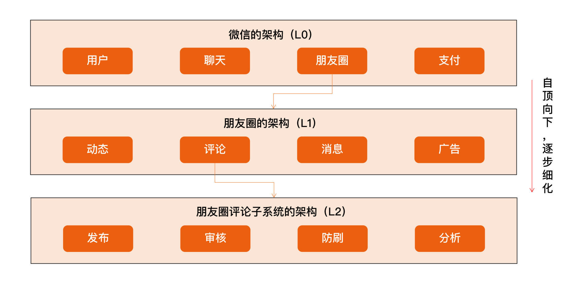

# 课程介绍

## 目录

> 极客时间的专栏《[从 0 开始学架构](https://time.geekbang.org/column/intro/100006601)》，作者：李运华(网名“华仔”，前阿里资深技术专家（P9）)
>
> 2018 年发布，2020年更新内容
>
> 作者经历：电信业务和移动互联网>蚂蚁国际，从事更加复杂的支付业务,参与了一个海外钱包从 0 到 1 的建设过程>2020 年,授课《大厂晋升指南》和《架构实战营》

```bash
# 0 开篇词
开篇词 | 照着做，你也能成为架构师！ 

# 1 基础架构
01 | 架构到底是指什么？ 
02 | 架构设计的历史背景 
03 | 架构设计的目的 
04 | 复杂度来源：高性能 
05 | 复杂度来源：高可用
06 | 复杂度来源：可扩展性
07 | 复杂度来源：低成本、安全、规模
08 | 架构设计三原则
09 | 架构设计原则案例
10 | 架构设计流程：识别复杂度
11 | 架构设计流程：设计备选方案
12 | 架构设计流程：评估和选择备选方案
13 | 架构设计流程：详细方案设计

# 2 高性能架构模式
14 | 高性能数据库集群：读写分离
15 | 高性能数据库集群：分库分表
16 | 高性能NoSQL
17 | 高性能缓存架构
18 | 单服务器高性能模式：PPC与TPC
19 | 单服务器高性能模式：Reactor与Proactor
20 | 高性能负载均衡：分类及架构
21 | 高性能负载均衡：算法

# 3 高可用架构模式
22 | 想成为架构师，你必须知道CAP理论
23 | 想成为架构师，你必须掌握的CAP细节
24 | FMEA方法，排除架构可用性隐患的利器
25 | 高可用存储架构：双机架构
26 | 高可用存储架构：集群和分区
27 | 如何设计计算高可用架构？
28 | 业务高可用的保障：异地多活架构
29 | 异地多活设计4大技巧
30 | 异地多活设计4步走
31 | 如何应对接口级的故障？

# 4 可扩展架构模式
32 | 可扩展架构的基本思想和模式
33 | 传统的可扩展架构模式：分层架构和SOA
34 | 深入理解微服务架构：银弹 or 焦油坑？
35 | 微服务架构最佳实践 - 方法篇
36 | 微服务架构最佳实践 - 基础设施篇
37 | 微内核架构详解

# 5 架构实战
38 | 架构师应该如何判断技术演进的方向？
39 | 互联网技术演进的模式
40 | 互联网架构模板：“存储层”技术
41 | 互联网架构模板：“开发层”和“服务层”技术
42 | 互联网架构模板：“网络层”技术
43 | 互联网架构模板：“用户层”和“业务层”技术
44 | 互联网架构模板：“平台”技术
45 | 架构重构内功心法第一式：有的放矢
46 | 架构重构内功心法第二式：合纵连横
47 | 架构重构内功心法第三式：运筹帷幄
48 | 再谈开源项目：如何选择、使用以及二次开发？
49 | 谈谈App架构的演进
50 | 架构实战：架构设计文档模板
51 | 如何画出优秀的软件系统架构图？

# 6 特别放送
架构专栏特别放送 | “华仔，放学别走！”第1期
架构专栏特别放送 | “华仔，放学别走！” 第2期
如何高效地学习开源项目 | “华仔，放学别走！” 第3期
架构师成长之路 | “华仔，放学别走！” 第4期
架构师必读书单 | “华仔，放学别走！” 第5期
新书首发 | 《从零开始学架构》
致「从0开始学架构」专栏订阅用户
第二季回归 | 照着做，你也能顺利晋升！
加餐｜单服务器高性能模式性能对比
加餐｜扒一扒中台皇帝的外衣
加餐｜业务架构实战营开营了
ChatGPT来临，架构师何去何从？

# 7 结束语
结束语 | 坚持，成就你的技术梦想
```


## 开篇词

> 几个架构设计相关的特性

1、架构设计的思维和程序设计的思维差异很大。

**架构设计的关键思维是判断和取舍，程序设计的关键思维是逻辑和实现**。

2、架构设计没有体系化的培训和训练机制。

3、程序员对架构设计的理解存在很多误区。


这个专栏涵盖作者的整套架构设计方法论和架构实践，主要包括以下内容。

- **架构基础**：我会先介绍架构设计的本质、历史背景和目的，然后从复杂度来源以及架构设计的原则和流程来详细介绍架构基础。
- **高性能架构模式**：我会从存储高性能、计算高性能方面，介绍几种设计方案的典型特征和应用场景。
- **高可用架构模式**：我会介绍 CAP 原理、FMEA 分析方法，分析常见的高可用存储架构和高可用计算架构，并给出一些设计方法和技巧。
- **可扩展架构模式**：我会介绍可扩展模式及其基本思想，分析一些常见架构模式。
- **架构实战**：我会将理论和案例结合，帮助你落地前面提到的架构原则、架构流程和架构模式。

通过本专栏的学习，你会收获：

- 清楚地理解架构设计相关的概念、本质、目的，避免架构师在实践过程中把握不住重点、分不清主次，眉毛胡子一把抓，导致架构设计变形或者“四不像” 。
- 掌握通用的架构设计原则，无论是何种业务或技术，架构师在判断和选择的时候有一套方法论可以参考，避免架构设计举棋不定，或者拍脑袋式设计。
- 掌握标准的架构设计流程，即使是刚开始做架构设计的新手，也能够按照步骤一步一步设计出合适的架构，避免某些步骤缺失导致错误的架构设计。
- 深入理解已有的架构模式，做到能够根据架构特点快速挑选合适的模式完成架构设计，或者在已有的模式上进行创新，或者将已有的模式组合出新的架构。
- 掌握架构演进和开源系统使用的一些技巧。


## 结束语


# 基础架构

## 01 | 架构到底是指什么？

### 指什么

以下这些问题，你能够准确地回答吗？

1. 微信有架构，微信的登录系统也有架构，微信的支付系统也有架构，当我们谈微信架构时，到底是在谈什么架构？
2. Linux 有架构，MySQL 有架构，JVM 也有架构，使用 Java 开发、MySQL 存储、跑在 Linux 上的业务系统也有架构，应该关注哪个架构呢？
3. 架构和框架是什么关系？有什么区别？


要想准确地理解架构的定义，关键就在于把三组容易混淆的概念梳理清楚：

1. 系统与子系统
2. 模块与组件
3. 框架与架构

#### 系统与子系统

我们先来看维基百科定义的“系统”：

> 系统泛指由一群有关联的个体组成，根据某种规则运作，能完成个别元件不能单独完成的工作的群体。它的意思是“总体”“整体”或“联盟”。

我来提炼一下里面的关键内容。

1. **关联**：系统是由一群有关联的个体组成的，没有关联的个体堆在一起不能成为一个系统。例如，把一个发动机和一台 PC 放在一起不能称之为一个系统，把发动机、底盘、轮胎、车架组合起来才能成为一台汽车。
2. **规则**：系统内的个体需要按照指定的规则运作，而不是单个个体各自为政。规则规定了系统内个体分工和协作的方式。例如，汽车发动机负责产生动力，然后通过变速器和传动轴，将动力输出到车轮上，从而驱动汽车前进。
3. **能力**：系统能力与个体能力有本质的差别，系统能力不是个体能力之和，而是产生了新的能力。例如，汽车能够载重前进，而发动机、变速器、传动轴、车轮本身都不具备这样的能力。


我们再来看子系统的定义：

> 子系统也是由一群有关联的个体所组成的系统，多半会是更大系统中的一部分。

其实，子系统的定义和系统定义是一样的，只是观察的角度有差异，一个系统可能是另外一个更大系统的子系统。

按照这个定义，系统和子系统比较容易理解，我们以微信为例来做一个分析：

1. 微信本身是一个系统，包含聊天、登录、支付、朋友圈等子系统。
2. 朋友圈这个系统又包括动态、评论、点赞等子系统。
3. 评论这个系统可能又包括防刷子系统、审核子系统、发布子系统、存储子系统。
4. 评**论审核子系统不再包含业务意义上的子系统，而是包括各个模块或者组件**，这些模块或者组件本身也是另外一个维度上的系统。例如，MySQL、Redis 等是存储系统，但不是业务子系统。

现在，我们可以回答第一个问题了。一个系统的架构，只包括**顶层**这一个层级的架构，而不包括下属子系统层级的架构。


#### 模块与组件

我们来看看这两者在维基百科上的定义：

> 软件模块（Module）是一套一致而互相有紧密关连的软件组织。它分别包含了程序和数据结构两部分。现代软件开发往往利用模块作为合成的单位。模块的接口表达了由该模块提供的功能和调用它时所需的元素。模块是可能分开被编写的单位。这使它们可再用和允许人员同时协作、编写及研究不同的模块。
>
> 软件组件（Component）定义为自包含的、可编程的、可重用的、与语言无关的软件单元，软件组件可以很容易被用于组装应用程序中。

其实，**模块和组件都是系统的组成部分，只是从不同的角度拆分系统而已**。

从业务逻辑的角度来拆分系统后，得到的单元就是“模块”；从物理部署的角度来拆分系统后，得到的单元就是“组件”。划分模块的主要目的是职责分离；划分组件的主要目的是单元复用。

其实，“组件”的英文 Component 也可翻译成中文的“零件”一词。“零件”更容易理解一些，它是一个物理的概念，并且具备“独立且可替换”的特点。

以一个最简单的网站系统来为例。假设我们要做一个学生信息管理系统，这个系统从逻辑的角度来拆分，可以分为“登录注册模块”“个人信息模块”和“个人成绩模块”；从物理的角度来拆分，可以拆分为 Nginx、Web 服务器和 MySQL。


现在，我们可以回答第二个问题了。如果你是业务系统的架构师，首先需要思考怎么从业务逻辑的角度把系统拆分成一个个模块**角色**，其次需要思考怎么从物理部署的角度把系统拆分成组件**角色，**例如选择 MySQL 作为存储系统。但是对于 MySQL 内部的体系架构（Parser、Optimizer、Caches&Buffers 和 Storage Engines 等），你其实是可以不用关注的，也不需要在你的业务系统架构中展现这些内容。


#### 框架与架构

框架是一整套开发规范，架构是某一套开发规范下的具体落地方案，包括各个模块之间的**组合关系**以及它们协同起来完成功能的**运作规则**。


参考维基百科上框架与架构的定义，来解释两者的区别。

> 软件框架（Software framework）通常指的是为了实现某个业界标准或完成特定基本任务的软件组件规范，也指为了实现某个软件组件规范时，提供规范所要求之基础功能的软件产品。

我来提炼一下其中关键部分：

1. 框架是**组件规范**：例如，MVC 就是一种最常见的开发规范，类似的还有 MVP、MVVM、J2EE 等框架。
2. 框架提供基础功能的产品：例如，Spring MVC 是 MVC 的开发框架，除了满足 MVC 的规范，Spring 提供了很多基础功能来帮助我们实现功能，包括注解（@Controller 等）、Spring Security、Spring JPA 等很多基础功能。


> 软件架构指软件系统的“基础结构”，创造这些基础结构的准则，以及对这些结构的描述。

单纯从定义的角度来看，框架和架构的区别还是比较明显的：**框架关注的是“规范”，架构关注的是“结构”**。

框架的英文是 Framework，架构的英文是 Architecture，Spring MVC 的英文文档标题就是“Web MVC framework”

用不同的角度或者维度，可以将系统划分为不同的结构：

从业务逻辑的角度分解，“学生管理系统”的架构是：


从物理部署的角度分解，“学生管理系统”的架构是：


从开发规范的角度分解，“学生管理系统”可以采用标准的 MVC 框架来开发，因此架构又变成了 MVC 架构：


这些“架构”，都是“学生管理系统”正确的架构，只是从不同的角度来分解而已，这也是 IBM 的 RUP 将软件架构视图分为著名的“**4+1 视图**”的原因。


### 重新定义架构：4R 架构

#### Rank

参考维基百科的定义，再结合自己的一些理解和思考，作者将软件架构重新定义为：**软件架构指软件系统的顶层（Rank）结构，它定义了系统由哪些角色（Role）组成，角色之间的关系（Relation）和运作规则（Rule）。**


第一个 R，Rank。它是指软件架构是分层的，对应“系统”和“子系统”的分层关系。通常情况下，我们只需要关注某一层的架构，最多展示相邻两层的架构，而不需要把每一层的架构全部糅杂在一起。无论是架构设计还是画架构图，都应该采取“**自顶向下，逐步细化**”的方式。以微信为例，Rank 的含义如下所示：




注：L0\L1\L2 指层级，一个 L0 往下可以分解多个 L1，一个 L1 可以往下分解多个 L2，以此类推，一般建议不超过 5 层（L0~L4）


#### Role

第二个 R，Role。它是指软件系统包含哪些角色，每个角色都会负责系统的一部分功能。架构设计最重要的工作之一就是将系统拆分为多个角色。最常见的微服务拆分其实就是将整体复杂的**业务系统**按照业务领域的方式，拆分为多个微服务，每个微服务就是系统的一个角色。

#### Relation

第三个 R，Relation。它是指软件系统的角色之间的关系，对应到架构图中其实就是连接线，角色之间的关系不能乱连，任何关系最后都需要代码来实现，包括连接方式（HTTP、TCP、UDP 和串口等）、数据协议（JSON、XML 和二进制等）以及具体的接口等。


#### Rule

第四个 R，Rule。它是指软件系统角色之间如何协作来完成系统功能。我们在前面解读什么是“系统”的时候提到过：系统能力不是个体能力之和，而是产生了新的能力。那么这个新能力具体如何完成的呢？具体哪些角色参与了这个新能力呢？这就是 Rule 所要表达的内容。在架构设计的时候，核心的业务场景都需要设计 Rule。


在实际工作中，为了方便理解，Rank、Role 和 Relation 是通过系统架构图来展示的，而 Rule 是通过系统序列图（System Sequence Diagram）来展示的。

我们以一个简化的支付系统为例，支付系统架构图如下所示：


“扫码支付”这个核心场景的系统序列图如下所示：


## 02 | 架构设计的历史背景

### 机器语言（1940 年之前）

最早的软件开发使用的是“**机器语言**”，直接使用二进制码 0 和 1 来表示机器可以识别的指令和数据。例如，在 8086 机器上完成“s=768+12288-1280”的数学运算，机器码如下：

```
101100000000000000000011
000001010000000000110000
001011010000000000000101
```

归纳一下，机器语言的主要问题是三难：**太难写、太难读、太难改**！


### 汇编语言（20 世纪 40 年代）

为了解决机器语言编写、阅读、修改复杂的问题，**汇编语言**应运而生。汇编语言又叫“**符号语言**”，用**助记符**代替机器指令的操作码，用地址符号（Symbol）或标号（Label）代替指令或操作数的地址。

例如，为了完成“将寄存器 BX 的内容送到 AX 中”的简单操作，汇编语言和机器语言分别如下。

```
机器语言：1000100111011000
汇编语言：mov ax,bx
```

汇编语言虽然解决了机器语言读写复杂的问题，但本质上还是**面向机器**的，因为写汇编语言需要我们精确了解计算机底层的知识。例如，CPU 指令、寄存器、段地址等底层的细节。

这对于程序员来说同样很复杂，因为程序员需要将现实世界中的问题和需求按照机器的逻辑进行翻译。例如，对于程序员来说，在现实世界中面对的问题是 4 + 6 = ？。而要用汇编语言实现一个简单的加法运算，代码如下：

```
.section .data
  a: .int 10
  b: .int 20
  format: .asciz "%d\n"
.section .text
.global _start
_start:
  movl a, %edx　　
  addl b, %edx　　
  pushl %edx
  pushl $format
  call printf
  movl $0, (%esp)
  call exit
```

除了编写本身复杂，还有另外一个复杂的地方在于：不同 CPU 的汇编指令和结构是不同的。


### 高级语言（20 世纪 50 年代）

为了解决汇编语言的问题，计算机前辈们从 20 世纪 50 年代开始又设计了多个**高级语言**，

最初的高级语言有下面几个，并且这些语言至今还在特定的领域继续使用。

- ortran：1955 年，名称取自”FORmula TRANslator”，即公式翻译器，由约翰·巴科斯（John Backus）等人发明。
- LISP：1958 年，名称取自”LISt Processor”，即枚举处理器，由约翰·麦卡锡（John McCarthy）等人发明。
- Cobol：1959 年，名称取自”Common Business Oriented Language”，即通用商业导向语言，由葛丽丝·霍普（Grace Hopper）发明。


为什么称这些语言为“高级语言”呢？原因在于这些语言让程序员不需要关注机器底层的低级结构和逻辑，而只要关注具体的问题和业务即可。

还是 4 + 6=？这个加法为例，如果用 LISP 语言实现，只需要简单一行代码即可：

```
(+ 4 6)
```

除此以外，通过编译程序的处理，高级语言可以被编译为适合不同 CPU 指令的机器语言。程序员只要写一次程序，就可以在多个不同的机器上编译运行，无须根据不同的机器指令重写整个程序。

（一次编写，多次编译，到处运行）


### 第一次软件危机与结构化程序设计（20 世纪 60 年代~20 世纪 70 年代）

20 世纪 60 年代中期开始爆发了第一次软件危机，典型表现有软件质量低下、项目无法如期完成、项目严重超支等，因为软件而导致的重大事故时有发生。例如，1963 年美国（http://en.wikipedia.org/wiki/Mariner_1）的水手一号火箭发射失败事故，就是因为一行 FORTRAN 代码错误导致的。


软件危机最典型的例子莫过于 IBM 的 **System/360 的操作系统**开发。佛瑞德·布鲁克斯（Frederick P. Brooks, Jr.）作为项目主管，率领 2000 多个程序员夜以继日地工作，共计花费了 5000 人一年的工作量，写出将近 100 万行的源码，总共投入 5 亿美元，是美国的“曼哈顿”原子弹计划投入的 1/4。尽管投入如此巨大，但项目进度却一再延迟，软件质量也得不到保障。布鲁克斯后来基于这个项目经验而总结的《**人月神话**》一书，成了畅销的软件工程书籍。


为了解决问题，在 1968、1969 年连续召开两次著名的 NATO 会议，会议正式创造了“软件危机”一词，并提出了针对性的解决方法“**软件工程**”。


差不多同一时间，“结构化程序设计”作为另外一种解决软件危机的方案被提了出来。艾兹赫尔·戴克斯特拉（Edsger Dijkstra）于 1968 年发表了著名的《GOTO 有害论》论文，引起了长达数年的论战，并由此产生了**结构化程序设计方法**。同时，第一个结构化的程序语言 Pascal 也在此时诞生，并迅速流行起来。


结构化程序设计的主要特点是抛弃 goto 语句，采取“自顶向下、逐步细化、模块化”的指导思想。结构化程序设计本质上还是一种面向过程的设计思想，但通过“自顶向下、逐步细化、模块化”的方法，将软件的复杂度控制在一定范围内，从而从整体上降低了软件开发的复杂度。结构化程序方法成为了 20 世纪 70 年代软件开发的潮流。


### 第二次软件危机与面向对象（20 世纪 80 年代）

随着硬件的快速发展，业务需求越来越复杂，以及编程应用领域越来越广泛，第二次软件危机很快就到来了。


第二次软件危机的根本原因还是在于软件生产力远远跟不上硬件和业务的发展。第一次软件危机的根源在于软件的“逻辑”变得非常**复杂**，而第二次软件危机主要体现在软件的**“扩展”**变得非常复杂。

在这种背景下，**面向对象的思想**开始流行起来。

面向对象的思想并不是在第二次软件危机后才出现的，早在 1967 年的 Simula 语言中就开始提出来了，但第二次软件危机促进了面向对象的发展。**面向对象真正开始流行是在 20 世纪 80 年代，主要得益于 C++ 的功劳，后来的 Java、C# 把面向对象推向了新的高峰。到现在为止，面向对象已经成为了主流的开发思想。**


### 软件架构的历史背景

虽然早在 20 世纪 60 年代，戴克斯特拉这位上古大神就已经涉及软件架构这个概念了，但软件架构真正流行却是从 20 世纪 90 年代开始的，由于在 Rational 和 Microsoft 内部的相关活动，软件架构的概念开始越来越流行了。

卡内基·梅隆大学的玛丽·肖（Mary Shaw）和戴维·加兰（David Garlan）对软件架构做了很多研究，他们在 1994 年的一篇文章《软件架构介绍》（An Introduction to Software Architecture）中写到：

> “When systems are constructed from many components, the organization of the overall system-the software architecture-presents a new set of design problems.”


简单翻译一下：随着软件系统规模的增加，计算相关的算法和数据结构不再构成主要的设计问题；当系统由许多部分组成时，整个系统的组织，也就是所说的“软件架构”，导致了一系列新的设计问题。

这段话很好地解释了“软件架构”为何先在 Rational 或者 Microsoft 这样的大公司开始逐步流行起来。因为只有大公司开发的软件系统才具备较大规模，而只有规模较大的软件系统才会面临软件架构相关的问题，例如：

- 系统规模庞大，内部耦合严重，开发效率低；
- 系统耦合严重，牵一发动全身，后续修改和扩展困难；
- 系统逻辑复杂，容易出问题，出问题后很难排查和修复。

软件架构的出现有其历史必然性。20 世纪 60 年代第一次软件危机引出了“结构化编程”，创造了“模块”概念；20 世纪 80 年代第二次软件危机引出了“面向对象编程”，创造了“对象”概念；到了 20 世纪 90 年代“软件架构”开始流行，创造了“组件”概念。我们可以看到，“模块”“对象”“组件”本质上都是对达到一定规模的软件进行拆分，差别只是在于随着软件的复杂度不断增加，拆分的粒度越来越粗，拆分的层次越来越高。


## 03 | 架构设计的目的

- 架构设计的误区
- 架构设计的真正目的
- 简单的复杂度分析案例
- 小结


## 04 | 复杂度来源：高性能

- 单机复杂度
- 集群的复杂度
- 小结

## 05 | 复杂度来源：高可用

- 计算高可用
- 存储高可用
- 高可用状态决策
- 小结


## 06 | 复杂度来源：可扩展性

- 预测变化
- 2 年法则
- 应对变化
- 方案一：提炼出“变化层”和“稳定层”
- 方案二：提炼出“抽象层”和“实现层”
- 1 写 2 抄 3 重构原则
- 小结


## 07 | 复杂度来源：低成本、安全、规模

- 低成本
- 安全
- 规模
- 小结

## 08 | 架构设计三原则

- 合适原则
- 简单原则
- 演化原则
- 小结


## 09 | 架构设计原则案例

- 淘宝
- 手机 QQ
- 小结


## 10 | 架构设计流程：识别复杂度

- 架构设计第 1 步：识别复杂度
- 识别复杂度实战
- 小结


## 11 | 架构设计流程：设计备选方案

- 架构设计第 2 步：设计备选方案
- 设计备选方案实战
- 小结


## 12 | 架构设计流程：评估和选择备选方案

- 架构设计第 3 步：评估和选择备选方案
- 评估和选择备选方案实战
- 小结


## 13 | 架构设计流程：详细方案设计

- 架构设计第 4 步：详细方案设计
- 详细方案设计实战
- 小结


# 高性能架构模式

## 14 | 高性能数据库集群：读写分离

- 读写分离原理
- 复制延迟
- 分配机制
- 小结


## 15 | 高性能数据库集群：分库分表

- 业务分库
- 分表
- 实现方法
- 小结


## 16 | 高性能NoSQL

- K-V 存储
- 文档数据库
- 列式数据库
- 全文搜索引擎
- 小结


## 17 | 高性能缓存架构

- 缓存穿透
- 缓存雪崩
- 缓存热点
- 实现方式
- 小结


## 18 | 单服务器高性能模式：PPC与TPC

- PPC
- prefork
- TPC
- prethread
- 小结


## 19 | 单服务器高性能模式：Reactor与Proactor

- Reactor
- Proactor
- 小结


## 20 | 高性能负载均衡：分类及架构

- 负载均衡分类
- 负载均衡典型架构
- 小结


## 21 | 高性能负载均衡：算法

- 轮询
- 加权轮询
- 负载最低优先
- 性能最优类
- Hash 类
- 小结


# 高可用架构模式

## 22 | 想成为架构师，你必须知道CAP理论

- CAP 理论
- CAP 应用
- 小结


## 23 | 想成为架构师，你必须掌握的CAP细节

- CAP 关键细节点
- ACID
- BASE
- 小结


## 24 | FMEA方法，排除架构可用性隐患的利器

- FMEA 介绍
- FMEA 方法
- FMEA 实战
- 小结

## 25 | 高可用存储架构：双机架构

- 主备复制
- 主从复制
- 双机切换
- 主主复制
- 小结


## 26 | 高可用存储架构：集群和分区

- 数据集群
- 数据分区
- 小结


## 27 | 如何设计计算高可用架构？

- 主备
- 主从
- 集群
- 小结

## 28 | 业务高可用的保障：异地多活架构

- 应用场景
- 架构模式
- 小结


## 29 | 异地多活设计4大技巧

- 技巧 1：保证核心业务的异地多活
- 技巧 2：保证核心数据最终一致性
- 技巧 3：采用多种手段同步数据
- 技巧 4：只保证绝大部分用户的异地多活
- 核心思想
- 小结


## 30 | 异地多活设计4步走

- 第 1 步：业务分级
- 第 2 步：数据分类
- 第 3 步：数据同步
- 第 4 步：异常处理
- 小结


## 31 | 如何应对接口级的故障？

- \1. 降级
- 1.1 系统后门降级
- 1.2 独立降级系统
- \2. 熔断
- \3. 限流
- 3.1 基于请求限流
- 3.2 基于资源限流
- 限流算法
- \4. 排队
- 小结


# 可扩展架构模式

## 32 | 可扩展架构的基本思想和模式

- 可扩展的基本思想
- 可扩展方式
- 小结


## 33 | 传统的可扩展架构模式：分层架构和SOA

- 分层架构
- SOA
- 小结


## 34 | 深入理解微服务架构：银弹 or 焦油坑？

- 微服务与 SOA 的关系
- 微服务的陷阱
- 小结


## 35 | 微服务架构最佳实践 - 方法篇

- 服务粒度
- 拆分方法
- 基础设施
- 小结


## 36 | 微服务架构最佳实践 - 基础设施篇

- 自动化测试
- 自动化部署
- 配置中心
- 接口框架
- API 网关
- 服务发现
- 服务路由
- 服务容错
- 服务监控
- 服务跟踪
- 服务安全
- 小结


## 37 | 微内核架构详解

- 基本架构
- 设计关键点
- OSGi 架构简析
- 规则引擎架构简析
- 小结


# 架构实战

## 38 | 架构师应该如何判断技术演进的方向？

- 技术演进的动力
- 技术演进的模式
- 小结


## 39 | 互联网技术演进的模式

- 业务复杂性
- 用户规模
- 量变到质变
- 小结

## 40 | 互联网架构模板：“存储层”技术

- SQL
- NoSQL
- 小文件存储
- 大文件存储
- 小结


## 41 | 互联网架构模板：“开发层”和“服务层”技术

- 开发层技术
- 服务层技术
- 小结


## 42 | 互联网架构模板：“网络层”技术

- 负载均衡
- CDN
- 多机房
- 多中心
- 小结


## 43 | 互联网架构模板：“用户层”和“业务层”技术

- 用户层技术
- 业务层技术
- 小结


## 44 | 互联网架构模板：“平台”技术

- 运维平台
- 测试平台
- 数据平台
- 管理平台
- 小结


## 45 | 架构重构内功心法第一式：有的放矢


## 46 | 架构重构内功心法第二式：合纵连横

- 合纵
- 连横
- 小结


## 47 | 架构重构内功心法第三式：运筹帷幄


## 48 | 再谈开源项目：如何选择、使用以及二次开发？

- 选：如何选择一个开源项目
- 用：如何使用开源项目
- 改：如何基于开源项目做二次开发
- 小结


## 49 | 谈谈App架构的演进

- Web App
- 原生 App
- Hybrid App
- 组件化 & 容器化
- 跨平台 App
- 小结


## 50 | 架构实战：架构设计文档模板

- 备选方案模板
- 架构设计模板


## 51 | 如何画出优秀的软件系统架构图？

- 4+1 视图
- 核心指导思想：4R 架构定义
- 常见架构图
- \1. 业务架构图
- \2. 客户端和前端架构图
- \3. 系统架构图
- \4. 应用架构图
- \5. 部署架构图
- \6. 系统序列图
- 补充说明
- 小结


# 特别放送
