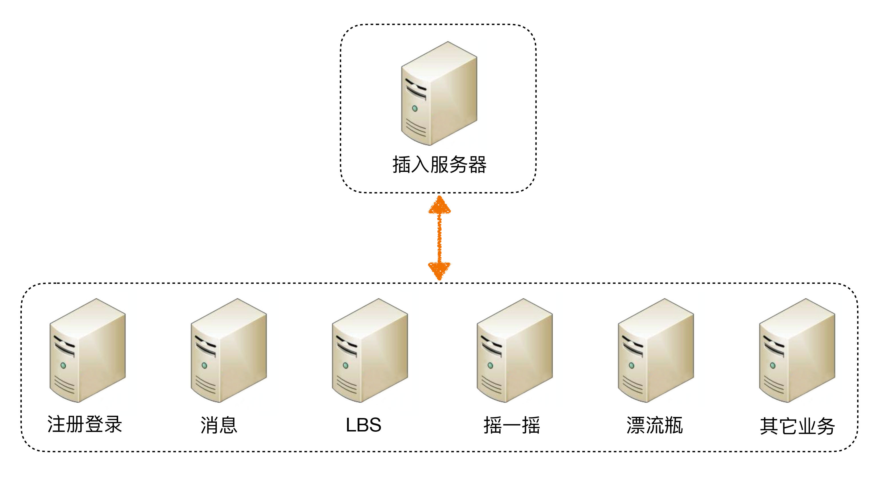
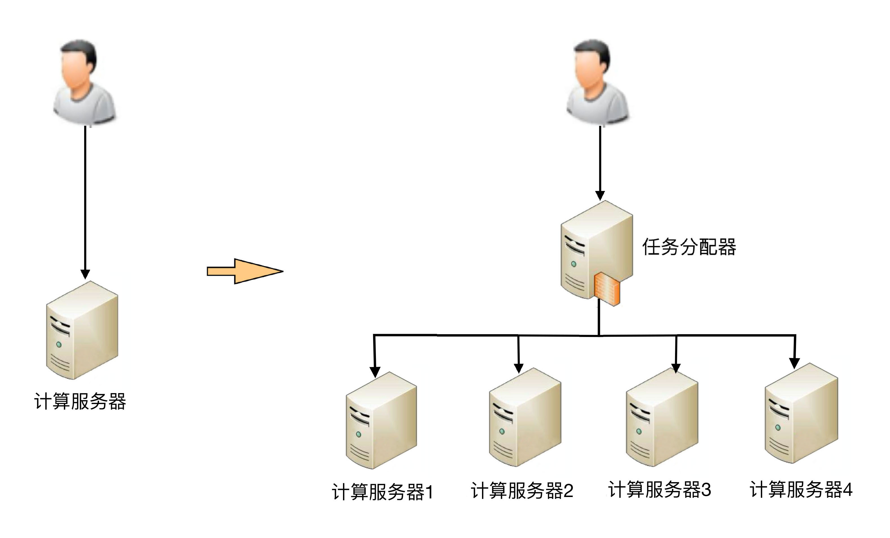
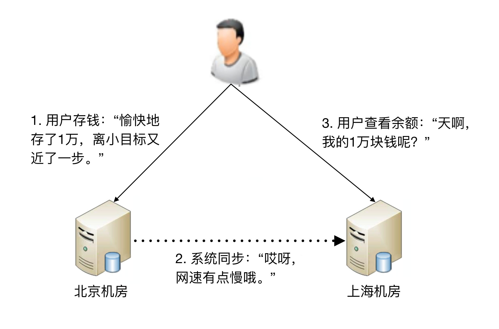
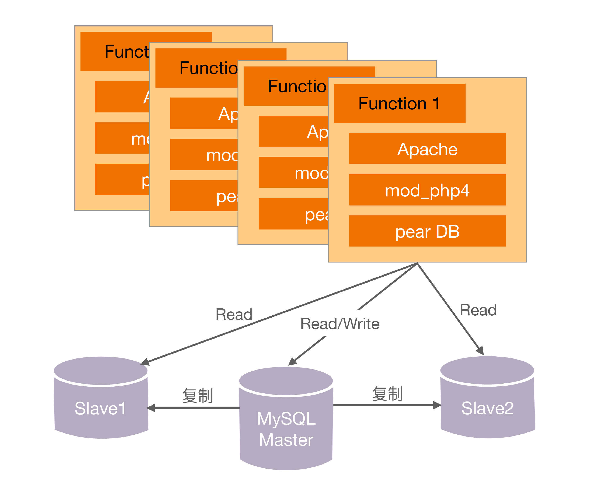
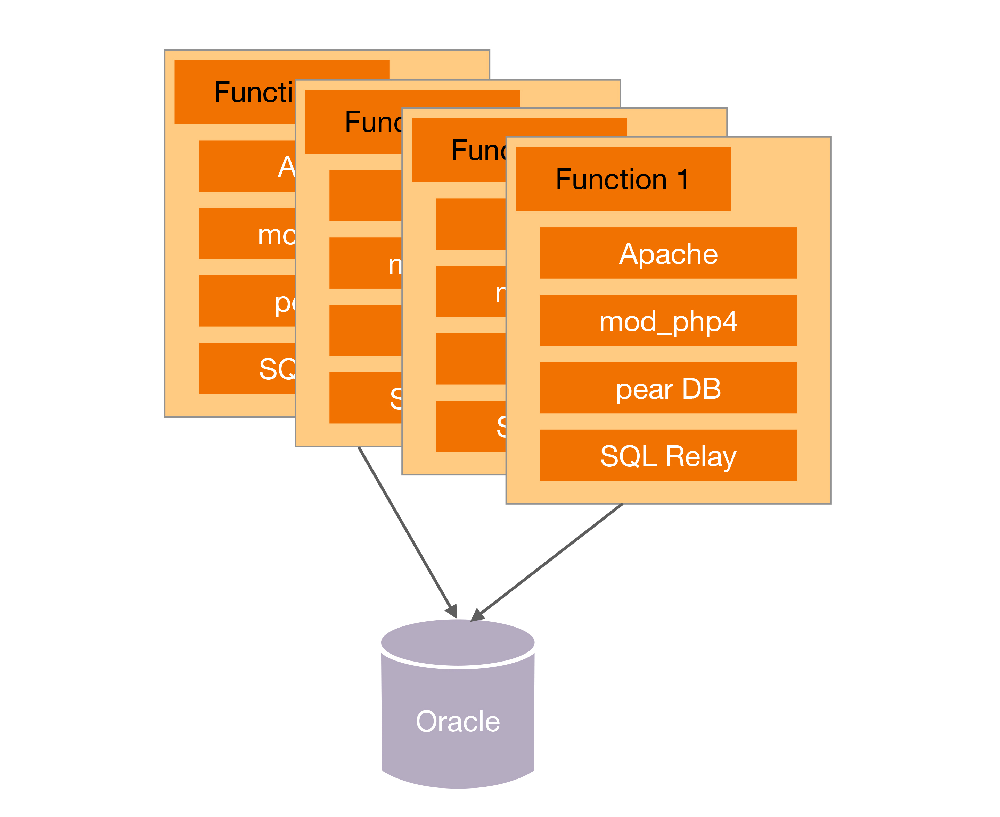
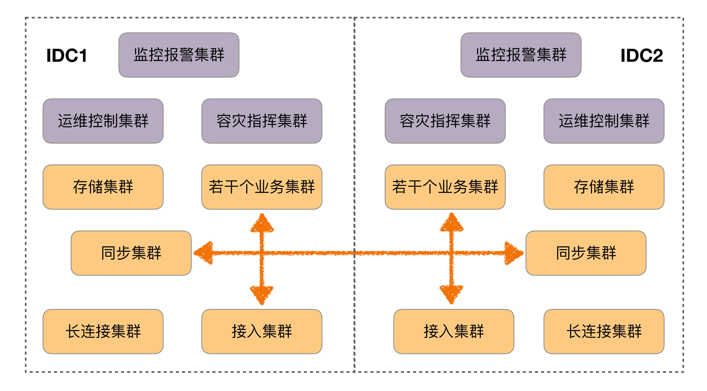

# 课程介绍

## 目录

> 极客时间的专栏《[从 0 开始学架构](https://time.geekbang.org/column/intro/100006601)》，作者：李运华(网名“华仔”，前阿里资深技术专家（P9）)
>
> 2018 年发布，2020年更新内容
>
> 作者经历：电信业务和移动互联网>蚂蚁国际，从事更加复杂的支付业务,参与了一个海外钱包从 0 到 1 的建设过程>2020 年,授课《大厂晋升指南》和《架构实战营》

```bash
# 0 开篇词
开篇词 | 照着做，你也能成为架构师！ 

# 1 基础架构
01 | 架构到底是指什么？ 
02 | 架构设计的历史背景 
03 | 架构设计的目的 
04 | 复杂度来源：高性能 
05 | 复杂度来源：高可用
06 | 复杂度来源：可扩展性
07 | 复杂度来源：低成本、安全、规模
08 | 架构设计三原则
09 | 架构设计原则案例
10 | 架构设计流程：识别复杂度
11 | 架构设计流程：设计备选方案
12 | 架构设计流程：评估和选择备选方案
13 | 架构设计流程：详细方案设计

# 2 高性能架构模式
14 | 高性能数据库集群：读写分离
15 | 高性能数据库集群：分库分表
16 | 高性能NoSQL
17 | 高性能缓存架构
18 | 单服务器高性能模式：PPC与TPC
19 | 单服务器高性能模式：Reactor与Proactor
20 | 高性能负载均衡：分类及架构
21 | 高性能负载均衡：算法

# 3 高可用架构模式
22 | 想成为架构师，你必须知道CAP理论
23 | 想成为架构师，你必须掌握的CAP细节
24 | FMEA方法，排除架构可用性隐患的利器
25 | 高可用存储架构：双机架构
26 | 高可用存储架构：集群和分区
27 | 如何设计计算高可用架构？
28 | 业务高可用的保障：异地多活架构
29 | 异地多活设计4大技巧
30 | 异地多活设计4步走
31 | 如何应对接口级的故障？

# 4 可扩展架构模式
32 | 可扩展架构的基本思想和模式
33 | 传统的可扩展架构模式：分层架构和SOA
34 | 深入理解微服务架构：银弹 or 焦油坑？
35 | 微服务架构最佳实践 - 方法篇
36 | 微服务架构最佳实践 - 基础设施篇
37 | 微内核架构详解

# 5 架构实战
38 | 架构师应该如何判断技术演进的方向？
39 | 互联网技术演进的模式
40 | 互联网架构模板：“存储层”技术
41 | 互联网架构模板：“开发层”和“服务层”技术
42 | 互联网架构模板：“网络层”技术
43 | 互联网架构模板：“用户层”和“业务层”技术
44 | 互联网架构模板：“平台”技术
45 | 架构重构内功心法第一式：有的放矢
46 | 架构重构内功心法第二式：合纵连横
47 | 架构重构内功心法第三式：运筹帷幄
48 | 再谈开源项目：如何选择、使用以及二次开发？
49 | 谈谈App架构的演进
50 | 架构实战：架构设计文档模板
51 | 如何画出优秀的软件系统架构图？

# 6 特别放送
架构专栏特别放送 | “华仔，放学别走！”第1期
架构专栏特别放送 | “华仔，放学别走！” 第2期
如何高效地学习开源项目 | “华仔，放学别走！” 第3期
架构师成长之路 | “华仔，放学别走！” 第4期
架构师必读书单 | “华仔，放学别走！” 第5期
新书首发 | 《从零开始学架构》
致「从0开始学架构」专栏订阅用户
第二季回归 | 照着做，你也能顺利晋升！
加餐｜单服务器高性能模式性能对比
加餐｜扒一扒中台皇帝的外衣
加餐｜业务架构实战营开营了
ChatGPT来临，架构师何去何从？

# 7 结束语
结束语 | 坚持，成就你的技术梦想
```


## 开篇词

> 几个架构设计相关的特性

1、架构设计的思维和程序设计的思维差异很大。

**架构设计的关键思维是判断和取舍，程序设计的关键思维是逻辑和实现**。

2、架构设计没有体系化的培训和训练机制。

3、程序员对架构设计的理解存在很多误区。


这个专栏涵盖作者的整套架构设计方法论和架构实践，主要包括以下内容。

- **架构基础**：我会先介绍架构设计的本质、历史背景和目的，然后从复杂度来源以及架构设计的原则和流程来详细介绍架构基础。
- **高性能架构模式**：我会从存储高性能、计算高性能方面，介绍几种设计方案的典型特征和应用场景。
- **高可用架构模式**：我会介绍 CAP 原理、FMEA 分析方法，分析常见的高可用存储架构和高可用计算架构，并给出一些设计方法和技巧。
- **可扩展架构模式**：我会介绍可扩展模式及其基本思想，分析一些常见架构模式。
- **架构实战**：我会将理论和案例结合，帮助你落地前面提到的架构原则、架构流程和架构模式。

通过本专栏的学习，你会收获：

- 清楚地理解架构设计相关的概念、本质、目的，避免架构师在实践过程中把握不住重点、分不清主次，眉毛胡子一把抓，导致架构设计变形或者“四不像” 。
- 掌握通用的架构设计原则，无论是何种业务或技术，架构师在判断和选择的时候有一套方法论可以参考，避免架构设计举棋不定，或者拍脑袋式设计。
- 掌握标准的架构设计流程，即使是刚开始做架构设计的新手，也能够按照步骤一步一步设计出合适的架构，避免某些步骤缺失导致错误的架构设计。
- 深入理解已有的架构模式，做到能够根据架构特点快速挑选合适的模式完成架构设计，或者在已有的模式上进行创新，或者将已有的模式组合出新的架构。
- 掌握架构演进和开源系统使用的一些技巧。


## 结束语


# 基础架构

## 01 | 架构到底是指什么？

### 指什么

以下这些问题，你能够准确地回答吗？

1. 微信有架构，微信的登录系统也有架构，微信的支付系统也有架构，当我们谈微信架构时，到底是在谈什么架构？
2. Linux 有架构，MySQL 有架构，JVM 也有架构，使用 Java 开发、MySQL 存储、跑在 Linux 上的业务系统也有架构，应该关注哪个架构呢？
3. 架构和框架是什么关系？有什么区别？


要想准确地理解架构的定义，关键就在于把三组容易混淆的概念梳理清楚：

1. 系统与子系统
2. 模块与组件
3. 框架与架构

#### 系统与子系统

我们先来看维基百科定义的“系统”：

> 系统泛指由一群有关联的个体组成，根据某种规则运作，能完成个别元件不能单独完成的工作的群体。它的意思是“总体”“整体”或“联盟”。

我来提炼一下里面的关键内容。

1. **关联**：系统是由一群有关联的个体组成的，没有关联的个体堆在一起不能成为一个系统。例如，把一个发动机和一台 PC 放在一起不能称之为一个系统，把发动机、底盘、轮胎、车架组合起来才能成为一台汽车。
2. **规则**：系统内的个体需要按照指定的规则运作，而不是单个个体各自为政。规则规定了系统内个体分工和协作的方式。例如，汽车发动机负责产生动力，然后通过变速器和传动轴，将动力输出到车轮上，从而驱动汽车前进。
3. **能力**：系统能力与个体能力有本质的差别，系统能力不是个体能力之和，而是产生了新的能力。例如，汽车能够载重前进，而发动机、变速器、传动轴、车轮本身都不具备这样的能力。


我们再来看子系统的定义：

> 子系统也是由一群有关联的个体所组成的系统，多半会是更大系统中的一部分。

其实，子系统的定义和系统定义是一样的，只是观察的角度有差异，一个系统可能是另外一个更大系统的子系统。

按照这个定义，系统和子系统比较容易理解，我们以微信为例来做一个分析：

1. 微信本身是一个系统，包含聊天、登录、支付、朋友圈等子系统。
2. 朋友圈这个系统又包括动态、评论、点赞等子系统。
3. 评论这个系统可能又包括防刷子系统、审核子系统、发布子系统、存储子系统。
4. 评**论审核子系统不再包含业务意义上的子系统，而是包括各个模块或者组件**，这些模块或者组件本身也是另外一个维度上的系统。例如，MySQL、Redis 等是存储系统，但不是业务子系统。

现在，我们可以回答第一个问题了。一个系统的架构，只包括**顶层**这一个层级的架构，而不包括下属子系统层级的架构。


#### 模块与组件

我们来看看这两者在维基百科上的定义：

> 软件模块（Module）是一套一致而互相有紧密关连的软件组织。它分别包含了程序和数据结构两部分。现代软件开发往往利用模块作为合成的单位。模块的接口表达了由该模块提供的功能和调用它时所需的元素。模块是可能分开被编写的单位。这使它们可再用和允许人员同时协作、编写及研究不同的模块。
>
> 软件组件（Component）定义为自包含的、可编程的、可重用的、与语言无关的软件单元，软件组件可以很容易被用于组装应用程序中。

其实，**模块和组件都是系统的组成部分，只是从不同的角度拆分系统而已**。

从业务逻辑的角度来拆分系统后，得到的单元就是“模块”；从物理部署的角度来拆分系统后，得到的单元就是“组件”。划分模块的主要目的是职责分离；划分组件的主要目的是单元复用。

其实，“组件”的英文 Component 也可翻译成中文的“零件”一词。“零件”更容易理解一些，它是一个物理的概念，并且具备“独立且可替换”的特点。

以一个最简单的网站系统来为例。假设我们要做一个学生信息管理系统，这个系统从逻辑的角度来拆分，可以分为“登录注册模块”“个人信息模块”和“个人成绩模块”；从物理的角度来拆分，可以拆分为 Nginx、Web 服务器和 MySQL。


现在，我们可以回答第二个问题了。如果你是业务系统的架构师，首先需要思考怎么从业务逻辑的角度把系统拆分成一个个模块**角色**，其次需要思考怎么从物理部署的角度把系统拆分成组件**角色，**例如选择 MySQL 作为存储系统。但是对于 MySQL 内部的体系架构（Parser、Optimizer、Caches&Buffers 和 Storage Engines 等），你其实是可以不用关注的，也不需要在你的业务系统架构中展现这些内容。


#### 框架与架构

框架是一整套开发规范，架构是某一套开发规范下的具体落地方案，包括各个模块之间的**组合关系**以及它们协同起来完成功能的**运作规则**。


参考维基百科上框架与架构的定义，来解释两者的区别。

> 软件框架（Software framework）通常指的是为了实现某个业界标准或完成特定基本任务的软件组件规范，也指为了实现某个软件组件规范时，提供规范所要求之基础功能的软件产品。

我来提炼一下其中关键部分：

1. 框架是**组件规范**：例如，MVC 就是一种最常见的开发规范，类似的还有 MVP、MVVM、J2EE 等框架。
2. 框架提供基础功能的产品：例如，Spring MVC 是 MVC 的开发框架，除了满足 MVC 的规范，Spring 提供了很多基础功能来帮助我们实现功能，包括注解（@Controller 等）、Spring Security、Spring JPA 等很多基础功能。


> 软件架构指软件系统的“基础结构”，创造这些基础结构的准则，以及对这些结构的描述。

单纯从定义的角度来看，框架和架构的区别还是比较明显的：**框架关注的是“规范”，架构关注的是“结构”**。

框架的英文是 Framework，架构的英文是 Architecture，Spring MVC 的英文文档标题就是“Web MVC framework”

用不同的角度或者维度，可以将系统划分为不同的结构：

从业务逻辑的角度分解，“学生管理系统”的架构是：


从物理部署的角度分解，“学生管理系统”的架构是：


从开发规范的角度分解，“学生管理系统”可以采用标准的 MVC 框架来开发，因此架构又变成了 MVC 架构：


这些“架构”，都是“学生管理系统”正确的架构，只是从不同的角度来分解而已，这也是 IBM 的 RUP 将软件架构视图分为著名的“**4+1 视图**”的原因。


### 重新定义架构：4R 架构

#### Rank

参考维基百科的定义，再结合自己的一些理解和思考，作者将软件架构重新定义为：**软件架构指软件系统的顶层（Rank）结构，它定义了系统由哪些角色（Role）组成，角色之间的关系（Relation）和运作规则（Rule）。**


第一个 R，Rank。它是指软件架构是分层的，对应“系统”和“子系统”的分层关系。通常情况下，我们只需要关注某一层的架构，最多展示相邻两层的架构，而不需要把每一层的架构全部糅杂在一起。无论是架构设计还是画架构图，都应该采取“**自顶向下，逐步细化**”的方式。以微信为例，Rank 的含义如下所示：


注：L0\L1\L2 指层级，一个 L0 往下可以分解多个 L1，一个 L1 可以往下分解多个 L2，以此类推，一般建议不超过 5 层（L0~L4）


#### Role

第二个 R，Role。它是指软件系统包含哪些角色，每个角色都会负责系统的一部分功能。架构设计最重要的工作之一就是将系统拆分为多个角色。最常见的微服务拆分其实就是将整体复杂的**业务系统**按照业务领域的方式，拆分为多个微服务，每个微服务就是系统的一个角色。

#### Relation

第三个 R，Relation。它是指软件系统的角色之间的关系，对应到架构图中其实就是连接线，角色之间的关系不能乱连，任何关系最后都需要代码来实现，包括连接方式（HTTP、TCP、UDP 和串口等）、数据协议（JSON、XML 和二进制等）以及具体的接口等。


#### Rule

第四个 R，Rule。它是指软件系统角色之间如何协作来完成系统功能。我们在前面解读什么是“系统”的时候提到过：系统能力不是个体能力之和，而是产生了新的能力。那么这个新能力具体如何完成的呢？具体哪些角色参与了这个新能力呢？这就是 Rule 所要表达的内容。在架构设计的时候，核心的业务场景都需要设计 Rule。


在实际工作中，为了方便理解，Rank、Role 和 Relation 是通过系统架构图来展示的，而 Rule 是通过系统序列图（System Sequence Diagram）来展示的。

我们以一个简化的支付系统为例，支付系统架构图如下所示：


“扫码支付”这个核心场景的系统序列图如下所示：


## 02 | 架构设计的历史背景

### 机器语言（1940 年之前）

最早的软件开发使用的是“**机器语言**”，直接使用二进制码 0 和 1 来表示机器可以识别的指令和数据。例如，在 8086 机器上完成“s=768+12288-1280”的数学运算，机器码如下：

```
101100000000000000000011
000001010000000000110000
001011010000000000000101
```

归纳一下，机器语言的主要问题是三难：**太难写、太难读、太难改**！


### 汇编语言（20 世纪 40 年代）

为了解决机器语言编写、阅读、修改复杂的问题，**汇编语言**应运而生。汇编语言又叫“**符号语言**”，用**助记符**代替机器指令的操作码，用地址符号（Symbol）或标号（Label）代替指令或操作数的地址。

例如，为了完成“将寄存器 BX 的内容送到 AX 中”的简单操作，汇编语言和机器语言分别如下。

```
机器语言：1000100111011000
汇编语言：mov ax,bx
```

汇编语言虽然解决了机器语言读写复杂的问题，但本质上还是**面向机器**的，因为写汇编语言需要我们精确了解计算机底层的知识。例如，CPU 指令、寄存器、段地址等底层的细节。

这对于程序员来说同样很复杂，因为程序员需要将现实世界中的问题和需求按照机器的逻辑进行翻译。例如，对于程序员来说，在现实世界中面对的问题是 4 + 6 = ？。而要用汇编语言实现一个简单的加法运算，代码如下：

```
.section .data
  a: .int 10
  b: .int 20
  format: .asciz "%d\n"
.section .text
.global _start
_start:
  movl a, %edx　　
  addl b, %edx　　
  pushl %edx
  pushl $format
  call printf
  movl $0, (%esp)
  call exit
```

除了编写本身复杂，还有另外一个复杂的地方在于：不同 CPU 的汇编指令和结构是不同的。


### 高级语言（20 世纪 50 年代）

为了解决汇编语言的问题，计算机前辈们从 20 世纪 50 年代开始又设计了多个**高级语言**，

最初的高级语言有下面几个，并且这些语言至今还在特定的领域继续使用。

- ortran：1955 年，名称取自”FORmula TRANslator”，即公式翻译器，由约翰·巴科斯（John Backus）等人发明。
- LISP：1958 年，名称取自”LISt Processor”，即枚举处理器，由约翰·麦卡锡（John McCarthy）等人发明。
- Cobol：1959 年，名称取自”Common Business Oriented Language”，即通用商业导向语言，由葛丽丝·霍普（Grace Hopper）发明。


为什么称这些语言为“高级语言”呢？原因在于这些语言让程序员不需要关注机器底层的低级结构和逻辑，而只要关注具体的问题和业务即可。

还是 4 + 6=？这个加法为例，如果用 LISP 语言实现，只需要简单一行代码即可：

```
(+ 4 6)
```

除此以外，通过编译程序的处理，高级语言可以被编译为适合不同 CPU 指令的机器语言。程序员只要写一次程序，就可以在多个不同的机器上编译运行，无须根据不同的机器指令重写整个程序。

（一次编写，多次编译，到处运行）


### 第一次软件危机与结构化程序设计（20 世纪 60 年代~20 世纪 70 年代）

20 世纪 60 年代中期开始爆发了第一次软件危机，典型表现有软件质量低下、项目无法如期完成、项目严重超支等，因为软件而导致的重大事故时有发生。例如，1963 年美国（http://en.wikipedia.org/wiki/Mariner_1）的水手一号火箭发射失败事故，就是因为一行 FORTRAN 代码错误导致的。


软件危机最典型的例子莫过于 IBM 的 **System/360 的操作系统**开发。佛瑞德·布鲁克斯（Frederick P. Brooks, Jr.）作为项目主管，率领 2000 多个程序员夜以继日地工作，共计花费了 5000 人一年的工作量，写出将近 100 万行的源码，总共投入 5 亿美元，是美国的“曼哈顿”原子弹计划投入的 1/4。尽管投入如此巨大，但项目进度却一再延迟，软件质量也得不到保障。布鲁克斯后来基于这个项目经验而总结的《**人月神话**》一书，成了畅销的软件工程书籍。


为了解决问题，在 1968、1969 年连续召开两次著名的 NATO 会议，会议正式创造了“软件危机”一词，并提出了针对性的解决方法“**软件工程**”。


差不多同一时间，“结构化程序设计”作为另外一种解决软件危机的方案被提了出来。艾兹赫尔·戴克斯特拉（Edsger Dijkstra）于 1968 年发表了著名的《GOTO 有害论》论文，引起了长达数年的论战，并由此产生了**结构化程序设计方法**。同时，第一个结构化的程序语言 Pascal 也在此时诞生，并迅速流行起来。


结构化程序设计的主要特点是抛弃 goto 语句，采取“自顶向下、逐步细化、模块化”的指导思想。结构化程序设计本质上还是一种面向过程的设计思想，但通过“自顶向下、逐步细化、模块化”的方法，将软件的复杂度控制在一定范围内，从而从整体上降低了软件开发的复杂度。结构化程序方法成为了 20 世纪 70 年代软件开发的潮流。


### 第二次软件危机与面向对象（20 世纪 80 年代）

随着硬件的快速发展，业务需求越来越复杂，以及编程应用领域越来越广泛，第二次软件危机很快就到来了。


第二次软件危机的根本原因还是在于软件生产力远远跟不上硬件和业务的发展。第一次软件危机的根源在于软件的“逻辑”变得非常**复杂**，而第二次软件危机主要体现在软件的**“扩展”**变得非常复杂。

在这种背景下，**面向对象的思想**开始流行起来。

面向对象的思想并不是在第二次软件危机后才出现的，早在 1967 年的 Simula 语言中就开始提出来了，但第二次软件危机促进了面向对象的发展。**面向对象真正开始流行是在 20 世纪 80 年代，主要得益于 C++ 的功劳，后来的 Java、C# 把面向对象推向了新的高峰。到现在为止，面向对象已经成为了主流的开发思想。**


### 软件架构的历史背景

虽然早在 20 世纪 60 年代，戴克斯特拉这位上古大神就已经涉及软件架构这个概念了，但软件架构真正流行却是从 20 世纪 90 年代开始的，由于在 Rational 和 Microsoft 内部的相关活动，软件架构的概念开始越来越流行了。

卡内基·梅隆大学的玛丽·肖（Mary Shaw）和戴维·加兰（David Garlan）对软件架构做了很多研究，他们在 1994 年的一篇文章《软件架构介绍》（An Introduction to Software Architecture）中写到：

> “When systems are constructed from many components, the organization of the overall system-the software architecture-presents a new set of design problems.”


简单翻译一下：随着软件系统规模的增加，计算相关的算法和数据结构不再构成主要的设计问题；当系统由许多部分组成时，整个系统的组织，也就是所说的“软件架构”，导致了一系列新的设计问题。

这段话很好地解释了“软件架构”为何先在 Rational 或者 Microsoft 这样的大公司开始逐步流行起来。因为只有大公司开发的软件系统才具备较大规模，而只有规模较大的软件系统才会面临软件架构相关的问题，例如：

- 系统规模庞大，内部耦合严重，开发效率低；
- 系统耦合严重，牵一发动全身，后续修改和扩展困难；
- 系统逻辑复杂，容易出问题，出问题后很难排查和修复。

软件架构的出现有其历史必然性。20 世纪 60 年代第一次软件危机引出了“结构化编程”，创造了“模块”概念；20 世纪 80 年代第二次软件危机引出了“面向对象编程”，创造了“对象”概念；到了 20 世纪 90 年代“软件架构”开始流行，创造了“组件”概念。我们可以看到，“模块”“对象”“组件”本质上都是对达到一定规模的软件进行拆分，差别只是在于随着软件的复杂度不断增加，拆分的粒度越来越粗，拆分的层次越来越高。


## 03 | 架构设计的目的

### 架构设计的误区

关于架构设计的目的，常见的误区有：

- 因为架构很重要，所以要做架构设计

这是一句正确的废话，架构是很重要，但架构为何重要呢？


例如：不做架构设计系统就跑不起来么？

其实不然，很多朋友尤其是经历了创业公司的朋友可能会发现，公司的初始产品可能没有架构设计，大伙撸起袖子简单讨论一下就开始编码了，根本没有正规的架构设计过程，而且也许产品开发速度还更快，上线后运行也还不错。


例如：做了架构设计就能提升开发效率么？

也不尽然，实际上有时候最简单的设计开发效率反而是最高的，架构设计毕竟需要投入时间和人力，这部分投入如果用来尽早编码，项目也许会更快。


例如：设计良好的架构能促进业务发展么？

好像有一定的道理，例如设计高性能的架构能够让用户体验更好，但反过来想，我们照抄微信的架构，业务就能达到微信的量级么？肯定不可能，不要说达到微信的量级，达到微信的 1/10 做梦都要笑醒了。


不是每个系统都要做架构设计吗

这其实是知其然不知其所以然，系统确实要做架构设计，但还是不知道为何要做架构设计，反正大家都要做架构设计，所以做架构设计肯定没错。

这样的架构师或者设计师很容易走入生搬硬套业界其他公司已有架构的歧路，美其名曰“参考”“微改进”。一旦强行引入其他公司架构后，很可能会发现架构水土不服，或者运行起来很别扭等各种情况，最后往往不得不削足适履，或者不断重构，甚至无奈推倒重来。


公司流程要求系统开发过程中必须有架构设计

与此答案类似还有因为“架构师总要做点事情”，所以要做架构设计，其实都是舍本逐末。


为了高性能、高可用、可扩展，所以要做架构设计

能够给出这个答案，说明已经有了一定的架构经历或者基础，毕竟确实很多架构设计都是冲着高性能、高可用……等“高 XX”的目标去的。

但往往持有这类观点的架构师和设计师会给项目带来巨大的灾难，这绝不是危言耸听，而是很多实际发生的事情，为什么会这样呢？因为这类架构师或者设计师不管三七二十一，不管什么系统，也不管什么业务，上来就要求“高性能、高可用、高扩展”，结果就会出现架构设计复杂无比，项目落地遥遥无期，团队天天吵翻天……等各种让人抓狂的现象，费尽九牛二虎之力将系统整上线，却发现运行不够稳定，经常出问题，出了问题很难解决，加个功能要改 1 个月……等各种继续让人抓狂的事件。


### 架构设计的真正目的

从之前分享的架构设计的历史背景，可以看到，整个软件技术发展的历史，其实就是一部与**“复杂度”**斗争的历史，架构的出现也不例外。

答案：**架构设计的主要目的是为了解决软件系统复杂度带来的问题**。


首先，遵循这条准则能够让“新手”架构师**心中有数，而不是一头雾水**。

明确了“架构设计是为了解决软件复杂度”原则后，就很好回答下面一些问题。

- “这么多需求，从哪里开始下手进行架构设计呢？”

——通过熟悉和理解需求，识别系统复杂性所在的地方，然后针对这些复杂点进行架构设计。


- “架构设计要考虑高性能、高可用、高扩展……这么多高 XX，全部设计完成估计要 1 个月，但老大只给了 1 周时间”

——架构设计并不是要面面俱到，不需要每个架构都具备高性能、高可用、高扩展等特点，而是要识别出复杂点然后有针对性地解决问题。


- “业界 A 公司的架构是 X，B 公司的方案是 Y，两个差别比较大，该参考哪一个呢？”

——理解每个架构方案背后所需要解决的复杂点，然后才能对比自己的业务复杂点，参考复杂点相似的方案。


其次，遵循这条准则能够让“老鸟”架构师**有的放矢，而不是贪大求全**。

一些“老鸟”架构师，为了证明自己的技术牛，可能会陷入贪大求全的焦油坑而无法自拔。例如：

“我们的系统一定要做到每秒 TPS 10 万”。【TPS 是指每秒事务处理量（Transactions Per Second）。在计算机系统中，TPS 是衡量系统处理能力的指标之一，表示系统每秒能够处理的事务数量。事务可以是数据库的读写操作、网络请求、交易处理等。】

——如果系统的复杂度不是在性能这部分，TPS 做到 10 万并没有什么用。


“淘宝的架构是这么做的，我们也要这么做”。

——淘宝的架构是为了解决淘宝业务的复杂度而设计的，淘宝的业务复杂度并不就是我们的业务复杂度，绝大多数业务的用户量都不可能有淘宝那么大。


“Docker 现在很流行，我们的架构应该将 Docker 应用进来”。

——Docker 不是万能的，只是为了解决资源重用和动态分配而设计的，如果我们的系统复杂度根本不是在这方面，引入 Docker 没有什么意义。


### 简单的复杂度分析案例

假设我们需要设计一个大学的学生管理系统，其基本功能包括登录、注册、成绩管理、课程管理等。当我们对这样一个系统进行架构设计的时候，首先应识别其复杂度到底体现在哪里。

**性能**：一个学校的学生大约 1 ~ 2 万人，学生管理系统的访问频率并不高，平均每天单个学生的访问次数平均不到 1 次，因此性能这部分并不复杂，存储用 MySQL 完全能够胜任，缓存都可以不用，Web 服务器用 Nginx 绰绰有余。

**可扩展性**：学生管理系统的功能比较稳定，可扩展的空间并不大，因此可扩展性也不复杂。

**高可用**：学生管理系统即使宕机 2 小时，对学生管理工作影响并不大，因此可以不做负载均衡，更不用考虑异地多活这类复杂的方案了。但是，如果学生的数据全部丢失，修复是非常麻烦的，只能靠人工逐条修复，这个很难接受，因此需要考虑**存储高可靠**，这里就有点复杂了。我们需要考虑多种异常情况：机器故障、机房故障，针对机器故障，我们需要设计 MySQL 同机房主备方案；针对机房故障，我们需要设计 MySQL 跨机房同步方案。

**安全性**：学生管理系统存储的信息有一定的隐私性，例如学生的家庭情况，但并不是和金融相关的，也不包含强隐私（例如玉照、情感）的信息，因此安全性方面只要做 3 个事情就基本满足要求了：Nginx 提供 ACL （Access Control List）控制【在 Nginx 中，你可以使用 `allow` 和 `deny` 指令来配置 ACL。这些指令可以在 `http`、`server` 或 `location` 块中使用，以便在不同的层级上进行访问控制。】、用户账号密码管理、数据库访问权限控制。

**成本**：由于系统很简单，基本上几台服务器就能够搞定，对于一所大学来说完全不是问题，可以无需太多关注。


还有其他方面，如果有兴趣，你可以自行尝试去分析。通过我上面的分析，可以看到这个方案的主要复杂性体现在存储可靠性上，需要保证异常的时候，不要丢失所有数据即可（丢失几个或者几十个学生的信息问题不大），对应的架构如下：	


学生管理系统虽然简单，但麻雀虽小五脏俱全，基本上能涵盖软件系统复杂度分析的各个方面，而且绝大部分技术人员都曾经自己设计或者接触过类似的系统，如果将这个案例和自己的经验对比，相信会有更多的收获。


## 04 | 复杂度来源：高性能

软件系统中高性能带来的复杂度主要体现在两方面，一方面是**单台计算机内部为了高性能带来的复杂度**；另一方面是**多台计算机集群为了高性能带来的复杂度**。


### 单机复杂度

计算机内部复杂度最关键的地方就是**操作系统**。计算机性能的发展本质上是由硬件发展驱动的，尤其是 **CPU** 的性能发展。著名的“摩尔定律”表明了 CPU 的处理能力每隔 18 个月就翻一番；而将硬件性能充分发挥出来的关键就是操作系统，所以操作系统本身其实也是跟随硬件的发展而发展的，操作系统是软件系统的运行环境，操作系统的复杂度直接决定了软件系统的复杂度。


操作系统和性能最相关的就是**进程**和**线程**。


**最早的计算机其实是没有操作系统的**，只有输入、计算和输出功能，用户输入一个指令，计算机完成操作，大部分时候计算机都在等待用户输入指令，这样的处理性能很显然是很低效的，因为人的输入速度是远远比不上计算机的运算速度的。


为了解决手工操作带来的低效，**批处理操作系统**应运而生。批处理简单来说就是先把要执行的指令预先写下来（写到纸带、磁带、磁盘等），形成一个指令清单，这个指令清单就是我们常说的“任务”，然后将任务交给计算机去执行，批处理操作系统负责读取“任务”中的指令清单并进行处理，计算机执行的过程中无须等待人工手工操作，这样性能就有了很大的提升。

批处理程序大大提升了处理性能，但有一个很明显的缺点：计算机一次只能执行一个任务，如果某个任务需要从 I/O 设备（例如磁带）读取大量的数据，在 I/O 操作的过程中，CPU 其实是空闲的，而这个空闲时间本来是可以进行其他计算的。


为了进一步提升性能，人们发明了“**进程**”，用进程来对应一个任务，每个任务都有自己独立的内存空间，进程间互不相关，由操作系统来进行调度。此时的 CPU 还没有多核和多线程的概念，为了达到多进程并行运行的目的，采取了**分时**的方式，即把 CPU 的时间分成很多片段，每个片段只能执行某个进程中的指令。虽然从操作系统和 CPU 的角度来说还是串行处理的，但是由于 CPU 的处理速度很快，从用户的角度来看，感觉是多进程在并行处理。

多进程虽然要求每个任务都有独立的内存空间，进程间互不相关，但从用户的角度来看，两个任务之间能够在运行过程中就进行通信，会让任务设计变得更加灵活高效。否则如果两个任务运行过程中不能通信，只能是 A 任务将结果写到存储，B 任务再从存储读取进行处理，不仅效率低，而且任务设计更加复杂。为了解决这个问题，**进程间通信**的各种方式被设计出来了，包括管道、消息队列、信号量、共享存储等。


多进程让多任务能够并行处理任务，但本身还有缺点，**单个进程内部只能串行处理**，而实际上很多进程内部的子任务并不要求是严格按照时间顺序来执行的，也需要并行处理。例如，一个餐馆管理进程，排位、点菜、买单、服务员调度等子任务必须能够并行处理，否则就会出现某个客人买单时间比较长（比如说信用卡刷不出来），其他客人都不能点菜的情况。为了解决这个问题，人们又发明了**线程**，线程是进程内部的子任务，但这些子任务都**共享同一份进程数**据。为了保证数据的正确性，又发明了**互斥锁机制**。有了多线程后，操作系统调度的最小单位就变成了线程，而进程变成了操作系统分配资源的最小单位。


多进程多线程虽然让多任务并行处理的性能大大提升，但本质上还是分时系统，并不能做到时间上真正的并行。解决这个问题的方式显而易见，就是让**多个 CPU 能够同时执行计算任务**，从而实现真正意义上的多任务并行。目前这样的解决方案有 3 种：**SMP（Symmetric Multi-Processor，对称多处理器结构）**、NUMA（Non-Uniform Memory Access，非一致存储访问结构）、MPP（Massive Parallel Processing，海量并行处理结构）。其中 SMP 是我们最常见的，目前流行的多核处理器就是 SMP 方案。


操作系统发展到现在，如果我们要完成一个高性能的软件系统，需要考虑如多进程、多线程、进程间通信、多线程并发等技术点，而且这些技术**并不是最新的就是最好的，也不是非此即彼的选择**。在做架构设计的时候，需要花费很大的精力来结合业务进行分析、判断、选择、组合，这个过程同样很复杂。举一个最简单的例子：Nginx 可以用多进程也可以用多线程，JBoss 采用的是多线程；**Redis 采用的是单进程**，Memcache 采用的是多线程，这些系统都实现了高性能，但内部实现差异却很大。


### 集群的复杂度

虽然计算机硬件的性能快速发展，但和业务的发展速度相比，还是小巫见大巫了，尤其是进入互联网时代后，业务的发展速度远远超过了硬件的发展速度。例如：

- 2016 年“双 11”支付宝每秒峰值达 12 万笔支付。
- 2017 年春节微信红包收发红包每秒达到 76 万个。

要支持支付和红包这种复杂的业务，单机的性能无论如何是无法支撑的，必须采用机器集群的方式来达到高性能。例如，支付宝和微信这种规模的业务系统，后台系统的机器数量都是万台级别的。

通过大量机器来提升性能，并不仅仅是增加机器这么简单，让多台机器配合起来达到高性能的目的，是一个复杂的任务，针对常见的几种方式简单分析一下。

#### 1、任务分配

任务分配的意思是指每台机器都可以处理完整的业务任务，不同的任务分配到不同的机器上执行。


从图中可以看到，1 台服务器演变为 2 台服务器后，架构上明显要复杂多了，主要体现在：

- 需要增加一个任务分配器，这个分配器可能是硬件网络设备（例如，F5、交换机等），可能是软件网络设备（例如，LVS），也可能是负载均衡软件（例如，Nginx、HAProxy），还可能是自己开发的系统。选择合适的任务分配器也是一件复杂的事情，需要综合考虑性能、成本、可维护性、可用性等各方面的因素。
- 任务分配器和真正的业务服务器之间有连接和交互（即图中任务分配器到业务服务器的连接线），需要选择合适的连接方式，并且对连接进行管理。例如，连接建立、连接检测、连接中断后如何处理等。
- 任务分配器需要增加分配算法。例如，是采用轮询算法，还是按权重分配，又或者按照负载进行分配。如果按照服务器的负载进行分配，则业务服务器还要能够上报自己的状态给任务分配器。

上面这个架构只是最简单地增加 1 台**业务机器**，我们假设单台业务服务器每秒能够处理 5000 次业务请求，那么这个架构理论上能够支撑 10000 次请求，实际上的性能一般按照 8 折计算，大约是 8000 次左右。

如果我们的性能要求继续提高，假设要求每秒提升到 10 万次，上面这个架构会出现什么问题呢？是不是将业务服务器增加到 25 台就可以了呢？显然不是，因为随着性能的增加，**任务分配器**本身又会成为性能瓶颈，当业务请求达到每秒 10 万次的时候，单台任务分配器也不够用了，任务分配器本身也需要扩展为多台机器，这时的架构又会演变成这个样子。


这个架构比 2 台业务服务器的架构要复杂，主要体现在：

- 任务分配器从 1 台变成了多台（对应图中的任务分配器 1 到任务分配器 M），这个变化带来的复杂度就是需要将不同的用户分配到不同的任务分配器上（即图中的虚线“用户分配”部分），常见的方法包括 DNS 轮询、智能 DNS、CDN（Content Delivery Network，内容分发网络）、GSLB 设备（Global Server Load Balance，全局负载均衡）等。
- 任务分配器和业务服务器的连接从简单的“1 对多”（1 台任务分配器连接多台业务服务器）变成了“多对多”（多台任务分配器连接多台业务服务器）的网状结构。
- 机器数量从 3 台扩展到 30 台（一般任务分配器数量比业务服务器要少，这里我们假设业务服务器为 25 台，任务分配器为 5 台），状态管理、故障处理复杂度也大大增加。


上面这两个例子都是以业务处理为例，实际上“任务”涵盖的范围很广，**可以指完整的业务处理，也可以单指某个具体的任务**。例如，“存储”“运算”“缓存”等都可以作为一项任务，因此存储系统、运算系统、缓存系统都可以按照任务分配的方式来搭建架构。此外，“任务分配器”也并不一定只能是物理上存在的机器或者一个独立运行的程序，也可以是嵌入在其他程序中的算法，例如 Memcache 的集群架构。


#### 2、任务分解

通过任务分配的方式，我们能够突破单台机器处理性能的瓶颈，通过增加更多的机器来满足业务的性能需求，但如果业务本身也越来越复杂，单纯只通过任务分配的方式来扩展性能，收益会越来越低。例如，业务简单的时候 1 台机器扩展到 10 台机器，性能能够提升 8 倍（需要扣除机器群带来的部分性能损耗，因此无法达到理论上的 10 倍那么高），但如果业务越来越复杂，1 台机器扩展到 10 台，性能可能只能提升 5 倍。造成这种现象的主要原因是业务越来越复杂，单台机器处理的性能会越来越低。为了能够继续提升性能，我们需要采取第二种方式：**任务分解**。

继续以上面“任务分配”中的架构为例，“业务服务器”如果越来越复杂，我们可以将其拆分为更多的组成部分，我以微信的后台架构为例。



通过上面的架构示意图可以看出，微信后台架构从逻辑上将各个子业务进行了拆分，包括：接入、注册登录、消息、LBS、摇一摇、漂流瓶、其他业务（聊天、视频、朋友圈等）。

通过这种任务分解的方式，能够把原来大一统但复杂的业务系统，拆分成小而简单但需要多个系统配合的业务系统。从业务的角度来看，任务分解既不会减少功能，也不会减少代码量（事实上代码量可能还会增加，因为从代码内部调用改为通过服务器之间的接口调用），那为何通过任务分解就能够提升性能呢？

主要有几方面的因素：

- **简单的系统更加容易做到高性能**

系统的功能越简单，影响性能的点就越少，就更加容易进行有针对性的优化。而系统很复杂的情况下，首先是比较难以找到关键性能点，因为需要考虑和验证的点太多；其次是即使花费很大力气找到了，修改起来也不容易，因为可能将 A 关键性能点提升了，但却无意中将 B 点的性能降低了，整个系统的性能不但没有提升，还有可能会下降。

- **可以针对单个任务进行扩展**

当各个逻辑任务分解到独立的子系统后，整个系统的性能瓶颈更加容易发现，而且发现后只需要针对有瓶颈的子系统进行性能优化或者提升，不需要改动整个系统，风险会小很多。以微信的后台架构为例，如果用户数增长太快，注册登录子系统性能出现瓶颈的时候，只需要优化登录注册子系统的性能（可以是代码优化，也可以简单粗暴地加机器），消息逻辑、LBS 逻辑等其他子系统完全不需要改动。

既然将一个大一统的系统分解为多个子系统能够提升性能，那是不是划分得越细越好呢？例如，上面的微信后台目前是 7 个逻辑子系统，如果我们把这 7 个逻辑子系统再细分，划分为 100 个逻辑子系统，性能是不是会更高呢？

其实不然，这样做性能不仅不会提升，反而还会下降，最主要的原因是如果系统拆分得太细，为了完成某个业务，系统间的调用次数会呈指数级别上升，而系统间的调用通道目前都是通过网络传输的方式，性能远比系统内的函数调用要低得多。我以一个简单的图示来说明。


从图中可以看到，当系统拆分 2 个子系统的时候，用户访问需要 1 次系统间的请求和 1 次响应；当系统拆分为 4 个子系统的时候，系统间的请求次数从 1 次增长到 3 次；假如继续拆分下去为 100 个子系统，为了完成某次用户访问，系统间的请求次数变成了 99 次。

为了描述简单，我抽象出来一个最简单的模型：假设这些系统采用 IP 网络连接，理想情况下一次请求和响应在网络上耗费为 1ms，业务处理本身耗时为 50ms。我们也假设系统拆分对单个业务请求性能没有影响，那么系统拆分为 2 个子系统的时候，处理一次用户访问耗时为 51ms；而系统拆分为 100 个子系统的时候，处理一次用户访问耗时竟然达到了 149ms。


虽然系统拆分可能在某种程度上能提升业务处理性能，但提升性能也是有限的，不可能系统不拆分的时候业务处理耗时为 50ms，系统拆分后业务处理耗时只要 1ms，因为最终决定业务处理性能的还是业务逻辑本身，业务逻辑本身没有发生大的变化下，理论上的性能是有一个上限的，系统拆分能够让性能逼近这个极限，但无法突破这个极限。因此，**任务分解带来的性能收益是有一个度的，并不是任务分解越细越好**，而对于架构设计来说，如何把握这个粒度就非常关键了。


## 05 | 复杂度来源：高可用

参考维基百科，先来看看高可用的定义。

> 系统**无中断**地执行其功能的能力，代表系统的可用性程度，是进行系统设计时的准则之一。

这个定义的关键在于“**无中断**”，但恰好难点也在“无中断”上面，因为无论是单个硬件还是单个软件，都不可能做到无中断，硬件会出故障，软件会有 bug；硬件会逐渐老化，软件会越来越复杂和庞大……

除了硬件和软件本质上无法做到“无中断”，外部环境导致的不可用更加不可避免、不受控制。例如，断电、水灾、地震，这些事故或者灾难也会导致系统不可用，而且影响程度更加严重，更加难以预测和规避。

所以，系统的高可用方案五花八门，但万变不离其宗，本质上都是通过“**冗余**”来实现高可用。


### 计算高可用

这里的“计算”指的是业务的逻辑处理。计算有一个特点就是**无论在哪台机器上进行计算，同样的算法和输入数据，产出的结果都是一样的**，所以将计算从一台机器迁移到另外一台机器，对业务并没有什么影响。既然如此，计算高可用的复杂度体现在哪里呢？以最简单的单机变双机为例进行分析。先来看一个单机变双机的简单架构示意图。


你可能会发现，这个双机的架构图和上期“高性能”讲到的双机架构图是一样的，因此复杂度也是类似的，具体表现为：

- 需要增加一个任务分配器，选择合适的任务分配器也是一件复杂的事情，需要综合考虑性能、成本、可维护性、可用性等各方面因素。
- 任务分配器和真正的业务服务器之间有连接和交互，需要选择合适的连接方式，并且对连接进行管理。例如，连接建立、连接检测、连接中断后如何处理等。
- 任务分配器需要增加分配算法。例如，**常见的双机算法有主备、主主**，主备方案又可以细分为**冷备、温备、热备**。


上面这个示意图只是简单的双机架构，我们再看一个复杂一点的高可用集群架构。




这个高可用集群相比双机来说，分配算法更加复杂，可以是 1 主 3 备、2 主 2 备、3 主 1 备、4 主 0 备，具体应该采用哪种方式，需要结合实际业务需求来分析和判断，并不存在某种算法就一定优于另外的算法。例如，ZooKeeper 采用的就是 1 主多备，而 Memcached 采用的就是全主 0 备。


### 存储高可用

对于需要存储数据的系统来说，整个系统的高可用设计关键点和难点就在于“存储高可用”。存储与计算相比，有一个本质上的区别：**将数据从一台机器搬到到另一台机器，需要经过线路进行传输**。线路传输的速度是毫秒级别，同一机房内部能够做到几毫秒；分布在不同地方的机房，传输耗时需要几十甚至上百毫秒。例如，从广州机房到北京机房，稳定情况下 ping **延时**大约是 50ms，不稳定情况下可能达到 1s 甚至更多。

延迟意味着整个系统在某个时间点上，数据肯定是不一致的。按照“**数据 + 逻辑 = 业务**”这个公式来套的话，数据不一致，即使逻辑一致，最后的业务表现就不一样了。

以最经典的银行储蓄业务为例，假设用户的数据存在北京机房，用户存入了 1 万块钱，然后他查询的时候被路由到了上海机房，北京机房的数据没有同步到上海机房，用户会发现他的余额并没有增加 1 万块。想象一下，此时用户肯定会背后一凉，马上会怀疑自己的钱被盗了，然后赶紧打客服电话投诉，甚至打 110 报警，即使最后发现只是因为传输延迟导致的问题，站在用户的角度来说，这个过程的体验肯定很不好。



除了物理上的传输速度限制，传输线路本身也存在可用性问题，**传输线路可能中断、可能拥塞、可能异常（错包、丢包）**，并且传输线路的故障时间一般都特别长，短的十几分钟，长的几个小时都是可能的。例如，2015 年支付宝因为光缆被挖断，业务影响超过 4 个小时；2016 年中美海底光缆中断 3 小时等。在传输线路中断的情况下，就意味着存储无法进行同步，在这段时间内整个系统的数据是不一致的。

综合分析，无论是正常情况下的传输延迟，还是异常情况下的传输中断，都会导致系统的数据在某个时间点或者时间段是不一致的，而数据的不一致又会导致业务问题；但如果完全不做冗余，系统的整体高可用又无法保证，所以**存储高可用的难点不在于如何备份数据，而在于如何减少或者规避数据不一致对业务造成的影响**。

分布式领域里面有一个著名的 CAP 定理，从理论上论证了存储高可用的复杂度。也就是说，存储高可用不可能同时满足“一致性、可用性、分区容错性”，最多满足其中两个，这就要求我们在做架构设计时结合业务进行取舍。


### 高可用状态决策

无论是计算高可用还是存储高可用，其基础都是“**状态决策**”，即系统需要能够判断当前的状态是正常还是异常，如果出现了异常就要采取行动来保证高可用。如果状态决策本身都是有错误或者有偏差的，那么后续的任何行动和处理无论多么完美也都没有意义和价值。但在具体实践的过程中，恰好存在一个本质的矛盾：**通过冗余来实现的高可用系统，状态决策本质上就不可能做到完全正确**。下面基于几种常见的决策方式进行详细分析。

### 1、独裁式

独裁式决策指的是存在一个独立的决策主体，我们姑且称它为“决策者”，负责收集信息然后进行决策；所有冗余的个体，我们姑且称它为“上报者”，都将状态信息发送给决策者。


独裁式的决策方式不会出现决策混乱的问题，因为只有一个决策者，但问题也正是在于只有一个决策者。当决策者本身故障时，整个系统就无法实现准确的状态决策。如果决策者本身又做一套状态决策，那就陷入一个递归的死循环了。

### 2、协商式

协商式决策指的是两个独立的个体通过交流信息，然后根据规则进行决策，**最常用的协商式决策就是主备决策**。

其实就是抢占成为主机？


这个架构的基本协商规则可以设计成：

- 2 台服务器启动时都是备机。
- 2 台服务器建立连接。
- 2 台服务器交换状态信息。
- 某 1 台服务器做出决策，成为主机；另一台服务器继续保持备机身份。

协商式决策的架构不复杂，规则也不复杂，其难点在于，如果两者的信息交换出现问题（比如主备连接中断），此时状态决策应该怎么做。

- 如果备机在连接中断的情况下认为主机故障，那么备机需要升级为主机，但实际上此时主机并没有故障，那么系统就出现了两个主机，这与设计初衷（1 主 1 备）是不符合的。


- 如果备机在连接中断的情况下不认为主机故障，则此时如果主机真的发生故障，那么系统就没有主机了，这同样与设计初衷（1 主 1 备）是不符合的。


- 如果为了规避连接中断对状态决策带来的影响，可以增加更多的连接。例如，双连接、三连接。这样虽然能够降低连接中断对状态带来的影响（注意：只能降低，不能彻底解决），但同时又引入了这几条连接之间信息取舍的问题，即如果不同连接传递的信息不同，应该以哪个连接为准？实际上这也是一个无解的答案，无论以哪个连接为准，在特定场景下都可能存在问题。


综合分析，协商式状态决策在某些场景总是存在一些问题的。


### 3、民主式

民主式决策指的是多个独立的个体通过**投票**的方式来进行状态决策。例如，ZooKeeper 集群在选举 leader 时就是采用这种方式。


民主式决策和协商式决策比较类似，其基础都是独立的个体之间交换信息，每个个体做出自己的决策，然后按照“**多数取胜**”的规则来确定最终的状态。不同点在于民主式决策比协商式决策要复杂得多，ZooKeeper 的选举算法 ZAB，绝大部分人都看得云里雾里，更不用说用代码来实现这套算法了。


除了算法复杂，民主式决策还有一个**固有的缺陷：脑裂**。

这个词来源于医学，指人体左右大脑半球的连接被切断后，左右脑因为无法交换信息，导致各自做出决策，然后身体受到两个大脑分别控制，会做出各种奇怪的动作。例如：当一个脑裂患者更衣时，他有时会一只手将裤子拉起，另一只手却将裤子往下脱。脑裂的根本原因是，原来统一的集群因为连接中断，造成了两个独立分隔的子集群，每个子集群单独进行选举，于是选出了 2 个主机，相当于人体有两个大脑了。


从图中可以看到，正常状态的时候，节点 5 作为主节点，其他节点作为备节点；当连接发生故障时，节点 1、节点 2、节点 3 形成了一个子集群，节点 4、节点 5 形成了另外一个子集群，这两个子集群的连接已经中断，无法进行信息交换。按照民主决策的规则和算法，两个子集群分别选出了节点 2 和节点 5 作为主节点，此时整个系统就出现了两个主节点。这个状态违背了系统设计的初衷，两个主节点会各自做出自己的决策，整个系统的状态就混乱了。


**为了解决脑裂问题，民主式决策的系统一般都采用“投票节点数必须超过系统总节点数一半”规则来处理。**

如图中那种情况，节点 4 和节点 5 形成的子集群总节点数只有 2 个，没有达到总节点数 5 个的一半，因此这个子集群不会进行选举。这种方式虽然解决了脑裂问题，但同时降低了系统整体的可用性，即如果系统不是因为脑裂问题导致投票节点数过少，而真的是因为节点故障（例如，节点 1、节点 2、节点 3 真的发生了故障），此时系统也不会选出主节点，整个系统就相当于宕机了，尽管此时还有节点 4 和节点 5 是正常的。


综合分析，无论采取什么样的方案，状态决策都不可能做到任何场景下都没有问题，但完全不做高可用方案又会产生更大的问题，如何选取适合系统的高可用方案，也是一个复杂的分析、判断和选择的过程。

小结


## 06 | 复杂度来源：可扩展性

**可扩展性是指，系统为了应对将来需求变化而提供的一种扩展能力**，当有新的需求出现时，系统不需要或者仅需要少量修改就可以支持，无须整个系统重构或者重建。

由于软件系统固有的多变性，新的需求总会不断提出来，因此可扩展性显得尤其重要。在软件开发领域，面向对象思想的提出，就是为了解决可扩展性带来的问题；后来的设计模式，更是将可扩展性做到了极致。得益于设计模式的巨大影响力，几乎所有的技术人员对于可扩展性都特别重视。

设计具备良好可扩展性的系统，有两个基本条件：

1. **正确预测变化**
2. **完美应对变化**


### 预测变化

理想是美好的，现实却是复杂的。有一句谚语：“唯一不变的是变化。”如果按照这个标准去衡量，架构师每个设计方案都要考虑可扩展性，例如：

- 架构师准备设计一个简单的后台管理系统，当架构师考虑用 MySQL 存储数据时，是否要考虑后续需要用 Oracle 来存储？
- 当架构师设计用 HTTP 做接口协议时，是否要考虑要不要支持 ProtocolBuffer？
- 甚至更离谱一点，架构师是否要考虑 VR 技术对架构的影响从而提前做好可扩展性？


如果每个点都考虑可扩展性，架构师会不堪重负，架构设计也会异常庞大且最终无法落地。但架构师也不能完全不做预测，否则可能系统刚上线，马上来新的需求就需要重构，这同样意味着前期很多投入的工作量也白费了。

同时，“预测”这个词，本身就暗示了不可能每次预测都是准确的。如果预测的事情出错，我们期望中的需求迟迟不来，甚至被明确否定，那么基于预测做的架构设计就没什么作用，投入的工作量也就白费了。

综合分析，预测变化的复杂性在于：

1. 不能每个设计点都考虑可扩展性。
2. 不能完全不考虑可扩展性。
3. 所有的预测都存在出错的可能性。


### 2 年法则

那么我们设计架构的时候要怎么办呢？根据以往的职业经历和思考，作者提炼出一个“2 年法则”供你参考：**只预测 2 年内的可能变化，不要试图预测 5 年甚至 10 年后的变化。**


当然，你可能会有疑问：为什么一定是 2 年呢？有的行业变化快，有的行业变化慢，不应该是按照行业特点来选择具体的预测周期吗？

理论上来说确实如此，但实际操作的时候你会发现，如果你要给出一个让大家都信服的行业预测周期，其实是很难的。

我之所以说要预测 2 年，是因为变化快的行业，你能够预测 2 年已经足够了；而变化慢的行业，本身就变化慢，预测本身的意义不大，预测 5 年和预测 2 年的结果是差不多的。所以“2 年法则”在大部分场景下都是适用的。


### 应对变化

假设架构师经验非常丰富，目光非常敏锐，看问题非常准，所有的变化都能准确预测，是否意味着可扩展性就很容易实现了呢？也没那么理想！因为预测变化是一回事，采取什么方案来应对变化，又是另外一个复杂的事情。即使预测很准确，如果方案不合适，则系统扩展一样很麻烦。

#### 方案一：提炼出“变化层”和“稳定层”

第一种应对变化的常见方案是：**将不变的部分封装在一个独立的“稳定层”，将“变化”封装在一个“变化层”**（也叫“适配层”）。这种方案的核心思想是通过变化层来**隔离变化**。


无论是变化层依赖稳定层，还是稳定层依赖变化层都是可以的，需要根据具体业务情况来设计。

如果系统需要支持 XML、JSON、ProtocolBuffer 三种接入方式，那么最终的架构就是“形式 1”架构；如果系统需要支持 MySQL、Oracle、DB2 数据库存储，那么最终的架构就变成了“形式 2”的架构了。


无论采取哪种形式，通过剥离变化层和稳定层的方式应对变化，都会带来两个主要的复杂性相关的问题。

1. 变化层和稳定层如何拆分？

对于哪些属于变化层，哪些属于稳定层，很多时候并不是像前面的示例（不同接口协议或者不同数据库）那样明确，不同的人有不同的理解，导致架构设计评审的时候可能吵翻天。


  2.变化层和稳定层之间的接口如何设计？

对于稳定层来说，接口肯定是越稳定越好；但对于变化层来说，在有差异的多个实现方式中找出共同点，并且还要保证当加入新的功能时，原有的接口不需要太大修改，这是一件很复杂的事情，所以接口设计同样至关重要。


例如，MySQL 的 REPLACE INTO 和 Oracle 的 MERGE INTO 语法和功能有一些差异，那么存储层如何向稳定层提供数据访问接口呢？是采取 MySQL 的方式，还是采取 Oracle 的方式，还是自适应判断？如果再考虑 DB2 的情况呢？


#### 方案二：提炼出“抽象层”和“实现层”

第二种常见的应对变化的方案是：**提炼出一个“抽象层”和一个“实现层”**。如果说方案一的核心思想是通过变化层来隔离变化，那么方案二的核心思想就是通过实现层来**封装变化**。

因为抽象层的接口是稳定的不变的，我们可以基于抽象层的接口来实现统一的处理规则，而实现层可以根据具体业务需求定制开发不同的实现细节，所以当加入新的功能时，只要遵循处理规则然后修改实现层，增加新的实现细节就可以了，无须修改抽象层。


方案二典型的实践就是设计模式和规则引擎。考虑到绝大部分技术人员对设计模式都非常熟悉，我以设计模式为例来说明这种方案的复杂性。

下面是设计模式的“装饰者”模式的类关系图。


图中的 Component 和 Decorator 就是抽象出来的规则，这个规则包括几部分：

1. Component 和 Decorator 类。
2. Decorator 类继承 Component 类。
3. Decorator 类聚合了 Component 类。

这个规则一旦抽象出来后就固定了，不能轻易修改。例如，把规则 3 去掉，就无法实现装饰者模式的目的了。

装饰者模式相比传统的继承来实现功能，确实灵活很多。例如，《设计模式》中装饰者模式的样例“TextView”类的实现，用了装饰者之后，能够灵活地给 TextView 增加额外更多功能，包括可以增加边框、滚动条和背景图片等。这些功能上的组合不影响规则，只需要按照规则实现即可。

但装饰者模式相对普通的类实现模式，明显要复杂多了。本来一个函数或者一个类就能搞定的事情，现在要拆分成多个类，而且多个类之间必须按照装饰者模式来设计和调用。

> 补充：快餐例子的装饰者模式


代码如下：

```java
//快餐接口
public abstract class FastFood {
    private float price;
    private String desc;

    public FastFood() {
    }

    public FastFood(float price, String desc) {
        this.price = price;
        this.desc = desc;
    }

    public void setPrice(float price) {
        this.price = price;
    }

    public float getPrice() {
        return price;
    }

    public String getDesc() {
        return desc;
    }

    public void setDesc(String desc) {
        this.desc = desc;
    }

    public abstract float cost();  //获取价格
}

//炒饭
public class FriedRice extends FastFood {

    public FriedRice() {
        super(10, "炒饭");
    }

    public float cost() {
        return getPrice();
    }
}

//炒面
public class FriedNoodles extends FastFood {

    public FriedNoodles() {
        super(12, "炒面");
    }

    public float cost() {
        return getPrice();
    }
}

//配料类
public abstract class Garnish extends FastFood {

    private FastFood fastFood;//快餐对象

    public FastFood getFastFood() {
        return fastFood;
    }

    public void setFastFood(FastFood fastFood) {
        this.fastFood = fastFood;
    }

    public Garnish(FastFood fastFood, float price, String desc) {
        super(price,desc);
        this.fastFood = fastFood;
    }
}

//鸡蛋配料
public class Egg extends Garnish {

    public Egg(FastFood fastFood) {
        super(fastFood,1,"鸡蛋");
    }

    public float cost() {
        return getPrice() + getFastFood().getPrice();
    }

    @Override
    public String getDesc() {
        return super.getDesc() + getFastFood().getDesc();
    }
}

//培根配料
public class Bacon extends Garnish {

    public Bacon(FastFood fastFood) {

        super(fastFood,2,"培根");
    }

    @Override
    public float cost() {
        return getPrice() + getFastFood().cost();
    }

    @Override
    public String getDesc() {
        return super.getDesc() + getFastFood().cost();
    }
}

//测试类
public class Client {
    public static void main(String[] args) {
        //点一份炒饭
        FastFood food = new FriedRice();
        //花费的价格
        System.out.println(food.getDesc() + " " + food.cost() + "元");

        System.out.println("========");
        //点一份加鸡蛋的炒饭
        FastFood food1 = new FriedRice();

        food1 = new Egg(food1);
        //花费的价格
        System.out.println(food1.getDesc() + " " + food1.cost() + "元");

        System.out.println("========");
        //点一份加培根的炒面
        FastFood food2 = new FriedNoodles();
        food2 = new Bacon(food2);
        //花费的价格
        System.out.println(food2.getDesc() + " " + food2.cost() + "元");
    }
}
```


规则引擎和设计模式类似，都是通过灵活的设计来达到可扩展的目的，但“灵活的设计”本身就是一件复杂的事情，不说别的，光是把 23 种设计模式全部理解和备注，都是一件很困难的事情。


### 1 写 2 抄 3 重构原则

那么，我们在实际工作中具体如何来应对变化呢？Martin Fowler 在他的经典书籍《重构》中给出一个“Rule of three”的原则，原文是“Three Strikes And You Refactor”，中文一般翻译为“事不过三，三则重构”。


而我将其翻译为“1 写 2 抄 3 重构”，也就是说你不要一开始就考虑复杂的可扩展性应对方法，而是等到第三次遇到类似的实现的时候再来重构，重构的时候采取隔离或者封装的方案。


举个最简单的例子，假设你们的创新业务要对接第三方钱包，按照这个原则，就可以这样做：

- **1 写**：最开始你们选择了微信钱包对接，此时不需要考虑太多可扩展性，直接快速对照微信支付的 API 对接即可，因为业务是否能做起来还不确定。
- **2 抄**：后来你们发现业务发展不错，决定要接入支付宝，此时还是可以不考虑可扩展，直接把原来微信支付接入的代码拷贝过来，然后对照支付宝的 API，快速修改上线。
- **3 重构**：因为业务发展不错，为了方便更多用户，你们决定接入银联云闪付，此时就需要考虑重构，参考设计模式的模板方法和策略模式将支付对接的功能进行封装。


## 07 | 复杂度来源：低成本、安全、规模

### 低成本

当我们的架构方案只涉及几台或者十几台服务器时，一般情况下成本并不是我们重点关注的目标，但如果架构方案涉及几百上千甚至上万台服务器，成本就会变成一个非常重要的架构设计考虑点。

当我们设计“高性能”“高可用”的架构时，通用的手段都是增加更多服务器来满足“高性能”和“高可用”的要求；而低成本正好与此相反，我们需要减少服务器的数量才能达成低成本的目标。因此，低成本本质上是与高性能和高可用冲突的，所以低成本很多时候不会是架构设计的首要目标，而是**架构设计的附加约束**。

低成本给架构设计带来的主要复杂度体现在，**往往只有“创新”才能达到低成本目标**。这里的“创新”既包括开创一个全新的技术领域（这个要求对绝大部分公司太高），也包括引入新技术，如果没有找到能够解决自己问题的新技术，那么就真的需要自己创造新技术了。

类似的新技术例子很多，我来举几个。

- NoSQL（Memcache、Redis 等）的出现是为了解决关系型数据库无法应对高并发访问带来的访问压力。
- 全文搜索引擎（Sphinx、Elasticsearch、Solr）的出现是为了解决关系型数据库 like 搜索的低效的问题。
- Hadoop 的出现是为了解决传统文件系统无法应对海量数据存储和计算的问题。

再来举几个业界类似的例子。

- Facebook 为了解决 PHP 的低效问题，刚开始的解决方案是 HipHop PHP，可以将 PHP 语言翻译为 C++ 语言执行，后来改为 HHVM，将 PHP 翻译为字节码然后由虚拟机执行，和 Java 的 JVM 类似。
- 新浪微博将传统的 Redis/MC + MySQL 方式，扩展为 Redis/MC + SSD Cache + MySQL 方式，SSD Cache 作为 L2 缓存使用，既解决了 MC/Redis 成本过高，容量小的问题，也解决了穿透 DB 带来的数据库访问压力（来源：http://www.infoq.com/cn/articles/weibo-platform-archieture ）。
- Linkedin 为了处理每天 5 千亿的事件，开发了高效的 Kafka 消息系统。
- 其他类似将 Ruby on Rails 改为 Java、Lua + redis 改为 Go 语言实现的例子还有很多。

无论是引入新技术，还是自己创造新技术，都是一件复杂的事情。引入新技术的主要复杂度在于需要去熟悉新技术，并且将新技术与已有技术结合起来；创造新技术的主要复杂度在于需要自己去创造全新的理念和技术，并且新技术跟旧技术相比，需要有质的飞跃。


相比来说，创造新技术复杂度更高，因此一般中小公司基本都是靠引入新技术来达到低成本的目标；而大公司更有可能自己去创造新的技术来达到低成本的目标，因为大公司才有足够的资源、技术和时间去创造新技术。


### 安全

安全本身是一个庞大而又复杂的技术领域，并且一旦出问题，对业务和企业形象影响非常大。例如：

- 2016 年雅虎爆出史上最大规模信息泄露事件，逾 5 亿用户资料在 2014 年被窃取。
- 2016 年 10 月美国遭史上最大规模 DDoS 攻击，东海岸网站集体瘫痪。
- 2013 年 10 月，为全国 4500 多家酒店提供网络服务的浙江慧达驿站网络有限公司，因安全漏洞问题，致 2 千万条入住酒店的客户信息泄露，由此导致很多敲诈、家庭破裂的后续事件。

正因为经常能够看到或者听到各类安全事件，所以大部分技术人员和架构师，对安全这部分会多一些了解和考虑。

从技术的角度来讲，安全可以分为两类：一类是功能上的安全，一类是架构上的安全。

#### 功能安全

例如，常见的 XSS 攻击、CSRF 攻击、SQL 注入、Windows 漏洞、密码破解等，本质上是因为系统实现有漏洞，黑客有了可乘之机。黑客会利用各种漏洞潜入系统，这种行为就像小偷一样，黑客和小偷的手法都是利用系统或家中不完善的地方潜入，并进行破坏或者盗取。因此形象地说，**功能安全其实就是“防小偷”**。


从实现的角度来看，功能安全更多地是和具体的编码相关，与架构关系不大。现在很多开发框架都内嵌了常见的安全功能，能够大大减少安全相关功能的重复开发，但框架只能预防常见的安全漏洞和风险（常见的 XSS 攻击、CSRF 攻击、SQL 注入等），无法预知新的安全问题，而且框架本身很多时候也存在漏洞（例如，流行的 Apache Struts2 就多次爆出了调用远程代码执行的高危漏洞，给整个互联网都造成了一定的恐慌）。所以功能安全是一个逐步完善的过程，而且往往都是在问题出现后才能有针对性的提出解决方案，我们永远无法预测系统下一个漏洞在哪里，也不敢说自己的系统肯定没有任何问题。换句话讲，功能安全其实也是一个“攻”与“防”的矛盾，只能在这种攻防大战中逐步完善，不可能在系统架构设计的时候一劳永逸地解决。


#### 架构安全

如果说功能安全是“防小偷”，那么**架构安全就是“防强盗”**。强盗会直接用大锤将门砸开，或者用炸药将围墙炸倒；小偷是偷东西，而强盗很多时候就是故意搞破坏，对系统的影响也大得多。因此架构设计时需要特别关注架构安全，尤其是互联网时代，理论上来说系统部署在互联网上时，全球任何地方都可以发起攻击。


传统的架构安全主要依靠**防火墙**，防火墙最基本的功能就是隔离网络，通过将网络划分成不同的区域，制定出不同区域之间的**访问控制策略**来控制不同信任程度区域间传送的数据流。例如，下图是一个典型的银行系统的安全架构。


从图中你可以看到，整个系统根据不同的分区部署了多个防火墙来保证系统的安全。


防火墙的功能虽然强大，但性能一般，所以在传统的银行和企业应用领域应用较多。但在互联网领域，防火墙的应用场景并不多。因为互联网的业务具有海量用户访问和高并发的特点，防火墙的性能不足以支撑；尤其是互联网领域的 DDoS 攻击，轻则几 GB，重则几十 GB。

2016 年知名安全研究人员布莱恩·克莱布斯（Brian Krebs）的安全博客网站遭遇 DDoS 攻击，攻击带宽达 665Gbps，是目前在网络犯罪领域已知的最大的拒绝服务攻击。这种规模的攻击，如果用防火墙来防，则需要部署大量的防火墙，成本会很高。例如，中高端一些的防火墙价格 10 万元，每秒能抗住大约 25GB 流量，那么应对这种攻击就需要将近 30 台防火墙，成本将近 300 万元，这还不包括维护成本，而这些防火墙设备在没有发生攻击的时候又没有什么作用。也就是说，如果花费几百万元来买这么一套设备，有可能几年都发挥不了任何作用。


就算是公司对钱不在乎，一般也不会堆防火墙来防 DDoS 攻击，因为 DDoS 攻击最大的影响是大量消耗机房的出口总带宽。不管防火墙处理能力有多强，当出口带宽被耗尽时，整个业务在用户看来就是不可用的，因为用户的正常请求已经无法到达系统了。防火墙能够保证内部系统不受冲击，但用户也是进不来的。对于用户来说，业务都已经受到影响了，至于是因为用户自己进不去，还是因为系统出故障，用户其实根本不会关心。


**基于上述原因，互联网系统的架构安全目前并没有太好的设计手段来实现，更多地是依靠运营商或者云服务商强大的带宽和流量清洗的能力，较少自己来设计和实现**。


### 规模

很多企业级的系统，既没有高性能要求，也没有双中心高可用要求，也不需要什么扩展性，但往往我们一说到这样的系统，很多人都会脱口而出：这个系统好复杂！为什么这样说呢？关键就在于这样的系统往往功能特别多，逻辑分支特别多。特别是有的系统，发展时间比较长，不断地往上面叠加功能，后来的人由于不熟悉整个发展历史，可能连很多功能的应用场景都不清楚，或者细节根本无法掌握，面对的就是一个黑盒系统，看不懂、改不动、不敢改、修不了，复杂度自然就感觉很高了。


**规模带来复杂度的主要原因就是“量变引起质变”**，当数量超过一定的阈值后，复杂度会发生质的变化。常见的规模带来的复杂度有：


1、**功能越来越多**，导致系统复杂度指数级上升


例如，某个系统开始只有 3 大功能，后来不断增加到 8 大功能，虽然还是同一个系统，但复杂度已经相差很大了，具体相差多大呢？

我以一个简单的抽象模型来计算一下，假设系统间的功能都是两两相关的，系统的复杂度 = 功能数量 + 功能之间的连接数量，通过计算我们可以看出：

- 3 个功能的系统复杂度 = 3 + 3 = 6
- 8 个功能的系统复杂度 = 8 + 28 = 36

可以看出，具备 8 个功能的系统的复杂度不是比具备 3 个功能的系统的复杂度多 5，而是多了 30，**基本是指数级增长的**，主要原因在于随着系统功能数量增多，功能之间的连接呈指数级增长。下图形象地展示了功能数量的增多带来了复杂度。


2、**数据越来越多**，系统复杂度发生质变

与功能类似，系统数据越来越多时，也会由量变带来质变，最近几年火热的“大数据”就是在这种背景下诞生的。大数据单独成为了一个热门的技术领域，主要原因就是数据太多以后，传统的数据收集、加工、存储、分析的手段和工具已经无法适应，必须应用新的技术才能解决。

目前的大数据理论基础是 Google 发表的三篇大数据相关论文，其中 Google File System 是大数据文件存储的技术理论，Google Bigtable 是列式数据存储的技术理论，Google MapReduce 是大数据运算的技术理论，这三篇技术论文各自开创了一个新的技术领域。


即使我们的数据没有达到大数据规模，数据的增长也可能给系统带来复杂性。最典型的例子莫过于使用关系数据库存储数据，**以 MySQL 为例**，MySQL 单表的数据因不同的业务和应用场景会有不同的最优值，但不管怎样都肯定是有一定的**限度的，一般推荐在 5000 万行左右**。如果因为业务的发展，单表数据达到了 10 亿行，就会产生很多问题，例如：

- 添加索引会很慢，可能需要几个小时，这几个小时内数据库表是无法插入数据的，相当于业务停机了。
- 修改表结构和添加索引存在类似的问题，耗时可能会很长。
- 即使有索引，索引的性能也可能会很低，因为数据量太大。
- 数据库备份耗时很长。
- ……

因此，当 MySQL 单表数据量太大时，我们必须考虑将单表拆分为多表，这个拆分过程也会引入更多复杂性，例如：

- 拆表的规则是什么？

以用户表为例：是按照**用户 id** 拆分表，还是按照用户注册时间拆表？


- 拆完表后查询如何处理？

以用户表为例：假设按照用户 id 拆表，当业务需要查询学历为“本科”以上的用户时，要去很多表查询才能得到最终结果，怎么保证性能？


## 08 | 架构设计三原则

优秀程序员和架构师之间还有一个明显的鸿沟需要跨越，这个鸿沟就是“**不确定性**”。

对于编程来说，本质上是不能存在不确定的，对于同样一段代码，不管是谁写的，不管什么时候执行，执行的结果应该都是确定的（注意：“确定的”并不等于“正确的”，有 bug 也是确定的）。而对于架构设计来说，本质上是不确定的，同样的一个系统，A 公司和 B 公司做出来的架构可能差异很大，但最后都能正常运转；同样一个方案，A 设计师认为应该这样做，B 设计师认为应该那样做，看起来好像都有道理……相比编程来说，架构设计并没有像编程语言那样的语法来进行约束，更多的时候是面对多种可能性时进行选择。


可是一旦涉及“选择”，就很容易让架构师陷入两难的境地，

例如：


- 是要选择业界最先进的技术，还是选择团队目前最熟悉的技术？如果选了最先进的技术后出了问题怎么办？如果选了目前最熟悉的技术，后续技术演进怎么办？
- 是要选择 Google 的 Angular 的方案来做，还是选择 Facebook 的 React 来做？Angular 看起来更强大，但 React 看起来更灵活？
- 是要选 MySQL 还是 MongoDB？团队对 MySQL 很熟悉，但是 MongoDB 更加适合业务场景？
- 淘宝的电商网站架构很完善，我们新做一个电商网站，是否简单地照搬淘宝就可以了？


还有很多类似的问题和困惑，关键原因在于架构设计领域并没有一套通用的规范来指导架构师进行架构设计，更多是依赖架构师的经验和直觉，因此架构设计有时候也会被看作一项比较神秘的工作。

业务千变万化，技术层出不穷，设计理念也是百花齐放，看起来似乎很难有一套通用的规范来适用所有的架构设计场景。但是在研究了架构设计的发展历史、多个公司的架构发展过程（QQ、淘宝、Facebook 等）、众多的互联网公司架构设计后，作者发现有几个共性的原则隐含其中，这就是：**合适原则、简单原则、演化原则**，架构设计时遵循这几个原则，有助于你做出最好的选择。


### 合适原则

**合适原则宣言：“合适优于业界领先”。**

再好的梦想，也需要脚踏实地实现！这里的“脚踏实地”主要体现在下面几个方面。

**1、 将军难打无兵之仗****

大公司的分工比较细，一个小系统可能就是一个小组负责，比如说某个通信大厂，做一个 OM 管理系统就有十几个人，阿里的中间件团队有几十个人，而大部分公司，整个研发团队可能就 100 多人，某个业务团队可能就十几个人。十几个人的团队，想做几十个人的团队的事情，而且还要做得更好，不能说绝对不可能，但难度是可想而知的。

**没那么多人，却想干那么多活，是失败的第一个主要原因。**


**2、罗马不是一天建成的**

业界领先的很多方案，其实并不是一堆天才某个时期灵机一动，然后加班加点就做出来的，而是经过几年时间的发展才逐步完善和初具规模的。阿里中间件团队 2008 年成立，发展到现在已经有十年了。我们只知道他们抗住了多少次“双 11”，做了多少优秀的系统，但经历了什么样的挑战、踩了什么样的坑，只有他们自己知道！这些挑战和踩坑，都是架构设计非常关键的促进因素，单纯靠拍脑袋或者头脑风暴，是不可能和真正实战相比的。

**没有那么多积累，却想一步登天，是失败的第二个主要原因。**


**3、冰山下面才是关键**

更多的时候，业界领先的方案其实都是“逼”出来的！简单来说，“业务”发展到一定阶段，量变导致了质变，出现了新的问题，已有的方式已经不能应对这些问题，需要用一种新的方案来解决，通过创新和尝试，才有了业界领先的方案。

GFS 为何在 Google 诞生，而不是在 Microsoft 诞生？我认为 Google 有那么庞大的数据是一个主要的因素，而不是因为 Google 的工程师比 Microsoft 的工程师更加聪明。

**没有那么卓越的业务场景，却幻想灵光一闪成为天才，是失败的第三个主要原因。**


所以，真正优秀的架构都是在企业当前人力、条件、业务等各种约束下设计出来的，能够合理地将资源整合在一起并发挥出最大功效，并且能够快速落地。这也是很多 BAT 出来的架构师到了小公司或者创业团队反而做不出成绩的原因，因为没有了大公司的平台、资源、积累，只是生搬硬套大公司的做法，失败的概率非常高。


### 简单原则

**简单原则宣言：“简单优于复杂”。**

团队的压力有时也会有意无意地促进我们走向复杂的方向，因为大部分人在评价一个方案水平高低的时候，复杂性是其中一个重要的参考指标。例如设计一个主备方案，如果你用心跳来实现，可能大家都认为这太简单了。但如果你引入 ZooKeeper 来做主备决策，可能很多人会认为这个方案更加“高大上”一些，毕竟 ZooKeeper 使用的是 ZAB 协议，而 ZAB 协议本身就很复杂。其实，真正理解 ZAB 协议的人很少（我也不懂），但并不妨碍我们都知道 ZAB 协议很优秀。


这些原因，会在潜意识层面促使初出茅庐的架构师，不自觉地追求架构的复杂性。然而，“复杂”在制造领域代表先进，在建筑领域代表领先，但在软件领域，却恰恰相反，代表的是“问题”。

软件领域的复杂性体现在两个方面：

1、结构的复杂性

结构复杂的系统几乎毫无例外具备两个特点：

- 组成复杂系统的**组件数量**更多；
- 同时这些**组件之间的关系**也更加复杂。

2 个组件组成的系统：


5 个组件组成的系统：


结构上的复杂性存在的第一个问题是，**组件越多，就越有可能其中某个组件出现故障**，从而导致系统故障。这个概率可以算出来，假设组件的故障率是 10%（有 10% 的时间不可用），那么有 3 个组件的系统可用性是（1-10%）×（1-10%）×（1-10%）= 72.9%，有 5 个组件的系统可用性是（1-10%）×（1-10%）×（1-10%）×（1-10%）×（1-10%）=59%，两者的可用性相差 13%。

结构上的复杂性存在的第二个问题是，**某个组件改动，会影响关联的所有组件**，这些被影响的组件同样会继续递归影响更多的组件。还以上面图中 5 个组件组成的系统为例，组件 A 修改或者异常时，会影响组件 B/C/E，D 又会影响 E。这个问题会影响整个系统的开发效率，因为一旦变更涉及外部系统，需要协调各方统一进行方案评估、资源协调、上线配合。

结构上的复杂性存在的第三个问题是，**定位一个复杂系统中的问题总是比简单系统更加困难**。首先是组件多，每个组件都有嫌疑，因此要逐一排查；其次组件间的关系复杂，有可能表现故障的组件并不是真正问题的根源。


**2、逻辑的复杂性**

意识到结构的复杂性后，我们的第一反应可能就是“降低组件数量”，毕竟组件数量越少，系统结构越简。最简单的结构当然就是整个系统只有一个组件，即系统本身，所有的功能和逻辑都在这一个组件中实现。

不幸的是，这样做是行不通的，原因在于除了结构的复杂性，还有逻辑的复杂性，即如果某个组件的逻辑太复杂，一样会带来各种问题。


逻辑复杂的组件，一个典型特征就是单个组件承担了太多的功能。

逻辑复杂几乎会导致软件工程的每个环节都有问题，假设现在淘宝将这些功能全部在单一的组件中实现，可以想象一下这个恐怖的场景：

- 系统会很庞大，可能是上百万、上千万的代码规模，“clone”一次代码要 30 分钟。
- 几十、上百人维护这一套代码，某个“菜鸟”不小心改了一行代码，导致整站崩溃。
- 需求像雪片般飞来，为了应对，开几十个代码分支，然后各种分支合并、各种分支覆盖。
- 产品、研发、测试、项目管理不停地开会讨论版本计划，协调资源，解决冲突。
- 版本太多，每天都要上线几十个版本，系统每隔 1 个小时重启一次。
- 线上运行出现故障，几十个人扑上去定位和处理，一间小黑屋都装不下所有人，整个办公区闹翻天。
- ……

但是，**为什么复杂的电路就意味更强大的功能**，而复杂的架构却有很多问题呢？根本原因在于电路一旦设计好后进入生产，就**不会再变**，复杂性只是在设计时带来影响；而一个软件系统在投入使用后，后续还有源源不断的需求要实现，因此要不断地修改系统，复杂性在整个系统生命周期中都有很大影响。


**功能复杂的组件，另外一个典型特征就是采用了复杂的算法**。复杂算法导致的问题主要是难以理解，进而导致难以实现、难以修改，并且出了问题难以快速解决。

以 ZooKeeper 为例，ZooKeeper 本身的功能主要就是选举，为了实现分布式下的选举，采用了 ZAB 协议，所以 ZooKeeper 功能虽然相对简单，但系统实现却比较复杂。相比之下，etcd 就要简单一些，因为 etcd 采用的是 Raft 算法，相比 ZAB 协议，Raft 算法更加容易理解，更加容易实现。

综合前面的分析，我们可以看到，无论是结构的复杂性，还是逻辑的复杂性，都会存在各种问题，所以架构设计时如果简单的方案和复杂的方案都可以满足需求，最好选择简单的方案。《UNIX 编程艺术》总结的 KISS（Keep It Simple, Stupid!）原则一样适应于架构设计。


### 演化原则

**演化原则宣言：“演化优于一步到位”。**


软件架构从字面意思理解和建筑结构非常类似，事实上“架构”这个词就是建筑领域的专业名词，维基百科对“软件架构”的定义中有一段话描述了这种相似性：

> 从和目的、主题、材料和结构的联系上来说，软件架构可以和建筑物的架构相比拟。


例如，软件架构描述的是一个软件系统的结构，包括各个模块，以及这些模块的关系；建筑架构描述的是一幢建筑的结构，包括各个部件，以及这些部件如何有机地组成成一幢完美的建筑。

然而，字面意思上的相似性却掩盖了一个本质上的差异：建筑一旦完成（甚至一旦开建）就不可再变，而软件却需要根据业务的发展不断地变化！

- 古埃及的吉萨大金字塔，4000 多年前完成的，到现在还是当初的架构。
- 中国的明长城，600 多年前完成的，现在保存下来的长城还是当年的结构。
- 美国白宫，1800 年建成，200 年来进行了几次扩展，但整体结构并无变化，只是在旁边的空地扩建或者改造内部的布局。

对比一下，我们来看看软件架构。

Windows 系统的发展历史：


如果对比 Windows 8 的架构和 Windows 1.0 的架构，就会发现它们其实是两个不同的系统了！

Android 的发展历史：


（http://www.dappworld.com/wp-content/uploads/2015/09/Android-History-Dappworld.jpg）

同样，Android 6.0 和 Android 1.6 的差异也很大。

**对于建筑来说，永恒是主题；而对于软件来说，变化才是主题**。软件架构需要根据业务的发展而不断变化。设计 Windows 和 Android 的人都是顶尖的天才，即便如此，他们也不可能在 1985 年设计出 Windows 8，不可能在 2009 年设计出 Android 6.0。

如果没有把握“软件架构需要根据业务发展不断变化”这个本质，在做架构设计的时候就很容易陷入一个误区：试图一步到位设计一个软件架构，期望不管业务如何变化，架构都稳如磐石。


为了实现这样的目标，要么照搬业界大公司公开发表的方案；要么投入庞大的资源和时间来做各种各样的预测、分析、设计。无论哪种做法，后果都很明显：投入巨大，落地遥遥无期。更让人沮丧的是，就算跌跌撞撞拼死拼活终于落地，却发现很多预测和分析都是不靠谱的。

考虑到软件架构需要根据业务发展不断变化这个本质特点，**软件架构设计其实更加类似于大自然“设计”一个生物，通过演化让生物适应环境，逐步变得更加强大：**

- 首先，生物要适应当时的环境。
- 其次，生物需要不断地繁殖，将有利的基因传递下去，将不利的基因剔除或者修复。
- 第三，当环境变化时，生物要能够快速改变以适应环境变化；如果生物无法调整就被自然淘汰；新的生物会保留一部分原来被淘汰生物的基因。

软件架构设计同样是类似的过程：

- 首先，**设计出来的架构要满足当时的业务需要**。
- 其次，架构要不断地在实际应用过程中迭代，**保留优秀的设计**，修复有缺陷的设计，改正错误的设计，去掉无用的设计，使得架构逐渐完善。
- 第三，**当业务发生变化时，架构要扩展、重构，甚至重写**；代码也许会重写，但有价值的经验、教训、逻辑、设计等（类似生物体内的基因）却可以在新架构中延续。


## 09 | 架构设计原则案例

### 淘宝

注：以下部分内容摘自《淘宝技术发展》。

淘宝技术发展主要经历了“个人网站”→“Oracle/ 支付宝 / 旺旺”→“Java 时代 1.0”→“Java 时代 2.0”→“Java 时代 3.0”→“分布式时代”。我们看看每个阶段的主要驱动力是什么。

1、个人网站

> **2003 年 4 月** 7 日马云提出成立淘宝，2003 年 5 月 10 日淘宝就上线了，中间只有 1 个月，怎么办？淘宝的答案就是：买一个。

> 估计大部分人很难想象如今技术牛气冲天的阿里最初的淘宝竟然是买来的，我们看看当初决策的依据：

> 当时对整个项目组来说压力最大的就是时间，怎么在最短的时间内把一个从来就没有的网站从零开始建立起来？了解淘宝历史的人知道淘宝是在 2003 年 5 月 10 日上线的，这之间只有一个月。要是你在这个团队里，你怎么做？我们的答案就是：买一个来。


淘宝当时在初创时，没有过多考虑技术是否优越、性能是否海量以及稳定性如何，主要的考虑因素就是：快！

因为此时业务要求快速上线，时间不等人，等你花几个月甚至十几个月搞出一个强大的系统出来，可能市场机会就没有了，黄花菜都凉了。

同样，在考虑如何买的时候，淘宝的决策依据主要也是“快”。

> 买一个网站显然比做一个网站要省事一些，但是他们的梦想可不是做一个小网站而已，要做大，就不是随便买个就行的，要有比较低的维护成本，要能够方便地扩展和二次开发。

> 那接下来就是第二个问题：买一个什么样的网站？答案是：轻量一点的，简单一点的。


**买一个系统是为了“快速可用”，而买一个轻量级的系统是为了“快速开发”**。因为系统上线后肯定有大量的需求需要做，这时能够快速开发就非常重要。

从这个实例我们可以看到：淘宝最开始的时候业务要求就是“快”，因此反过来要求技术同样要“快”，业务决定技术，这里架构设计和选择主要遵循的是“合适原则”和“简单原则”。

第一代的技术架构如图所示。



（最开始用的也是php）

2.Oracle/ 支付宝 / 旺旺

淘宝网推出后，由于正好碰到“非典”，网购很火爆，加上采取了成功的市场运作，流量和交易量迅速上涨，业务发展很快，在 2003 年底，**MySQL 已经撑不住**了。

一般人或者团队在这个时候，可能就开始优化系统、优化架构、分拆业务了，因为这些是大家耳熟能详也很拿手的动作。那我们来看看淘宝这个时候怎么采取的措施：

> 技术的替代方案非常简单，就是换成 Oracle。换 Oracle 的原因除了它容量大、稳定、安全、性能高，还有人才方面的原因。

可以看出这个时候淘宝的策略主要还是“买”，买更高配置的 Oracle，这个是当时情况下最快的方法。

除了购买 Oracle，后来为了优化，又买了更强大的存储：

> 后来数据量变大了，本地存储不行了。买了 NAS（Network Attached Storage，网络附属存储），NetApp 的 NAS 存储作为了数据库的存储设备，加上 Oracle RAC（Real Application Clusters，实时应用集群）来实现负载均衡。

为什么淘宝在这个时候继续采取“买”的方式来快速解决问题呢？我们可以从时间上看出端倪：此时离刚上线才半年不到，业务飞速发展，最快的方式支撑业务的发展还是去买。如果说第一阶段买的是“方案”，这个阶段买的就是“性能”，这里架构设计和选择主要遵循的还是“合适原则”和“简单原则”。


换上 Oracle 和昂贵的存储后，第二代架构如图所示。



3、脱胎换骨的 Java 时代 1.0

> 淘宝切换到 Java 的原因很有趣，主要因为找了一个 PHP 的开源连接池 SQL Relay 连接到 Oracle，而这个代理经常死锁，死锁了就必须重启，而数据库又必须用 Oracle，于是决定换个开发语言。最后淘宝挑选了 Java，而且当时挑选 Java，也是请 Sun 公司的人，这帮人很厉害，先是将淘宝网站从 PHP 热切换到了 Java，后来又做了支付宝。

这次切换的最主要原因是因为技术影响了业务的发展，频繁的死锁和重启对用户业务产生了严重的影响，从业务的角度来看这是不得不解决的技术问题。

但这次淘宝为什么没有去“买”呢？我们看最初选择 SQL Relay 的原因：

> 但对于 PHP 语言来说，它是放在 Apache 上的，每一个请求都会对数据库产生一个连接，它没有连接池这种功能（Java 语言有 Servlet 容器，可以存放连接池）。那如何是好呢？这帮人打探到 eBay 在 PHP 下面用了一个连接池的工具，是 BEA 卖给他们的。我们知道 BEA 的东西都很贵，我们买不起，于是多隆在网上寻寻觅觅，找到一个开源的连接池代理服务 SQL Relay。

不清楚当时到底有多贵，Oracle 都可以买，连接池买不起 ？所以我个人感觉这次切换语言，更多是为以后业务发展做铺垫，毕竟当时 PHP 语言远远没有 Java 那么火、那么好招人。淘宝选择 Java 语言的理由可以从侧面验证这点：


> Java 是当时最成熟的网站开发语言，它有比较良好的企业开发框架，被世界上主流的大规模网站普遍采用，另外有 Java 开发经验的人才也比较多，后续维护成本会比较低。

综合来看，这次架构的变化没有再简单通过“买”来解决，而是通过重构来解决，架构设计和选择遵循了“演化原则”。

从 PHP 改为 Java 后，第三代技术架构如图所示。


4、坚若磐石的 Java 时代 2.0

Java 时代 2.0，淘宝做了很多优化工作：数据分库、放弃 EJB、引入 Spring、加入缓存、加入 CDN、采用开源的 JBoss。为什么在这个时候要做这些动作？原文作者很好地概括了做这些动作的原因：

> 这些杂七杂八的修改，我们对数据分库、放弃 EJB、引入 Spring、加入缓存、加入 CDN、采用开源的 JBoss，看起来没有章法可循，其实都是围绕着提高容量、提高性能、节约成本来做的。


我们思考一下，为什么在前面的阶段，淘宝考虑的都是“快”，而现在**开始考虑“容量、性能、成本”**了呢？而且为什么这个时候不采取“买”的方式来解决容量、性能、成本问题呢？

简单来说，就是“买”也搞不定了，此时的业务发展情况是这样的：

> 随着数据量的继续增长，到了 2005 年，商品数有 1663 万，PV 有 8931 万，注册会员有 1390 万，这给数据和存储带来的压力依然很大，数据量大，性能就慢。

原有的方案存在固有缺陷，随着业务的发展，已经不是靠“买”就能够解决问题了，此时必须从整个架构上去进行调整和优化。比如说 Oracle 再强大，在做 like 类搜索的时候，也不可能做到纯粹的搜索系统如 Solr、Sphinx 等的性能，因为这是机制决定的。

另外，随着规模的增大，纯粹靠买的一个典型问题开始成为重要的考虑因素，那就是**成本**。当买一台两台 Oracle 的时候，可能对成本并不怎么关心，但如果要买 100 台 Oracle，成本就是一个关键因素了。这就是“量变带来质变”的一个典型案例，业务和系统发生质变后，架构设计遵循“演化原则”的思想，需要再一次重构甚至重写。

Java 架构经过各种优化，第四代技术架构如图所示。


5.Java 时代 3.0 和分布式时代

> Java 时代 3.0 我个人认为是淘宝技术飞跃的开始，**简单来说就是淘宝技术从商用转为“自研”**，典型的就是去 IOE 化。
>
> 分布式时代我认为是淘宝技术的修炼成功，到了这个阶段，自研技术已经自成一派，除了支撑本身的海量业务，也开始影响整个互联网的技术发展。


到了这个阶段，业务规模急剧上升后，原来并不是主要复杂度的 IOE 成本开始成为了主要的问题，因此通过自研系统来降低 IOE 的成本，去 IOE 也是系统架构的再一次演化。


### 手机 QQ

注：以下部分内容摘自《QQ 1.4 亿在线背后的故事》。

手机 QQ 的发展历程按照用户规模可以粗略划分为 4 个阶段：十万级、百万级、千万级、亿级，不同的用户规模，IM 后台的架构也不同，而且基本上都是用户规模先上去，然后产生各种问题，倒逼技术架构升级。

1、 十万级 IM 1.X

最开始的手机 QQ 后台是这样的，可以说是简单得不能再简单、普通得不能再普通的一个架构了，因为当时业务刚开始，架构设计遵循的是“合适原则”和“简单原则”。


2、百万级 IM 2.X

随着业务发展到 2001 年，QQ 同时在线人数也突破了一百万。第一代架构很简单，明显不可能支撑百万级的用户规模，主要的问题有：

- 以接入服务器的内存为例，单个在线用户的存储量约为 2KB，索引和在线状态为 50 字节，好友表 400 个好友 × 5 字节 / 好友 = 2000 字节，大致来说，2GB **内存**只能支持一百万在线用户。
- CPU/ 网卡包量和流量 / 交换机流量等**瓶颈**。
- 单台服务器支撑不下所有在线用户 / 注册用户。

于是针对这些问题做架构改造，按照“演化原则”的指导进行了重构，重构的方案相比现在来说也还是简单得多，因此当时做架构设计时也遵循了“合适原则”和“简单原则”。IM 2.X 的最终架构如图所示。


3、千万级 IM 3.X

业务发展到 **2005 年，QQ 同时在线人数突破了一千万**。

第二代架构支撑百万级用户是没问题的，但支撑千万级用户又会产生新问题，表现有：

- 同步流量太大，状态同步服务器遇到单机瓶颈。
- 所有在线用户的在线状态信息量太大，单台接入服务器存不下，如果在线数进一步增加，甚至单台状态同步服务器也存不下。
- 单台状态同步服务器支撑不下所有在线用户。
- 单台接入服务器支撑不下所有在线用户的在线状态信息。

针对这些问题，架构需要继续改造升级，再一次“演化”。IM 3.X 的最终架构如下图，可以看到这次的方案相比之前的方案来说并不简单了，这是业务特性决定的。



4、亿级 IM 4.X

业务发展到 **2010 年 3 月**，QQ 同时在线人数过亿。第三代架构此时也不适应了，主要问题有：

- 灵活性很差，比如“昵称”长度增加一半，需要两个月；增加“故乡”字段，需要两个月；最大好友数从 500 变成 1000，需要三个月。
- 无法支撑某些关键功能，比如好友数上万、隐私权限控制、PC QQ 与手机 QQ 不可互踢、微信与 QQ 互通、异地容灾。

除了不适应，还有一个更严重的问题：

> IM 后台从 1.0 到 3.5 都是在原来基础上做改造升级的，但是持续打补丁已经难以支撑亿级在线，IM 后台 4.0 必须从头开始，重新设计实现！

这里再次遵循了“演化原则”，决定重新打造一个这么复杂的系统，不得不佩服当时决策人的勇气和魄力！

重新设计的 IM 4.0 架构如图所示，和之前的架构相比，架构本身都拆分为两个主要的架构：存储架构和通信架构。

- 存储架构


- 通信架构


### 小结

今天我给你讲了淘宝和手机 QQ 两个典型互联网业务的架构发展历程，通过这两个案例我们可以看出，即使是现在非常复杂、非常强大的架构，也并不是一开始就进行了复杂设计，而是首先采取了简单的方式（简单原则），满足了当时的业务需要（合适原则），随着业务的发展逐步演化而来的（演化原则）。罗马不是一天建成的，架构也不是一开始就设计成完美的样子，然后可以一劳永逸一直用下去。


这就是今天的全部内容，留一道思考题给你吧。搜索一个互联网大厂（BATJ、TMD 等）的架构发展案例，分析一下其发展过程，看看哪些地方体现了这三条架构设计原则。

## 10 | 架构设计流程：识别复杂度

### 架构设计第 1 步：识别复杂度

架构设计的本质目的是为了解决软件系统的复杂性，所以在我们设计架构时，首先就要分析系统的复杂性。

例如，专栏前面提到过的“亿级用户平台”失败的案例，设计对标腾讯的 QQ，按照腾讯 QQ 的用户量级和功能复杂度进行设计，高性能、高可用、可扩展、安全等技术一应俱全，一开始就设计出了 40 多个子系统，然后投入大量人力开发了将近 1 年时间才跌跌撞撞地正式上线。上线后发现之前的过度设计完全是多此一举，而且带来很多问题：

- 系统复杂无比，运维效率低下，每次业务版本升级都需要十几个子系统同步升级，操作步骤复杂，容易出错，出错后回滚还可能带来二次问题。
- 每次版本开发和升级都需要十几个子系统配合，开发效率低下。
- 子系统数量太多，关系复杂，小问题不断，而且出问题后定位困难。
- 开始设计的号称 TPS 50000/ 秒的系统，实际 TPS 连 500 都不到。

不要幻想一次架构重构解决所有问题。正确的做法是**将主要的复杂度问题列出来，然后根据业务、技术、团队等综合情况进行排序，优先解决当前面临的最主要的复杂度问题**。

识别复杂度对架构师来说是一项挑战，因为原始的需求中并没有哪个地方会明确地说明复杂度在哪里，需要架构师在理解需求的基础上进行分析。有经验的架构师可能一看需求就知道复杂度大概在哪里；如果经验不足，那只能采取“排查法”，从不同的角度逐一进行分析。


### 识别复杂度实战

我们假想一个创业公司，名称叫作“前浪微博”。前浪微博的业务发展很快，系统也越来越多，系统间协作的效率很低，例如：

- 用户发一条微博后，微博子系统需要通知审核子系统进行审核，然后通知统计子系统进行统计，再通知广告子系统进行广告预测，接着通知消息子系统进行消息推送……一条微博有十几个通知，目前都是系统间通过接口调用的。每通知一个新系统，微博子系统就要设计接口、进行测试，效率很低，问题定位很麻烦，经常和其他子系统的技术人员产生分岐，微博子系统的开发人员不胜其烦。
- 用户等级达到 VIP 后，等级子系统要通知福利子系统进行奖品发放，要通知客服子系统安排专属服务人员，要通知商品子系统进行商品打折处理……等级子系统的开发人员也是不胜其烦。

新来的架构师在梳理这些问题时，结合自己的经验，敏锐地发现了这些问题背后的根源在于架构上各业务子系统强耦合，而消息队列系统正好可以完成子系统的解耦，于是提议要引入消息队列系统。经过一分析二讨论三开会四汇报五审批等一系列操作后，消息队列系统终于立项了。其他背景信息还有：

- 中间件团队规模不大，大约 6 人左右。
- 中间件团队熟悉 Java 语言，但有一个新同事 C/C++ 很牛。
- 开发平台是 Linux，数据库是 MySQL。
- 目前整个业务系统是单机房部署，没有双机房。


针对前浪微博的消息队列系统，采用“排查法”来分析复杂度，具体分析过程是：

1、这个消息队列是否需要高性能

我们假设前浪微博系统用户每天发送 1000 万条微博，那么微博子系统一天会产生 1000 万条消息，我们再假设平均一条消息有 10 个子系统读取，那么其他子系统读取的消息大约是 1 亿次。

1000 万和 1 亿看起来很吓人，**但对于架构师来说，关注的不是一天的数据，而是 1 秒的数据，即 TPS 和 QPS**。

我们将数据按照秒来计算，一天内平均每秒写入消息数为 115 条，每秒读取的消息数是 1150 条；再考虑系统的读写并不是完全平均的，**设计的目标应该以峰值来计算。峰值一般取平均值的 3 倍**，那么消息队列系统的 TPS 是 345，QPS 是 3450，这个量级的数据意味着并不要求高性能。

虽然根据当前业务规模计算的性能要求并不高，但业务会增长，因此系统设计需要考虑一定的性能余量。由于现在的基数较低，为了预留一定的系统容量应对后续业务的发展，我们将设计目标设定为峰值的 4 倍，因此最终的性能要求是：TPS 为 1380，QPS 为 13800。TPS 为 1380 并不高，但 QPS 为 13800 已经比较高了，因此高性能读取是复杂度之一。注意，这里的设计目标设定为峰值的 4 倍是根据业务发展速度来预估的，不是固定为 4 倍，不同的业务可以是 2 倍，也可以是 8 倍，但一般不要设定在 10 倍以上，更不要一上来就按照 100 倍预估。


2、这个消息队列是否需要高可用性

对于微博子系统来说，如果消息丢了，导致没有审核，然后触犯了国家法律法规，则是非常严重的事情；对于等级子系统来说，如果用户达到相应等级后，系统没有给他奖品和专属服务，则 VIP 用户会很不满意，导致用户流失从而损失收入，虽然也比较关键，但没有审核子系统丢消息那么严重。

综合来看，消息队列需要高可用性，包括消息写入、消息存储、消息读取都需要保证高可用性。


3、这个消息队列是否需要高可扩展性

消息队列的功能很明确，基本无须扩展，因此可扩展性不是这个消息队列的复杂度关键。

为了方便理解，这里我只排查“高性能”“高可用”“扩展性”这 3 个复杂度，在实际应用中，不同的公司或者团队，可能还有一些其他方面的复杂度分析。例如，金融系统可能需要考虑安全性，有的公司会考虑成本等。


综合分析下来，**消息队列的复杂性主要体现在这几个方面：高性能消息读取、高可用消息写入、高可用消息存储、高可用消息读取**。

“前浪微博”的消息队列设计才刚完成第 1 步，专栏下一期会根据今天识别的复杂度设计备选方案，前面提到的场景在下一期还会用到哦。


## 11 | 架构设计流程：设计备选方案

### 架构设计第 2 步：设计备选方案

架构师的工作并不神秘，成熟的架构师需要对已经存在的技术非常熟悉，对已经经过验证的架构模式烂熟于心，然后根据自己对业务的理解，挑选合适的架构模式进行组合，再对组合后的方案进行修改和调整。

虽然软件技术经过几十年的发展，新技术层出不穷，但是经过时间考验，已经被各种场景验证过的成熟技术其实更多。例如，**高可用的主备方案、集群方案**，**高性能的负载均衡、多路复用**，**可扩展的分层、插件化**等技术，绝大部分时候我们有了明确的目标后，按图索骥就能够找到可选的解决方案。


只有当这种方式完全无法满足需求的时候，才会考虑进行方案的创新，而事实上方案的创新绝大部分情况下也都是基于已有的成熟技术。

- NoSQL：Key-Value 的存储和数据库的索引其实是类似的，Memcache 只是把数据库的索引独立出来做成了一个缓存系统。
- Hadoop 大文件存储方案，基础其实是集群方案 + 数据复制方案。
- Docker 虚拟化，基础是 LXC（Linux Containers）。
- LevelDB 的文件存储结构是 Skip List。

在《技术的本质》一书中，对技术的组合有清晰的阐述：

> 新技术都是在现有技术的基础上发展起来的，现有技术又来源于先前的技术。将技术进行功能性分组，可以大大简化设计过程，这是技术“模块化”的首要原因。技术的“组合”和“递归”特征，将彻底改变我们对技术本质的认识。

虽说基于已有的技术或者架构模式进行组合，然后调整，大部分情况下就能够得到我们需要的方案，但并不意味着架构设计是一件很简单的事情。因为可选的模式有很多，组合的方案更多，往往一个问题的解决方案有很多个；如果再在组合的方案上进行一些创新，解决方案会更多。因此，如何设计最终的方案，并不是一件容易的事情，这个阶段也是很多架构师容易犯错的地方。


**第一种常见的错误：设计最优秀的方案。**

很多架构师在设计架构方案时，心里会默认有一种技术情结：我要设计一个优秀的架构，才能体现我的技术能力！例如，高可用的方案中，集群方案明显比主备方案要优秀和强大；高性能的方案中，淘宝的 XX 方案是业界领先的方案……

根据架构设计原则中“合适原则”和“简单原则“的要求，挑选合适自己业务、团队、技术能力的方案才是好方案；否则要么浪费大量资源开发了无用的系统（例如，之前提过的“亿级用户平台”的案例，设计了 TPS 50000 的系统，实际 TPS 只有 500），要么根本无法实现（例如，10 个人的团队要开发现在的整个淘宝系统）。


**第二种常见的错误：只做一个方案。**

很多架构师在做方案设计时，可能心里会简单地对几个方案进行初步的设想，再简单地判断哪个最好，然后就基于这个判断开始进行详细的架构设计了。

这样做有很多弊端：

- 心里评估过于简单，可能没有想得全面，只是因为某一个缺点就把某个方案给否决了，而实际上没有哪个方案是完美的，某个地方有缺点的方案可能是综合来看最好的方案。
- 架构师再怎么牛，经验知识和技能也有局限，有可能某个评估的标准或者经验是不正确的，或者是老的经验不适合新的情况，甚至有的评估标准是架构师自己原来就理解错了。
- 单一方案设计会出现过度辩护的情况，即架构评审时，针对方案存在的问题和疑问，架构师会竭尽全力去为自己的设计进行辩护，经验不足的设计人员可能会强词夺理。

因此，架构师需要设计多个备选方案，但方案的数量可以说是无穷无尽的，架构师也不可能穷举所有方案，那合理的做法应该是什么样的呢？

- **备选方案的数量以 3 ~ 5 个为最佳**。少于 3 个方案可能是因为思维狭隘，考虑不周全；多于 5 个则需要耗费大量的精力和时间，并且方案之间的差别可能不明显。
- **备选方案的差异要比较明显**。例如，主备方案和集群方案差异就很明显，或者同样是主备方案，用 ZooKeeper 做主备决策和用 Keepalived 做主备决策的差异也很明显。但是都用 ZooKeeper 做主备决策，一个检测周期是 1 分钟，一个检测周期是 5 分钟，这就不是架构上的差异，而是细节上的差异了，不适合做成两个方案。
- **备选方案的技术不要只局限于已经熟悉的技术**。设计架构时，架构师需要将视野放宽，考虑更多可能性。很多架构师或者设计师积累了一些成功的经验，出于快速完成任务和降低风险的目的，可能自觉或者不自觉地倾向于使用自己已经熟悉的技术，对于新的技术有一种不放心的感觉。就像那句**俗语说的：“如果你手里有一把锤子，所有的问题在你看来都是钉子”**。例如，架构师对 MySQL 很熟悉，因此不管什么存储都基于 MySQL 去设计方案，系统性能不够了，首先考虑的就是 MySQL 分库分表，而事实上也许引入一个 Memcache 缓存就能够解决问题。


**第三种常见的错误：备选方案过于详细。**

有的架构师或者设计师在写备选方案时，错误地将备选方案等同于最终的方案，每个备选方案都写得很细。这样做的弊端显而易见：

- 耗费了大量的时间和精力。
- 将注意力集中到细节中，忽略了整体的技术设计，导致备选方案数量不够或者差异不大。
- 评审的时候其他人会被很多细节给绕进去，评审效果很差。例如，评审的时候针对某个定时器应该是 1 分钟还是 30 秒，争论得不可开交。

正确的做法是**备选阶段关注的是技术选型，而不是技术细节**，技术选型的差异要比较明显。

例如，采用 ZooKeeper 和 Keepalived 两种不同的技术来实现主备，差异就很大；而同样都采用 ZooKeeper，一个方案的节点设计是 /service/node/master，另一个方案的节点设计是 /company/service/master，这两个方案并无明显差异，无须在备选方案设计阶段作为两个不同的备选方案，至于节点路径究竟如何设计，只要在最终的方案中挑选一个进行细化即可。


### 设计备选方案实战

还是回到“前浪微博”的场景，上期我们通过“排查法”识别了消息队列的复杂性主要体现在：高性能消息读取、高可用消息写入、高可用消息存储、高可用消息读取。接下来进行第 2 步，设计备选方案。


**备选方案 1：采用开源的 Kafka**

Kafka 是成熟的开源消息队列方案，功能强大，性能非常高，而且已经比较成熟，很多大公司都在使用。


**备选方案 2：集群 + MySQL 存储**

首先考虑单服务器高性能。高性能消息读取属于“计算高可用”的范畴，单服务器高性能备选方案有很多种。考虑到团队的开发语言是 Java，虽然有人觉得 C/C++ 语言更加适合写高性能的中间件系统，但架构师综合来看，认为无须为了语言的性能优势而让整个团队切换语言，消息队列系统继续用 Java 开发。由于 Netty 是 Java 领域成熟的高性能网络库，因此架构师选择基于 Netty 开发消息队列系统。


由于系统设计的 QPS 是 13800，即使单机采用 Netty 来构建高性能系统，单台服务器支撑这么高的 QPS 还是有很大风险的，因此架构师选择采取集群方式来满足高性能消息读取，集群的负载均衡算法采用简单的轮询即可。

同理，“高可用写入”和“高性能读取”一样，可以采取集群的方式来满足。因为消息只要写入集群中一台服务器就算成功写入，因此“高可用写入”的集群分配算法和“高性能读取”也一样采用轮询，即正常情况下，客户端将消息依次写入不同的服务器；某台服务器异常的情况下，客户端直接将消息写入下一台正常的服务器即可。

整个系统中最复杂的是“高可用存储”和“高可用读取”，“高可用存储”要求已经写入的消息在单台服务器宕机的情况下不丢失；“高可用读取”要求已经写入的消息在单台服务器宕机的情况下可以继续读取。架构师第一时间想到的就是可以利用 MySQL 的主备复制功能来达到“高可用存储“的目的，通过服务器的主备方案来达到“高可用读取”的目的。

具体方案：


简单描述一下方案：

- 采用数据分散集群的架构，集群中的服务器进行**分组，每个分组存储一部分消息数据**。
- 每个分组包含一台主 MySQL 和一台备 MySQL，分组内主备数据复制，分组间数据不同步。

- 正常情况下，分组内的主服务器对外提供消息写入和消息读取服务，备服务器不对外提供服务；主服务器宕机的情况下，备服务器对外提供消息读取的服务。
- 客户端采取轮询的策略写入和读取消息。


**备选方案 3：集群 + 自研存储方案**

在备选方案 2 的基础上，将 MySQL 存储替换为自研实现存储方案，因为 MySQL 的关系型数据库的特点并不是很契合消息队列的数据特点，参考 Kafka 的做法，可以自己实现一套文件存储和复制方案（此处省略具体的方案描述，实际设计时需要给出方案）。


可以看出，高性能消息读取单机系统设计这部分时并没有多个备选方案可选，备选方案 2 和备选方案 3 都采取基于 Netty 的网络库，用 Java 语言开发，原因就在于团队的 Java 背景约束了备选的范围。通常情况下，成熟的团队不会轻易改变技术栈，反而是新成立的技术团队更加倾向于采用新技术。

面简单地给出了 3 个备选方案用来示范如何操作，实践中要比上述方案复杂一些。架构师的技术储备越丰富、经验越多，备选方案也会更多，从而才能更好地设计备选方案。例如，开源方案选择可能就包括 Kafka、ActiveMQ、RabbitMQ；集群方案的存储既可以考虑用 MySQL，也可以考虑用 HBase，还可以考虑用 Redis 与 MySQL 结合等；自研文件系统也可以有多个，可以参考 Kafka，也可以参考 LevelDB，还可以参考 HBase 等。


小结


## 12 | 架构设计流程：评估和选择备选方案

### 架构设计第 3 步：评估和选择备选方案

在完成备选方案设计后，如何挑选出最终的方案也是一个很大的挑战，主要原因有：

- 每个方案都是可行的，如果方案不可行就根本不应该作为备选方案。
- 没有哪个方案是完美的。例如，A 方案有性能的缺点，B 方案有成本的缺点，C 方案有新技术不成熟的风险。
- 评价标准主观性比较强，比如设计师说 A 方案比 B 方案复杂，但另外一个设计师可能会认为差不多，因为比较难将“复杂”一词进行量化。因此，方案评审的时候我们经常会遇到几个设计师针对某个方案或者某个技术点争论得面红耳赤。


正因为选择备选方案存在这些困难，所以实践中很多设计师或者架构师就采取了下面几种指导思想：

- 最简派

设计师挑选一个看起来最简单的方案。

例如，我们要做全文搜索功能，方案 1 基于 MySQL，方案 2 基于 Elasticsearch。MySQL 的查询功能比较简单，而 Elasticsearch 的倒排索引设计要复杂得多，写入数据到 Elasticsearch，要设计 Elasticsearch 的索引，要设计 Elasticsearch 的分布式……全套下来复杂度很高，所以干脆就挑选 MySQL 来做吧。


- 最牛派

最牛派的做法和最简派正好相反，设计师会倾向于挑选技术上看起来最牛的方案。

例如，性能最高的、可用性最好的、功能最强大的，或者淘宝用的、微信开源的、Google 出品的等。

我们以缓存方案中的 Memcache 和 Redis 为例，假如我们要挑选一个搭配 MySQL 使用的缓存，Memcache 是纯内存缓存，支持基于一致性 hash 的集群；而 Redis 同时支持持久化、支持数据字典、支持主备、支持集群，看起来比 Memcache 好很多啊，所以就选 Redis 好了。


- 最熟派

设计师基于自己的过往经验，挑选自己最熟悉的方案。

以编程语言为例，假如设计师曾经是一个 C++ 经验丰富的开发人员，现在要设计一个运维管理系统，由于对 Python 或者 Ruby on Rails 不熟悉，因此继续选择 C++ 来做运维管理系统。


- 领导派

领导派就更加聪明了，列出备选方案，设计师自己拿捏不定，然后就让领导来定夺，~~反正最后方案选的对那是领导厉害，方案选的不对怎么办？那也是领导“背锅”。~~


前面提到了那么多指导思想，真正应该选择哪种方法来评估和选择备选方案呢？作者的答案就是“**360 度环评**”！具体的操作方式为：**列出我们需要关注的质量属性点，然后分别从这些质量属性的维度去评估每个方案，再综合挑选适合当时情况的最优方案**。


常见的方案**质量属性点**有：性能、可用性、硬件成本、项目投入、复杂度、安全性、可扩展性等。在评估这些质量属性时，需要遵循架构设计原则 1“合适原则”和原则 2“简单原则”，避免贪大求全，基本上某个质量属性能够满足一定时期内业务发展就可以了。


假如我们做一个购物网站，现在的 TPS 是 1000，如果我们预期 1 年内能够发展到 TPS 2000（业务一年翻倍已经是很好的情况了），在评估方案的性能时，只要能超过 2000 的都是合适的方案，而不是说淘宝的网站 TPS 是每秒 10 万，我们的购物网站就要按照淘宝的标准也实现 TPS 10 万。

有的设计师会有这样的担心：如果我们运气真的很好，业务直接一年翻了 10 倍，TPS 从 1000 上升到 10000，那岂不是按照 TPS 2000 做的方案不合适了，又要重新做方案？

这种情况确实有可能存在，但概率很小，如果每次做方案都考虑这种小概率事件，我们的方案会出现过度设计，导致投入浪费。考虑这个问题的时候，需要遵循架构设计原则 3“演化原则”，避免过度设计、一步到位的想法。按照原则 3 的思想，即使真的出现这种情况，那就算是重新做方案，代价也是可以接受的，因为业务如此迅猛发展，钱和人都不是问题。例如，淘宝和微信的发展历程中，有过多次这样大规模重构系统的经历。


通常情况下，如果某个质量属性评估和业务发展有关系（例如，性能、硬件成本等），需要评估未来业务发展的规模时，一种简单的方式是将当前的业务规模乘以 2 ~4 即可，如果现在的基数较低，可以乘以 4；如果现在基数较高，可以乘以 2。例如，现在的 TPS 是 1000，则按照 TPS 4000 来设计方案；如果现在 TPS 是 10000，则按照 TPS 20000 来设计方案。


当然，最理想的情况是设计一个方案，能够简单地扩容就能够跟上业务的发展。例如，我们设计一个方案，TPS 2000 的时候只要 2 台机器，TPS 20000 的时候只需要简单地将机器扩展到 20 台即可。但现实往往没那么理想，因为量变会引起质变，具体哪些地方质变，是很难提前很长时间能预判到的。举一个最简单的例子：一个开发团队 5 个人开发了一套系统，能够从 TPS 2000 平滑扩容到 TPS 20000，但是当业务规模真的达到 TPS 20000 的时候，团队规模已经扩大到了 20 个人，此时系统发生了两个质变：

- 首先是团队规模扩大，20 个人的团队在同一个系统上开发，开发效率变将很低，系统迭代速度很慢，经常出现某个功能开发完了要等另外的功能开发完成才能一起测试上线，此时如果要解决问题，就需要将系统拆分为更多子系统。
- **其次是原来单机房的集群设计不满足业务需求了，需要升级为异地多活的架构**。

如果团队一开始就预测到这两个问题，系统架构提前就拆分为多个子系统并且支持异地多活呢？这种“事后诸葛亮”也是不行的，因为最开始的时候团队只有 5 个人，5 个人在有限的时间内要完成后来 20 个人才能完成的高性能、异地多活、可扩展的架构，项目时间会遥遥无期，业务很难等待那么长的时间。

完成方案的 360 度环评后，我们可以基于评估结果整理出 360 度环评表，一目了然地看到各个方案的优劣点。但是 360 度环评表也只能帮助我们分析各个备选方案，还是没有告诉我们具体选哪个方案，原因就在于没有哪个方案是完美的，极少出现某个方案在所有对比维度上都是最优的。例如：引入开源方案工作量小，但是可运维性和可扩展性差；自研工作量大，但是可运维和可维护性好；使用 C 语言开发性能高，但是目前团队 C 语言技术积累少；使用 Java 技术积累多，但是性能没有 C 语言开发高，成本会高一些……诸如此类。


面临这种选择上的困难，有**几种看似正确但实际错误的做法**。

- 数量对比法：简单地看哪个方案的优点多就选哪个。例如，总共 5 个质量属性的对比，其中 A 方案占优的有 3 个，B 方案占优的有 2 个，所以就挑选 A 方案。

这种方案主要的问题在于把所有质量属性的重要性等同，而没有考虑质量属性的优先级。例如，对于 BAT 这类公司来说，方案的成本都不是问题，可用性和可扩展性比成本要更重要得多；但对于创业公司来说，成本可能就会变得很重要。

其次，有时候会出现两个方案的优点数量是一样的情况。例如，我们对比 6 个质量属性，很可能出现两个方案各有 3 个优点，这种情况下也没法选；如果为了数量上的不对称，强行再增加一个质量属性进行对比，这个最后增加的不重要的属性反而成了影响方案选择的关键因素，这又犯了没有区分质量属性的优先级的问题。


- 加权法：每个质量属性给一个权重。例如，性能的权重高中低分别得 10 分、5 分、3 分，成本权重高中低分别是 5 分、3 分、1 分，然后将每个方案的权重得分加起来，最后看哪个方案的权重得分最高就选哪个。

这种方案主要的问题是无法客观地给出每个质量属性的权重得分。例如，性能权重得分为何是 10 分、5 分、3 分，而不是 5 分、3 分、1 分，或者是 100 分、80 分、60 分？这个分数是很难确定的，没有明确的标准，甚至会出现为了选某个方案，设计师故意将某些权重分值调高而降低另外一些权重分值，最后方案的选择就变成了一个数字游戏了。


正确的做法是**按优先级选择**，即架构师综合当前的业务发展情况、团队人员规模和技能、业务发展预测等因素，将质量属性按照优先级排序，首先挑选满足第一优先级的，如果方案都满足，那就再看第二优先级……以此类推。那会不会出现两个或者多个方案，每个质量属性的优缺点都一样的情况呢？理论上是可能的，但实际上是不可能的。前面我提到，在做备选方案设计时，不同的备选方案之间的差异要比较明显，差异明显的备选方案不可能所有的优缺点都是一样的。


### 评估和选择备选方案实战

再回到我们设计的场景“前浪微博”。针对上期提出的 3 个备选方案，架构师组织了备选方案评审会议，参加的人有研发、测试、运维、还有几个核心业务的主管。


**备选方案 1：采用开源 Kafka 方案**

- 业务主管倾向于采用 Kafka 方案，因为 Kafka 已经比较成熟，各个业务团队或多或少都了解过 Kafka。
- 中间件团队部分研发人员也支持使用 Kafka，因为使用 Kafka 能节省大量的开发投入；但部分人员认为 Kafka 可能并不适合我们的业务场景，因为 Kafka 的设计目的是为了支撑大容量的日志消息传输，而我们的消息队列是为了业务数据的可靠传输。
- 运维代表提出了强烈的反对意见：首先，Kafka 是 Scala 语言编写的，运维团队没有维护 Scala 语言开发的系统的经验，出问题后很难快速处理；其次，目前运维团队已经有一套成熟的运维体系，包括部署、监控、应急等，使用 Kafka 无法融入这套体系，需要单独投入运维人力。
- 测试代表也倾向于引入 Kafka，因为 Kafka 比较成熟，无须太多测试投入。


**备选方案 2：集群 + MySQL 存储**

- 中间件团队的研发人员认为这个方案比较简单，但**部分研发人员对于这个方案的性能持怀疑态度******，毕竟使用 MySQL 来存储消息数据，性能肯定不如使用文件系统****；并且有的研发人员担心做这样的方案是否会影响中间件团队的技术声誉，毕竟用 MySQL 来做消息队列，看起来比较“土”、比较另类。
- 运维代表赞同这个方案，因为这个方案可以融入到现有的运维体系中，而且使用 MySQL 存储数据，可靠性有保证，运维团队也有丰富的 MySQL 运维经验；但运维团队认为这个方案的成本比较高，一个数据分组就需要 4 台机器（2 台服务器 + 2 台数据库）。
- 测试代表认为这个方案测试人力投入较大，包括功能测试、性能测试、可靠性测试等都需要大量地投入人力。
- 业务主管对这个方案既不肯定也不否定，因为反正都不是业务团队来投入人力来开发，系统维护也是中间件团队负责，对业务团队来说，只要保证消息队列系统稳定和可靠即可。


**备选方案 3：集群 + 自研存储系统**

- 中间件团队部分研发人员认为这是一个很好的方案，既能够展现中间件团队的技术实力，性能上相比 MySQL 也要高；但另外的研发人员认为这个方案复杂度太高，按照目前的团队人力和技术实力，要做到稳定可靠的存储系统，需要耗时较长的迭代，这个过程中消息队列系统可能因为存储出现严重问题，例如文件损坏导致丢失大量数据。
- 运维代表不太赞成这个方案，因为运维之前遇到过几次类似的存储系统故障导致数据丢失的问题，损失惨重。例如，MongoDB 丢数据、Tokyo Tyrant 丢数据无法恢复等。运维团队并不相信目前的中间件团队的技术实力足以支撑自己研发一个存储系统（~~这让中间件团队的人员感觉有点不爽~~）。
- 测试代表赞同运维代表的意见，并且自研存储系统的测试难度也很高，投入也很大。
- 业务主管对自研存储系统也持保留意见，因为从历史经验来看，新系统上线肯定有 bug，而存储系统出 bug 是最严重的，一旦出 bug 导致大量消息丢失，对系统的影响会严重。


针对 3 个备选方案的讨论初步完成后，架构师列出了 3 个方案的 360 度环评表：


列出这个表格后，无法一眼看出具体哪个方案更合适，于是大家都把目光投向架构师，决策的压力现在集中在架构师身上了。

架构师经过思考后，给出了最终选择备选方案 2，原因有：

- 排除备选方案 1 的主要原因是可运维性，因为再成熟的系统，上线后都可能出问题，如果出问题无法快速解决，则无法满足业务的需求；并且 Kafka 的主要设计目标是高性能日志传输，而我们的消息队列设计的主要目标是业务消息的可靠传输。
- 排除备选方案 3 的主要原因是复杂度，目前团队技术实力和人员规模（总共 6 人，还有其他中间件系统需要开发和维护）无法支撑自研存储系统（参考架构设计原则 2：简单原则）。
- 备选方案 2 的优点就是复杂度不高，也可以很好地融入现有运维体系，可靠性也有保障。

针对备选方案 2 的缺点，架构师解释是：

- 备选方案 2 的第一个缺点是性能，业务目前需要的性能并不是非常高，方案 2 能够满足，即使后面性能需求增加，方案 2 的数据分组方案也能够平行扩展进行支撑（参考架构设计原则 3：演化原则）。
- 备选方案 2 的第二个缺点是成本，一个分组就需要 4 台机器，支撑目前的业务需求可能需要 12 台服务器，但实际上备机（包括服务器和数据库）主要用作备份，可以和其他系统并行部署在同一台机器上。
- 备选方案 2 的第三个缺点是技术上看起来并不很优越，但我们的设计目的不是为了证明自己（参考架构设计原则 1：合适原则），而是更快更好地满足业务需求。

最后，大家针对一些细节再次讨论后，确定了选择备选方案 2。

通过“前浪微博”这个案例我们可以看出，备选方案的选择和很多因素相关，并不单单考虑性能高低、技术是否优越这些纯技术因素。业务的需求特点、运维团队的经验、已有的技术体系、团队人员的技术水平都会影响备选方案的选择。因此，同样是上述 3 个备选方案，有的团队会选择引入 Kafka（例如，很多创业公司的初创团队，人手不够，需要快速上线支撑业务），有的会选择自研存储系统（例如，阿里开发了 RocketMQ，人多力量大，业务复杂是主要原因）。


### 思考题

> RocketMQ 和 Kafka 有什么区别，阿里为何选择了自己开发 RocketMQ？

RocketMQ和Kafka是两个流行的分布式消息队列系统，它们有以下区别：

1. 来源和生态系统：RocketMQ是由阿里巴巴集团自主开发的，而Kafka是由LinkedIn开发并捐赠给Apache软件基金会。由于不同的起源，它们在生态系统、社区支持和用户群体方面有所不同。
2. 消息模型：RocketMQ采用了传统的消息队列模型，支持发布-订阅和点对点模式。Kafka则采用了发布-订阅模型，所有消息都会被持久化到磁盘，消费者可以根据自己的需求选择从哪个偏移量开始消费。
3. 消息顺序性：RocketMQ在设计上非常注重消息的顺序性，可以保证同一个Topic的消息按照发送的顺序进行消费。Kafka也可以提供消息的顺序性，但需要消费者自己进行处理。
4. 消息持久化：RocketMQ将消息存储在磁盘上，可以提供较高的消息持久化能力。Kafka也将消息持久化到磁盘上，但是它使用了零拷贝技术，可以实现更高的吞吐量。
5. 可靠性和容错性：RocketMQ提供了主从复制和消息重试机制，以确保消息的可靠性和容错性。Kafka通过副本机制来提供高可用性和容错性。

阿里选择自己开发RocketMQ的原因可能有以下几点：

1. 顺序消息支持：阿里巴巴的业务场景中，有很多对消息顺序性要求较高的场景，例如订单处理、事务处理等。RocketMQ在设计上注重消息的顺序性，能够满足这些场景的需求。
2. 高可用性和容错性：阿里巴巴的业务规模庞大，需要一个高可用性和容错性强的消息队列系统。RocketMQ提供了主从复制和消息重试机制，能够保证消息的可靠性和系统的高可用性。
3. 集成阿里巴巴生态系统：阿里巴巴有自己的一套完整的技术生态系统，包括分布式计算、存储、监控等。通过自己开发RocketMQ，可以更好地与阿里巴巴的其他技术组件进行集成和协同工作。

需要注意的是，选择使用RocketMQ还是Kafka取决于具体的业务需求和场景。每个系统都有自己的特点和适用范围，需要根据实际情况进行选择。


## 13 | 架构设计流程：详细方案设计

### 架构设计第 4 步：详细方案设计

## 架构设计第 4 步：详细方案设计

简单来说，详细方案设计就是将方案涉及的关键技术细节给确定下来。

- 假如我们确定使用 Elasticsearch 来做全文搜索，那么就需要确定 Elasticsearch 的索引是按照业务划分，还是一个大索引就可以了；副本数量是 2 个、3 个还是 4 个，集群节点数量是 3 个还是 6 个等。
- 假如我们确定使用 MySQL 分库分表，那么就需要确定哪些表要分库分表，按照什么维度来分库分表，分库分表后联合查询怎么处理等。
- 假如我们确定引入 Nginx 来做负载均衡，那么 Nginx 的主备怎么做，Nginx 的负载均衡策略用哪个（权重分配？轮询？ip_hash？）等。
- 

可以看到，详细设计方案里面其实也有一些技术点和备选方案类似。

例如，Nginx 的负载均衡策略，备选有轮询、权重分配、ip_hash、fair、url_hash 五个，具体选哪个呢？看起来和备选方案阶段面临的问题类似，但实际上这里的技术方案选择是**很轻量级的**，我们无须像备选方案阶段那样操作，而只需要简单根据这些技术的适用场景选择就可以了。

例如，Nginx 的负载均衡策略，简单按照下面的规则选择就可以了。

- 轮询（默认）

每个请求按时间顺序逐一分配到不同的后端服务器，后端服务器分配的请求数基本一致，如果后端服务器“down 掉”，能自动剔除。

- 加权轮询

根据权重来进行轮询，权重高的服务器分配的请求更多，主要适应于后端服务器性能不均的情况，如新老服务器混用。

- ip_hash

每个请求按访问 IP 的 hash 结果分配，这样每个访客固定访问一个后端服务器，主要用于**解决 session 的问题**，如购物车类的应用。

- fair（公平）

按后端服务器的响应时间来分配请求，**响应时间短的优先分配**，能够最大化地平衡各后端服务器的压力，可以适用于后端服务器性能不均衡的情况，也可以防止某台后端服务器性能不足的情况下还继续接收同样多的请求从而造成雪崩效应。

- url_hash

按访问 URL 的 hash 结果来分配请求，每个 URL 定向到同一个后端服务器，适用于后端服务器能够将 URL 的响应结果缓存的情况。


这几个策略的适用场景区别还是比较明显的，根据我们的业务需要，挑选一个合适的即可。例如，比如一个电商架构，由于和 session 比较强相关，因此如果用 Nginx 来做集群负载均衡，那么选择 ip_hash 策略是比较合适的。


**详细设计方案阶段可能遇到的一种极端情况就是在详细设计阶段发现备选方案不可行，一般情况下主要的原因是备选方案设计时遗漏了某个关键技术点或者关键的质量属性。**例如，我曾经参与过一个项目，在备选方案阶段确定是可行的，但在详细方案设计阶段，发现由于细节点太多，方案非常庞大，整个项目可能要开发长达 1 年时间，最后只得废弃原来的备选方案，重新调整项目目标、计划和方案。这个项目的主要失误就是在备选方案评估时忽略了开发周期这个质量属性。


幸运的是，这种情况可以通过下面方式有效地避免：

- **架构师不但要进行备选方案设计和选型，还需要对备选方案的关键细节有较深入的理解。**例如，架构师选择了 Elasticsearch 作为全文搜索解决方案，前提必须是架构师自己对 Elasticsearch 的设计原理有深入的理解，比如索引、副本、集群等技术点；而不能道听途说 Elasticsearch 很牛，所以选择它，更不能成为把“细节我们不讨论”这句话挂在嘴边的“PPT 架构师”。
- **通过分步骤、分阶段、分系统等方式，尽量降低方案复杂度**，方案本身的复杂度越高，某个细节推翻整个方案的可能性就越高，适当降低复杂性，可以减少这种风险。
- 如果方案本身就很复杂，那就采取**设计团队**的方式来进行设计，博采众长，汇集大家的智慧和经验，防止只有 1~2 个架构师可能出现的思维盲点或者经验盲区。


#### 详细方案设计实战

下面我列出一些备选方案 2 典型的需要细化的点供参考，有兴趣的同学可以自己尝试细化更多的设计点。


1、 细化设计点 1：数据库表如何设计？

- 数据库设计两类表，一类是日志表，用于消息写入时快速存储到 MySQL 中；另一类是消息表，每个消息队列一张表。
- 业务系统发布消息时，首先写入到日志表，日志表写入成功就代表消息写入成功；后台线程再从日志表中读取消息写入记录，将消息内容写入到消息表中。
- 业务系统读取消息时，从消息表中读取。
- 日志表表名为 MQ_LOG，包含的字段：日志 ID、发布者信息、发布时间、队列名称、消息内容。
- 消息表表名就是队列名称，包含的字段：消息 ID（递增生成）、消息内容、消息发布时间、消息发布者。
- 日志表需要及时清除已经写入消息表的日志数据，消息表最多保存 30 天的消息数据。


2、细化设计点 2：数据如何复制？

直接采用 MySQL 主从复制即可，只复制消息存储表，不复制日志表。


3、 细化设计点 3：主备服务器如何倒换？

**采用 ZooKeeper 来做主备决策**，主备服务器都连接到 ZooKeeper 建立自己的节点，主服务器的路径规则为“/MQ/server/ 分区编号 /master”，备机为“/MQ/server/ 分区编号 /slave”，节点类型为 EPHEMERAL。

**备机监听主机的节点消息，当发现主服务器节点断连后，备服务器修改自己的状态，对外提供消息读取服务**。


4、 细化设计点 4：业务服务器如何写入消息？

- 消息队列系统设计两个角色：生产者和消费者，每个角色都有唯一的名称。
- 消息队列系统提供 SDK 供各业务系统调用，SDK 从配置中读取所有消息队列系统的服务器信息，SDK 采取轮询算法发起消息写入请求给主服务器。如果某个主服务器无响应或者返回错误，SDK 将发起请求发送到下一台服务器。


5、细化设计点 5：业务服务器如何读取消息？

- 消息队列系统提供 SDK 供各业务系统调用，SDK 从配置中读取所有消息队列系统的服务器信息，轮流向所有服务器发起消息读取请求。
- 消息队列服务器需要记录每个消费者的消费状态，即当前消费者已经读取到了哪条消息，当收到消息读取请求时，返回下一条未被读取的消息给消费者。


6、 细化设计点 6：业务服务器和消息队列服务器之间的通信协议如何设计？

考虑到消息队列系统后续可能会对接多种不同编程语言编写的系统，为了提升兼容性，传输协议用 TCP，数据格式为 ProtocolBuffer。


# 高性能架构模式

## 14 | 高性能数据库集群：读写分离

- 读写分离原理
- 复制延迟
- 分配机制
- 小结


## 15 | 高性能数据库集群：分库分表

- 业务分库
- 分表
- 实现方法
- 小结


## 16 | 高性能NoSQL

- K-V 存储
- 文档数据库
- 列式数据库
- 全文搜索引擎
- 小结


## 17 | 高性能缓存架构

- 缓存穿透
- 缓存雪崩
- 缓存热点
- 实现方式
- 小结


## 18 | 单服务器高性能模式：PPC与TPC

- PPC
- prefork
- TPC
- prethread
- 小结


## 19 | 单服务器高性能模式：Reactor与Proactor

- Reactor
- Proactor
- 小结


## 20 | 高性能负载均衡：分类及架构

- 负载均衡分类
- 负载均衡典型架构
- 小结


## 21 | 高性能负载均衡：算法

- 轮询
- 加权轮询
- 负载最低优先
- 性能最优类
- Hash 类
- 小结


# 高可用架构模式

## 22 | 想成为架构师，你必须知道CAP理论

- CAP 理论
- CAP 应用
- 小结


## 23 | 想成为架构师，你必须掌握的CAP细节

- CAP 关键细节点
- ACID
- BASE
- 小结


## 24 | FMEA方法，排除架构可用性隐患的利器

- FMEA 介绍
- FMEA 方法
- FMEA 实战
- 小结

## 25 | 高可用存储架构：双机架构

- 主备复制
- 主从复制
- 双机切换
- 主主复制
- 小结


## 26 | 高可用存储架构：集群和分区

- 数据集群
- 数据分区
- 小结


## 27 | 如何设计计算高可用架构？

- 主备
- 主从
- 集群
- 小结

## 28 | 业务高可用的保障：异地多活架构

- 应用场景
- 架构模式
- 小结


## 29 | 异地多活设计4大技巧

- 技巧 1：保证核心业务的异地多活
- 技巧 2：保证核心数据最终一致性
- 技巧 3：采用多种手段同步数据
- 技巧 4：只保证绝大部分用户的异地多活
- 核心思想
- 小结


## 30 | 异地多活设计4步走

- 第 1 步：业务分级
- 第 2 步：数据分类
- 第 3 步：数据同步
- 第 4 步：异常处理
- 小结


## 31 | 如何应对接口级的故障？

- \1. 降级
- 1.1 系统后门降级
- 1.2 独立降级系统
- \2. 熔断
- \3. 限流
- 3.1 基于请求限流
- 3.2 基于资源限流
- 限流算法
- \4. 排队
- 小结


# 可扩展架构模式

## 32 | 可扩展架构的基本思想和模式

- 可扩展的基本思想
- 可扩展方式
- 小结


## 33 | 传统的可扩展架构模式：分层架构和SOA

- 分层架构
- SOA
- 小结


## 34 | 深入理解微服务架构：银弹 or 焦油坑？

- 微服务与 SOA 的关系
- 微服务的陷阱
- 小结


## 35 | 微服务架构最佳实践 - 方法篇

- 服务粒度
- 拆分方法
- 基础设施
- 小结


## 36 | 微服务架构最佳实践 - 基础设施篇

- 自动化测试
- 自动化部署
- 配置中心
- 接口框架
- API 网关
- 服务发现
- 服务路由
- 服务容错
- 服务监控
- 服务跟踪
- 服务安全
- 小结


## 37 | 微内核架构详解

- 基本架构
- 设计关键点
- OSGi 架构简析
- 规则引擎架构简析
- 小结


# 架构实战

## 38 | 架构师应该如何判断技术演进的方向？

- 技术演进的动力
- 技术演进的模式
- 小结


## 39 | 互联网技术演进的模式

- 业务复杂性
- 用户规模
- 量变到质变
- 小结

## 40 | 互联网架构模板：“存储层”技术

- SQL
- NoSQL
- 小文件存储
- 大文件存储
- 小结


## 41 | 互联网架构模板：“开发层”和“服务层”技术

- 开发层技术
- 服务层技术
- 小结


## 42 | 互联网架构模板：“网络层”技术

- 负载均衡
- CDN
- 多机房
- 多中心
- 小结


## 43 | 互联网架构模板：“用户层”和“业务层”技术

- 用户层技术
- 业务层技术
- 小结


## 44 | 互联网架构模板：“平台”技术

- 运维平台
- 测试平台
- 数据平台
- 管理平台
- 小结


## 45 | 架构重构内功心法第一式：有的放矢


## 46 | 架构重构内功心法第二式：合纵连横

- 合纵
- 连横
- 小结


## 47 | 架构重构内功心法第三式：运筹帷幄


## 48 | 再谈开源项目：如何选择、使用以及二次开发？

- 选：如何选择一个开源项目
- 用：如何使用开源项目
- 改：如何基于开源项目做二次开发
- 小结


## 49 | 谈谈App架构的演进

- Web App
- 原生 App
- Hybrid App
- 组件化 & 容器化
- 跨平台 App
- 小结


## 50 | 架构实战：架构设计文档模板

- 备选方案模板
- 架构设计模板


## 51 | 如何画出优秀的软件系统架构图？

- 4+1 视图
- 核心指导思想：4R 架构定义
- 常见架构图
- \1. 业务架构图
- \2. 客户端和前端架构图
- \3. 系统架构图
- \4. 应用架构图
- \5. 部署架构图
- \6. 系统序列图
- 补充说明
- 小结


# 特别放送
