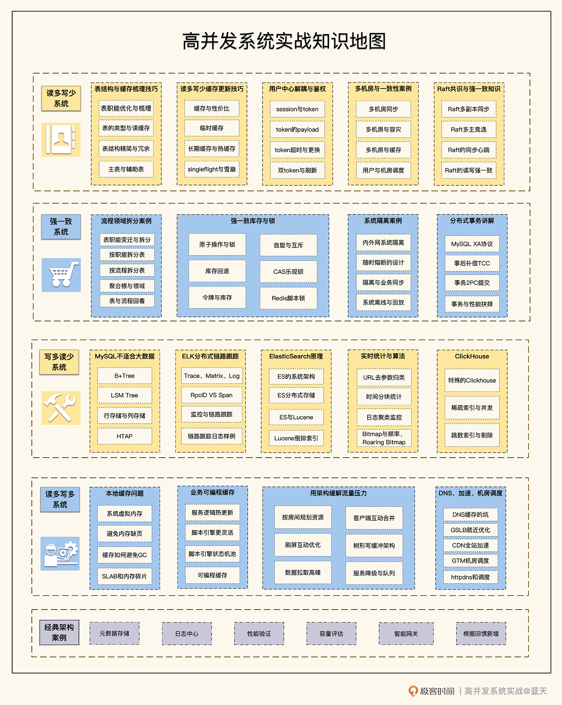
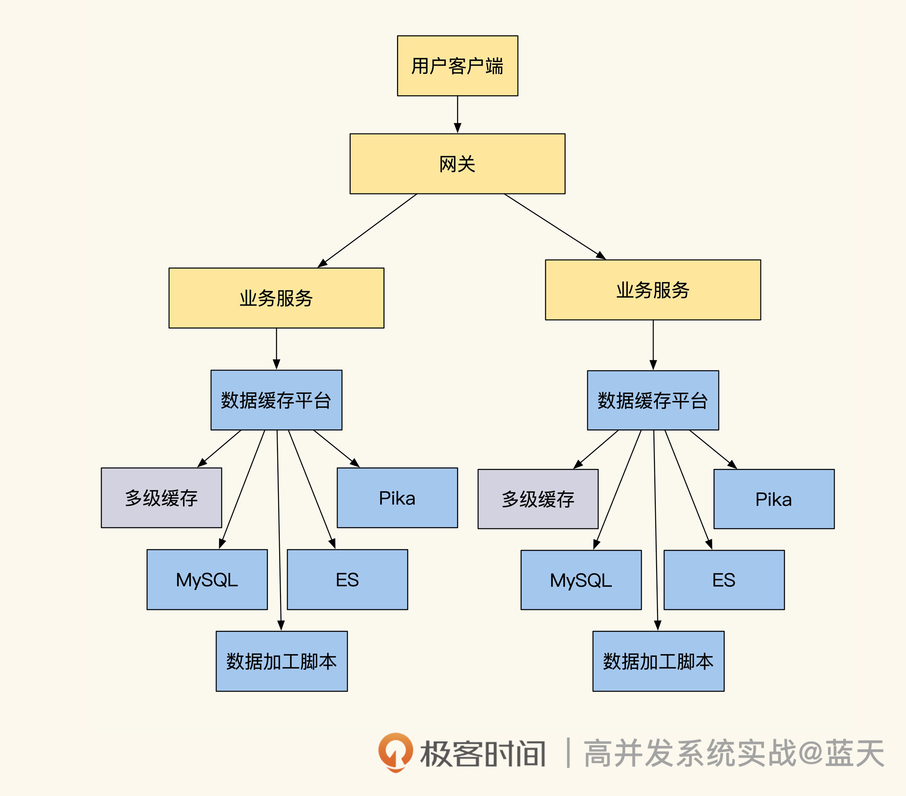

# 课程介绍

> 极客时间：[《高并发系统实战课》](https://time.geekbang.org/column/intro/100309001)


## 你将获得

- 大厂系统设计的经典案例
- 深度拆解 4 大系统改造方案
- 30+ 性能问题诊断与解决思路
- 一套完整的高并发学习路径

## 课程介绍

互联网已经迈入高并发时代，大厂与创业公司之间的技术壁垒在不断加码。是否具有高并发系统实践经验，成为检验工程师技术能力的重要指标。从个人职业发展看，**具备高并发系统改造优化的经验和能力**，就能迅速建立自己的技术优势，不但能从容面试、晋升，更能**提升技术竞争力**，为未来成为架构师奠定基础。

近年来，高并发相关知识也成了**大厂考核的标配**。我们经常能看到类似下面这类问题：

- 为什么百万并发系统不能直接使用 MySQL 服务？
- 为什么 Redis 内存比磁盘用更多的空间？
- 怎么保证条件查询缓存的数据一致性？
- 为什么高级语言不能直接做业务缓存服务？

问题五花八门，但最终考察的是你是否具备高并发系统的底层知识，是否具备解决复杂技术问题的系统设计思路与方法。

本课程将结合徐长龙老师十五年来的从业经验，归纳总结高并发系统领域的关键问题与解决方案。同时，课程还选择了**用户中心、电商系统、直播系统等经典业务案例**，针对系统特性逐一解决技术改造的重难点问题，梳理出一条高效的高并发学习路径，带你真正掌握高并发。


## 课程设计



**读多写少的系统**
从互联网最典型的读多写少系统入门，围绕用户中心的案例，重点讲解数据梳理、数据缓存、加缓存后如何保证数据一致性等问题。通过这部分学习，你会从熟悉的业务视角跳出来，并为后续分布式和强一致的学习打下基础。

**强一致性的电商系统**
以最典型的电商系统为例，讲解强一致性系统如何优化。这类系统主要需要从拆分、错峰、隔离、协调几个方面优化。学完这部分内容，你会加深对系统隔离、同步降级和库存锁等内容的认识，真正把握分布式事务组件的运作规律。

**写多读少的系统**
写多读少系统，涉及到大量数据如何落盘、如何传输、存储、压缩，还有冷热数据切换备份以及索引查询等多方面问题。学完这部分内容，你将掌握分布式数据服务的核心思路，并学会如何定制一个更匹配业务的链路跟踪系统。

**读多写多的直播系统**
重点讲解如何用内存数据做业务服务、无需热重启的脚本引擎集成，以及 CDN 和业务流量调度的相关知识。通过这部分内容，你将学会如何处理直播场景高并发优化的一系列挑战。

**内网建设案例讲解**
对于流量刚成长起来的业务，这一章很有参考价值。你将看到各类项目方案和有趣实用的设计，帮你应对业务流量增长带来的冲击。此外，还会补充一些头部开源解决方案，带你拓宽视野。


## 课程目录


# 开篇词

## 开篇词｜高并发系统，技术实力的试金石

你好，我是徐长龙，欢迎加入我的高并发实战课。

我目前在极客时间担任架构师一职，在此之前从事架构已有十几年，曾就职于穷游网、微博、好未来，**主要做老系统的高并发迁移与改造**，对 RPC 建设、服务化、框架、分布式链路跟踪监控以及 Kubernetes 管理平台拥有丰富的经验。


我个人对计算机技术有浓厚的兴趣，始终在主动学习各种技术，早年曾活跃在 Swoole 社区、PHP 开发者大会。


作为一名一线技术老兵，回顾我这么多年职业生涯的发展关键节点，总是和“高并发系统改造”密切相关。


### 为什么大厂这么重视高并发？

说起高并发系统，你可能**既熟悉又陌生。**

熟悉是因为我们生活中常用的服务都属于高并发系统，比如淘宝、微博、美团、饿了么、12306、滴滴等等。


说它陌生，则是因为现实中只有少部分研发同学才能真正接触到这类系统，更多同学的刚需可能会局限于大厂面试。比如你是否也刷过这些问题：

**1. 为什么百万并发系统不能直接使用 MySQL 服务？**

**2. 为什么 Redis 内存相比磁盘，需要用更多的空间？**

**3. 怎么保证条件查询缓存的数据一致性？**

**4. 为什么高级语言不能直接做业务缓存服务？**


那么大厂究竟关注的是什么呢？我们又该怎么看待高并发？

无论问题多么花哨，归根结底其实就一句话：**大厂看重的是你解决问题的思路和方法，而支撑你去完美回应这些的是更深层次的系统设计方向和原理**。


比如说，上面我们提到的为什么百万并发不能直接使用 MySQL 服务，没有足够积累的话，你回答的大概是因为太高的并发查询会导致 MySQL 缓慢，然后简单地讲讲如何用缓存抵挡流量。

但是如果你面的是更高级别的岗位，面试官想要的其实是让你讲讲 MySQL 数据库为什么不能提供这么大的并发服务，同时你需要深入一起讨论下分布式数据库索引、存储、数据分片、存算分离等相关知识。


我们知道，互联网服务的核心价值就是流量，流量越大，平台的可能性和空间就越大，所以这也是为什么大厂倾向于有高并发经验的研发。2014 年后，互联网迈入高并发时代，大厂与创业公司之间的技术壁垒一直在不断加码，高并发相关人才从早几年的趋势已然成为如今的大厂标配。


**近几年云服务厂商的基础建设越来越成熟**，他们直接提供了无感的分布式服务支撑，这进一步减少了我们亲自动手实践的机会，**这会导致很多架构师的工作只剩下选厂商、选服务、如何快速接入和如何节省成本**。


所以我们需正视，高并发在大厂与小厂之间确实建起了一道墙，想跨越它，系统学习底层知识、实践高并发场景就是必经之路。


### 进阶高并发，最重要的是项目级实战

那具体怎么跨越？可以参考我的经历。

2007 年我刚毕业那会儿，国内的技术环境还谈不上什么高并发，我的工作局限在小流量场景，**最多就是想想代码的可复用性和业务逻辑的完整性，而市场上最不缺的就是我这个阶段的研发**。被套牢在业务逻辑实现里的日子，我开始关注各种技术，但对开源和系统底层的认识还很浅薄，也不知道该怎么去加深这些知识。


直到我加入穷游网，实际主持老系统高并发改造工作，在 RPC 建设时，因为 RPC 性能瓶颈我碰了一鼻子灰，才真正发现了差距。


之前的一些技巧，不见得适用于更高要求的系统。小流量场景里无伤大雅的问题，系统规模变大后都可能被无限放大，这会给脆弱的系统造成“致命打击”。在高并发场景中，你会发现很多网上开源的自我介绍，跟实践验证的结果大相径庭。


这段经历，让我看问题的思路和视角有了一个很大的转变。

为了弥补自己的不足，我**阅读了大量计算机系统著作**，恶补底层知识。在相关技术社区与同好激烈地讨论，在项目中我动手实测过大量的开源，也对他们提了很多改进 issue 建议。


总之，**学习、实践、交流**多管齐下，还是非常有成效的，很快我加入了微博广告部，从事基础架构方面的相关工作。


微博是我的一个黄金成长期，在这里体验了不少“有趣但变态的需求”，这里常常**就给两台服务器。就要你去开发服务微博全网的业务**，还要求你不能崩。期间我还参与建设了很多实用有趣的服务，这让我从三百多人的广告部脱颖而出，得到了珍贵的晋升机会。也是这段经历，让我真正转向基础服务研发，在数据服务和高并发服务方面积累了更多经验。


后来，我陆陆续续收到很多公司或朋友的邀请，为各种系统提供服务改造优化方面的指导。有的系统迁移改造好比蚂蚁搬家，断断续续花了两年多的时间；有的系统崩溃，公司损失达到千万元，叫我去救火；有的系统谁都拆不动，没有人说得清到底该怎么优化……


所以你清楚进阶路径了吗？学习、实践、交流会是最实用的方法，最终帮助你建立系统化的思维。


你可以先从手边的项目开始，比如对你所在企业的现有系统进行高并发改造，注意不要只阅读理论，而是要一边分析实践，一边用压测去验证。风险可控的话，推荐你可以先找一些无关紧要的小系统实践。


### 如何实践高并发？

那么具体如何改造呢？后面这四步最关键：**识别系统类型、完善监控系统、梳理改造要点、小步改造验证**。


以第一步为例，我们可以按照数据特征给系统归类，分别为**读多写少、强一致性、写多读少、读多写多**这四种类型。确定了系统的类型，就等同于确定了具体的优化方向。

而这个专栏就会针对这四个优化方向，带你梳理关键改造点。无论你需要构建高并发系统，还是面临业务流量增长或是系统改造升级，都能在这里找到参考。


这里我梳理了课程的知识结构图，下面结合图解说明一下课程的设计思路：


#### 读多写少的系统

我会以占比最高的“读多写少”系统带你入门，梳理和改造用户中心项目。**这类系统的优化工作会聚焦于如何通过缓存分担数据库查询压力**，

所以我们的学习重点就是做好缓存，包括但不限于**数据梳理、做数据缓存、加缓存后保证数据一致性**等等工作。


另外，为了帮你从单纯的业务实现思想中“跳出来”，我们还会一起拓展下主从同步延迟和多机房同步的相关知识，为后续学习分布式和强一致打好基础。


#### 强一致性的电商系统

这一章我们会以最典型的电商系统为例，学习要求更高的强一致性系统。


这类系统的主要挑战是**承接高并发流量的同时，还要做好系统隔离性、事务一致性以及库存高并发争抢不超卖**。

我会和你详细讨论拆分实践的要点，让你**加深对系统隔离、同步降级和库存锁**等相关内容的认识，弄明白分布式事务组件的运作规律。了解这些，你会更容易看透一些基础架构组件的设计初衷。


#### 写多读少的系统如何做链路跟踪

接下来是高并发写系统，它涉及大量数据如何落盘、如何传输、存储、压缩，还有冷热数据的切换备份、索引查询等多方面问题，我会一一为你展开分析。我还会给你分享一个**全量日志分布式链路跟踪系统的完整案例**，帮你熟悉并发写场景落地的方方面面。


另外，行业内写高并发的服务通常需要借助一些开源才能实现，我还会介绍一些相关开源实现原理和应用方向，完善你的“兵器库”。


#### 读多写多的直播系统

读多写多系统是最复杂的系统类型，就像最火热的游戏、直播服务都属于这个类型。其中很多技术都属于行业天花板级别，毕竟线上稍有点问题，都极其影响用户体验。


这类系统数据基本**都是在内存中直接对外服务**，同时服务都要**拆成很小的单元**，**数据是周期落到磁盘或数据库，而不是实时更新到数据库**。

因此我们的学习重点是如何用内存数据做业务服务、系统无需重启热更新、脚本引擎集成、脚本与服务互动交换数据、直播场景高并发优化、一些关于网络优化 CDN 和 DNS、知识以及业务流量调度、客户端本地缓存等相关知识。


#### 第五章 内网建设案例讲解

最后一章，我精选了一些案例，也是我特别添加的，这里既有让人眼前一亮的项目方案，也有很多有趣实用的设计，主要目的是帮助你**开拓视野**，未来能自行实现一些基础服务设计。


对于流量刚成长起来的业务，这一章很有参考价值，能让你的系统在后续业务流量增长时，扛住需求冲击并能快速解决问题。同时，相信你对头部开源解决方案也会有更深的理解。

一起到达目的地之后，我希望你已经有了更加宏观的视野，通过多项目实践系统了解了高并发。在面临各类相关问题时，能针对不同类型的系统，实现更匹配业务需求和技术条件的改造优化。


高并发不会是区别大厂、小厂工程师的标准，却是**检验技术实力的一道关**。课程搭建的学习场景是个良好起点，为你创造机会提高能力，期待看到你未来的成长突破！


# 用户中心：读多写少的系统高并发优化实践


## 01｜结构梳理：大并发下，你的数据库表可能成为性能隐患

这一章我们主要讲解怎么对读多写少的系统进行高并发优化，我会拿**用户中心**作为例子，带你来看改造的几个要点。


用户中心是一个典型的读多写少系统，可以说我们大部分的系统都属于这种类型，而这类系统通过缓存就能获得很好的性能提升。并且在流量增大后，用户中心通常是系统改造中第一个要优化的模块，因为它常常和多个系统重度耦合，所以梳理这个模块对整个系统后续的高并发改造非常重要。


今天这节课，我会带你对**读多写少**的用户中心做数据整理优化，这会让数据更容易缓存。数据梳理是一个很重要的技巧，任何老系统在做高并发改造时都建议先做一次**表的梳理**。


**因为老系统在使用数据库的时候存在很多问题**，比如实体表字段过多、表查询维度和用途多样、表之间关系混乱且存在 m:n 情况……这些问题会让缓存改造十分困难，**严重拖慢改造进度**。


如果我们从数据结构出发，先对一些场景进行改造，然后再去做缓存，会让之后的改造变得简单很多。所以先**梳理数据库结构，再对系统进行高并发改造是很有帮助的**。


这节课我会给你讲几个具体的规律和思路，帮助你快速判断当前的表结构是否适用于高并发场景，方便后续的系统升级和改造。


### 精简数据会有更好的性能

为了方便讨论，我先对用户中心做一些简单介绍，如图：


> 是不是跟rabc基于角色的权限控制系统很像？

用户中心的主要功能是**维护用户信息、用户权限和登录状态**，它保存的数据大部分都属于**读多写少的数据。**

用户中心常见的优化方式主要是将用户中心和业务彻底拆开，不再与业务耦合，并适当增加缓存来提高系统性能。


我举一个简单的例子：当时整表内有接近 2000 万的账号信息，我**对表的功能和字段进行了业务解耦和精简**，让用户中心的账户表里只会保留用户登陆所需的账号、密码：

```sql
CREATE TABLE `account` (
  `id` int(10) NOT NULL AUTO_INCREMENT,
  `account` char(32) COLLATE utf8mb4_unicode_ci NOT NULL,
  `password` char(32) COLLATE utf8mb4_unicode_ci NOT NULL,
  `salt` char(16) COLLATE utf8mb4_unicode_ci NOT NULL,
  `status` tinyint(3) NOT NULL DEFAULT '0',
  `update_time` int(10) NOT NULL,
  `create_time` int(10) NOT NULL,
  PRIMARY KEY (`id`),
  UNIQUE KEY `login_account` (`account`)
) ENGINE=InnoDB DEFAULT CHARSET=utf8mb4 COLLATE=utf8mb4_unicode_ci;

```

我们知道数据库是系统的核心，如果它缓慢，那么我们所有的业务都会受它影响，我们的服务很少能超过核心数据库的性能上限。

而我们**减少账号表字段的核心在于，长度小的数据在吞吐、查询、传输上都会很快，也会更好管理和缓存**。


精简后的表拥有更少的字段，对应的业务用途也会比较单纯。其业务主要功能就是检测用户登陆账号密码是否正确，除此之外平时不会有其他访问，也不会被用于其他范围查询上。可想而知这种表的性能一定极好，虽然存储两千万账号，但是整体表现很不错。


不过你要注意，**精简数据量虽然能换来更好的响应速度，但不提倡过度设计**。因为表字段如果缺少冗余会导致业务实现更为繁琐，比如账户表如果把昵称和头像删减掉，我们每次登录就需要多读取一次数据库，并且需要一直关注账户表的缓存同步更新；但如果我们在账户表中保留用户昵称和头像，在登陆验证后直接就可以继续其他业务逻辑了，无需再查询一次数据库。


所以你看，有些查询往往会因为精简一两个字段就多查一次数据库，并且还要考虑缓存同步问题，实在是得不偿失，因此我们要在“更多的字段”和“更少的职能”之间找到平衡。


### 数据的归类及深入整理


02｜缓存一致：读多写少时，如何解决数据更新缓存不同步？应学14分钟


03｜Token：如何降低用户身份鉴权的流量压力？应学8分钟


04｜同城双活：如何实现机房之间的数据同步？应学13分钟


05｜共识Raft：如何保证多机房数据的一致性？应学12分钟


# 电商系统：强一致性系统如何改造


## 06｜领域拆分：如何合理地拆分系统？


07｜强一致锁：如何解决高并发下的库存争抢问题？应学15分钟


08｜系统隔离：如何应对高并发流量冲击？应学11分钟


09｜分布式事务：多服务的2PC、TCC都是怎么实现的？应学17分钟


答疑课堂｜思考题答案（一）应学1分钟


# 基础服务：写多读少的链路跟踪系统


10｜稀疏索引：为什么高并发写不推荐关系数据库？应学14分钟


11｜链路追踪：如何定制一个分布式链路跟踪系统 ？应学20分钟


12｜引擎分片：Elasticsearch如何实现大数据检索？应学13分钟


13 | 实时统计：链路跟踪实时计算中的实用算法应学14分钟


14｜跳数索引：后起新秀ClickHouse应学20分钟


15｜实践方案：如何用C++自实现链路跟踪？应学14分钟


# 直播互动：读多写多系统如何实现


16｜本地缓存：用本地缓存做服务会遇到哪些坑？应学13分钟


17｜业务脚本：为什么说可编程订阅式缓存服务更有用？应学12分钟


18｜流量拆分：如何通过架构设计缓解流量压力？应学14分钟


19｜流量调度：DNS、全站加速及机房负载均衡应学17分钟


# 内网建设：系统如何降低业务复杂度


## 20｜数据引擎：统一缓存数据平台

通过前四章，我们已经了解了不同类型的系统如何优化，其中有哪些关键技术点。不过除了这些基础知识之外，我们还要了解大型互联网是如何设计支撑一个高并发系统的。所以，在这个章节里我精选了几个案例，帮助你打开视野，看看都有哪些实用的内网服务设计。


任何一个互联网公司都会有几个核心盈利的业务，我们经常会给基础核心业务做一些增值服务，以此来扩大我们的服务范围以及构建产业链及产业生态，但是这些增值服务需要核心项目的数据及交互才能更好地提供服务。


但核心系统如果对增值业务系统做太多的耦合适配，就会导致业务系统变得十分复杂，如何能既让增值服务拿到核心系统的资源，又能减少系统之间的耦合？


这节课我会重点带你了解**一款内网主动缓存支撑的中间件**，通过这个中间件，可以很方便地实现高性能实体数据访问及缓存更新。


### 回顾临时缓存的实现

我们先回顾下之前展示的临时缓存实现，这个代码摘自之前的[第二节课](https://time.geekbang.org/column/article/596644)。

```go
// 尝试从缓存中直接获取用户信息
userinfo, err := Redis.Get("user_info_9527")
if err != nil {
  return nil, err
}

//缓存命中找到，直接返回用户信息
if userinfo != nil {
  return userinfo, nil
}

//没有命中缓存，从数据库中获取
userinfo, err := userInfoModel.GetUserInfoById(9527)
if err != nil {
  return nil, err
}

//查找到用户信息
if userinfo != nil {
  //将用户信息缓存，并设置TTL超时时间让其60秒后失效
  Redis.Set("user_info_9527", userinfo, 60)
  return userinfo, nil
}

// 没有找到，放一个空数据进去，短期内不再访问数据库
// 可选，这个是用来预防缓存穿透查询攻击的
Redis.Set("user_info_9527", "", 30)
return nil, nil

```

上述代码演示了临时缓存提高读性能的常用方式：即查找用户信息时直接用 ID 从缓存中进行查找，如果在缓存中没有找到，那么会从数据库中回源查找数据，找到数据后，再将数据写入缓存方便下次查询。


相对来说这个实现很简单，但是如果我们所有业务代码都需要去这么写，工作量还是很大的。


即便我们会对这类实现做一些封装，但封装的功能在静态语言中并不是很通用，性能也不好。那有没有什么方式能统一解决这类问题，减少我们的重复工作量呢？


### 实体数据主动缓存

之前我们在[第二节课](https://time.geekbang.org/column/article/596644)讲过**实体数据**最容易做缓存，实体数据的缓存 key 可以设计为**前缀 + 主键 ID 这种形式** 。通过这个设计，我们只要拥有实体的 ID，就可以直接在缓存中获取到实体的数据了。

为了降低重复的工作量，我们对这个方式做个提炼，单独将这个流程做成中间件，具体实现如下图：


​                                                                              通过canal监控实现简单的主动推送数据缓存


结合上图，我们分析一下这个中间件的工作原理。我们**通过 canal 来监控 MySQL 数据库的 binlog 日志**，当有数据变更时，消息监听端会收到变更通知。

因为变更消息包含变更的表名和所有变更数据的所有主键 ID，所以这时我们可以通过主键 ID，回到数据库主库查询出最新的实体数据，再根据需要来加工这个数据，并将其推送数据到缓存当中。


而从过往经验来看，**很多刚变动的数据有很大概率会被马上读取**。所以，这个实现会有较好的缓存命中率。同时，当我们的数据被缓存后会根据配置设置一个 TTL，缓存在一段时间没有被读取的话，就会被 LRU 策略淘汰掉，这样还能节省缓存空间。


如果你仔细思考一下，就会发现这个设计还是有缺陷：如果业务系统无法从缓存中拿到所需数据，还是要回数据库查找数据，并且再次将数据放到缓存当中。这和我们设计初衷不一致。为此，我们还需要配套一个缓存查询服务，请看下图：


如上图所示，当我们查找缓存时如果没找到数据，中间件就会通过 Key 识别出待查数据属于数据库的哪个表和处理脚本，再按配置执行脚本查询数据库做数据加工，然后中间件将获取的数据回填到缓存当中，最后再返回结果。


为了提高查询效率，建议查询服务使用类似 Redis 的纯文本长链接协议，同时还需要支持批量获取功能，比如 Redis 的 mget 实现。如果我们的数据支撑架构很复杂，并且一次查询的数据量很大，还可以做成批量并发处理来提高系统吞吐性能。


落地缓存服务还有一些实操的技巧，我们一起看看。


**如果查询缓存时数据不存在，会导致请求缓存穿透的问题**，请求量很大核心数据库就会崩溃。为了预防这类问题我们需要在缓存中加一个特殊标志，这样查询服务查不到数据时，就会直接返回数据不存在。


有时要查询的数据分布在**数据库的多个表内，我们需要把多个表的数据组合起来**或**需要刷新多个缓存**，所以这要求我们的缓存服务能提供定制脚本，这样才能实现业务数据的刷新。


另外，由于是数据库和缓存这两个系统之间的同步，为了更好的排查缓存同步问题，建议在数据库中和缓存中都记录数据最后更新的时间，方便之后对比。


到这里，我们的服务就基本完整了。当业务需要按 id 查找数据时，直接调用数据中间件即可获取到最新的数据，而无需重复实现，开发过程变得简单很多。


### L1 缓存及热点缓存延期

上面我们设计的缓存中间件已经能够应付大部分**临时缓存**所需的场景。但如果碰到大并发查询的场景，缓存出现缺失或过期的情况，就会给数据库造成很大压力，为此还需要继续改进这个服务。


改进方式就是**统计查询次数，判断被查询的 key 是否是热点缓存**。举个例子，比如通过时间块异步统计 5 分钟内缓存 key 被访问的次数，单位时间内超过设定次数（根据业务实现设定）就是热点缓存。


具体的**热点缓存统计和续约**流程如下图所示：


对照流程图可以看到，热点统计服务获取了被认定是热点的 key 之后，会按统计次数大小做区分。如果是**很高频率**访问的 key 会被**定期从脚本推送到 L1 缓存**中（L1 缓存可以部署在每台业务服务器上，或每几台业务服务器共用一个 L1 缓存）。


当业务查询数据时，业务的查询 SDK 驱动会通过热点 key 配置，检测当前 key 是否为热点 key，如果是会去 L1 缓存获取，如果不是热点缓存会去集群缓存获取数据。

而**相对频率较高**的 key 热点缓存服务，只会定期通知查询服务刷新对应的 key，或做 TTL 刷新续期的操作。


当我们被查询的数据退热后，我们的数据时间块的访问统计数值会下降，这时 L1 热点缓存推送或 TTL 续期会停止继续操作，不久后数据会 TTL 过期。


增加这个功能后，这个缓存中间件就可以改名叫做数据缓存平台了，不过它和真正的平台还有一些差距，因为这个平台只能提供实体数据的缓存，无法灵活加工推送的数据，一些业务结构代码还要人工实现。


### 关系数据缓存

可以看到，目前我们的缓存还仅限于实体数据的缓存，并不支持关系数据库的缓存。

为此，我们首先需要**改进消息监听服务**，将它做成 Kafka Group Consumer 服务，同时实现可动态扩容，这能提升系统的并行数据处理能力，支持更大量的并发修改。

其次，对于量级更高的数据缓存系统，还可以引入多种数据引擎共同提供不同的数据支撑服务，比如：

- lua 脚本引擎（具体可以回顾[第十七节课](https://time.geekbang.org/column/article/608526)）是数据推送的“发动机”，能帮我们把数据动态同步到多个数据源；
- Elasticsearch 负责提供全文检索功能；
- **Pika 负责提供大容量 KV 查询功能**；
- ClickHouse 负责提供实时查询数据的汇总统计功能；
- MySQL 引擎负责支撑新维度的数据查询。

你有没有发现这几个引擎我们在之前的课里都有涉及？唯一你可能感到有点陌生的就是 Pika，不过它也没那么复杂，可以理解成 RocksDB 的加强版。

这里我没有把每个引擎一一展开，但概括了它们各自擅长的方面。如果你有兴趣深入研究的话，可以自行探索，看看不同引擎适合用在什么业务场景中。


### 多数据引擎平台

一个理想状态的多数据引擎平台是十分庞大的，需要投入很多人力建设，它能够给我们提供强大的数据查询及分析能力，并且接入简单方便，能够大大促进我们的业务开发效率。

为了让你有个整体认知，这里我特意画了一张**多数据引擎平台的架构图**，帮助你理解数据引擎和缓存以及数据更新之间的关系，如下图所示：


可以看到，这时基础数据服务已经做成了一个平台。MySQL 数据更新时，会通过我们订阅的变更消息，根据数据加工过滤进程，将数据推送到不同的引擎当中，对外提供数据统计、大数据 KV、内存缓存、全文检索以及 MySQL 异构数据查询的服务。


具体业务需要用到核心业务基础数据时，需要在该平台申请数据访问授权。如果还有特殊需要，可以向平台提交数据加工 lua 脚本。高流量的业务甚至可以申请独立部署一套数据支撑平台。


### 总结

这节课我们一起学习了统一缓存数据平台的实现方案，有了这个中间件，研发效率会大大提高。在使用数据支撑组件之前，是**业务自己实现的缓存以及多数据源的同步**，需要我们业务重复写大量关于缓存刷新的逻辑，如下图：


而使用数据缓存平台后，我们省去了很多人工实现的工作量，**研发同学只需要在平台里做好配置，就能坐享中间件提供的强大多级缓存功能、多种数据引擎提供的数据查询服务**，如下图所示：




我们回顾下中间件的工作原理。首先我们通过 Canal 订阅 MySQL 数据库的 binlog，获取数据的变更消息。然后，缓存平台根据订阅变更信息实现触发式的缓存更新。另外，结合客户端 SDK 及缓存查询服务实现热点数据的识别，即可实现多级缓存服务。


可以说, 数据是我们系统的心脏，如数据引擎能力足够强大，能做的事情会变得更多。数据支撑平台最大的特点在于，将我们的数据和各种数据引擎结合起来，从而实现更强大的数据服务能力。


大公司的核心系统通常会用多引擎组合的方式，共同提供数据支撑数据服务，甚至有些服务的服务端只需做配置就可以得到这些功能，这样业务实现更轻量，能给业务创造更广阔的增值空间。


### 思考题

L1 缓存使用 BloomFilter 来减少 L1 缓存查询，那么 BloomFilter 的 hash 列表如何更新到客户端呢？

> chatGPT回答

Bloom Filter 的 hash 列表是在服务端维护的，客户端通过查询服务端的 Bloom Filter 来判断元素是否可能存在于 L1 缓存中。这样可以减少对底层存储系统的查询负载，提高查询效率。


21｜业务缓存：元数据服务如何实现？应学16分钟


22｜存储成本：如何推算日志中心的实现成本？应学18分钟


## 23｜网关编程：如何通过用户网关和缓存降低研发成本？


如果说用户的流量就像波涛汹涌的海浪，那网关就是防御冲击的堤坝。在大型的互联网项目里，网关必不可少，是我们目前最好用的防御手段。通过网关，我们能把大量的流量分流到各个服务上，如果配合使用 Lua 脚本引擎提供的一些能力，还能大大降低系统的耦合度和性能损耗，节约我们的成本。


一般来说，网关分为外网网关和内网网关。外网网关主要负责做**限流、入侵预防、请求转发**等工作，常见方式是使用 Nginx + Lua 做类似的工作；

而最近几年，内网网关发展出现了各种定制功能的网关，比如 ServiceMesh、SideCar 等方式，以及类似 Kong、Nginx Unit 等，它们的用途虽然有差异，但是主要功能还是做**负载均衡、流量管理调度和入侵预防**这些工作。


那么网关到底提供了哪些至关重要的功能支持呢？这节课我们就来分析分析。


### 外网网关功能

我们先从外网网关的用法说起，我会给你分享两类外网网关的实用设计，两个设计可以帮助我们预防入侵和接触业务的依赖。

#### 蜘蛛嗅探识别

流量大一些的网站都有过网站被攻击、被蜘蛛抓取，甚至被黑客入侵的经历。有了网关，我们就能实现限速和入侵检测功能，预防一些常见的入侵。


这里我主要想和你分享一下，非法引用和机器人抓取这两类最常见、也最严重的问题要如何应对。


一般来说，常见的非法使用，会大量引用我们的网络资源。对此，可以用**检测请求 refer** 方式来预防，如果 refer 不是本站域名就拒绝用户请求，这种方式可以降低我们的资源被非法使用的风险。


另一类问题就是机器人抓取。识别机器人抓取我们需要一些小技巧。


首先是**划定范围**，一般这类用户有两种：一种是匿名的用户请求，我们需要根据 IP 记录统计**请求排行时间块**，分析请求热点 IP，请求频率过高的 IP 会被筛选关注；另外一种是登录用户，这种我们用时间块统计记录单个用户的请求次数及频率，超过一定程度就拒绝请求，同时将用户列入怀疑名单，方便后续进一步确认。


**想要确认怀疑名单中用户的行为**。具体怎么实现呢？这里我给你分享一个误判概率比较低的技巧。

我们可以在被怀疑用户请求时，通过网关对特定用户或 IP 动态注入 **JS 嗅探代码**，这个代码会在 Cookie 及 LocalStorage 内写入特殊密文。（与前端代码配合）


我们的前端 JS 代码检测到密文后，就会进入反机器人模式。反机器人模式可以识别客户端是否有鼠标移动及点击动作，以此判断用户是否为机器人。确认用户没问题以后，才会对服务端发送再次签名的密文请求解锁。如果客户端一直没有回馈，就自动将怀疑用户列为准备封禁的用户，并封禁该请求，当一个 IP 被封禁的请求达到一定程度就会进行封禁。


不过这种设计有一个缺点——对 SEO 很不友好，各大搜索引擎的机器人都会被拒绝。我们之前的做法是用白名单方式避免机器人被阻拦，具体会根据机器人的 UserAgent 放行各大引擎的机器人，并定期人工审核确认搜索引擎机器人的 IP。


除此之外，对于一些核心重要的接口，我们可以增加“必须增加带时间的签名，方可请求，否则拒绝服务”这样的规则，来避免一些机器人抓取。（签名）


#### 网关鉴权与用户中心解耦


刚才我分享了如何利用网关来阻挡一些非法用户骚扰的技巧，其实网关除了防御攻击、避免资源被恶意消耗的作用外，还能帮我们解除一些业务依赖。

还记得我们[第三节课](https://time.geekbang.org/column/article/597664)提到的用户登陆设计么？每个业务可以不依赖用户中心来验证用户合法性，用户鉴权普遍会通过每个子业务集成用户中心的 SDK 来实现校验逻辑统一。


不过这也牵扯到一个问题，那就是 SDK 同步依赖升级问题。基础公共组件通常会提供 SDK，这样做业务开发更加方便，而仅仅通过 API 提供服务的话，有一些特殊的操作就需要重复实现，但是这个 SDK 一旦放出，我们后续就要做好同时维护多个版本 SDK 在线工作的心理准备。


下图是[第三节课](https://time.geekbang.org/column/article/597664)用 SDK 鉴权 token 方式，以及通过用户中心接口鉴权的效果：


如上图，集成 SDK 可以让业务自行校验用户身份而无需请求用户中心，但是 SDK 会有多个版本，后续用户中心升级会碰到很大阻力，因为要兼顾我们所有的“用户”业务。


SDK 属于植入对方项目内的组件，为了确保稳定性，很多项目不会频繁升级修改组件的版本，这导致了用户中心很难升级。每一次基础服务的大升级，都需要大量的人力配合同步更新服务的 SDK，加大了项目的维护难度。


那么除了使用 SDK 以外，还有什么方式能够避免这种组件的耦合呢？这里我分享一种有趣的设计，那就是把用户登陆鉴权的功能放在网关。


我用画图的方式描述了请求过程，你可以对照示意图听我继续分析。


结合上图，我们来看看这个实现的工作流程。用户业务请求发到业务接口时，首先会由网关来鉴定请求用户的身份。


如果鉴定通过，用户的信息就会通过 header 传递给后面的服务，而业务的 API 无需关注用户中心的实现细节，只需接收 header 中附带的用户信息即可直接工作。如果业务上还要求用户必须登录才能使用，我们可以在业务中增加一个对请求 header 是否有 uid 的判断。如果没有 uid，则给前端返回统一的错误码，提醒用户需要先登陆。


不难看出，这种鉴权服务的设计，解耦了业务和用户中心这两个模块。用户中心如果有逻辑变更，也不需要业务配合升级。

除了常见的登陆鉴权外，我们可以对一些域名开启 RBAC 服务，根据不同业务的需要定制不同的 RBAC、ABAC 服务，并且通过网关对不同的用户开启不同的权限以及灰度测试等功能。


### 内网网关服务

了解了外网的两种妙用，我们再看看内网的功能。它可以提供失败重试服务和平滑重启机制，我们分别来看看。


#### 失败重试

当我们的项目发布升级期间需要重启，或者发生崩溃的故障，服务会短暂不可用。这时如果有用户发出服务请求，会因为后端没有响应返回 504 错误，这样用户体验很不好。


面对这种情况，我们可以利用内网网关的自动重试功能，这样在请求发到后端，并且服务返回 500、403 或 504 错误时，网关不会马上返回错误，而是让请求等待一会儿后，再次**重试**，**或者直接返回上次的缓存内容**。这样就能实现业务热更新的平滑升级，让服务看起来更稳定，用户也不会对线上升级产生明显感知。


#### 平滑重启

接下来，我再说说平滑重启的机制。


在我们的服务升级时，可以不让服务进程收到 kill 信号后直接退出，而是制作平滑重启功能，即先让服务停止接收新的请求，等待之前的请求处理完成，如果等待超过 10 秒则直接退出。


通过这个机制，用户请求处理就不会被中断，这样就能保证正在处理中的业务事务是完整的，否则很有可能会导致业务事务不一致，或只做了一半的情况。

有了这个重试和平滑重启的机制后，我们可以随时在线升级发布我们的代码，发布新的功能。不过开启这个功能后，可能会屏蔽一些线上的故障，这时候可以配合网关服务的监控，来帮我们检测系统的状态。


### 内外网关综合应用

前面我们说了外网网关和内网网关独立提供的功能，接下来我们再看看二者的综合应用。


#### 服务接口缓存

首先来看网关接口缓存功能，也就是利用网关实现一些接口返回内容的缓存，适合用在服务降级场景，用它短暂地缓解用户流量的冲击，或者用于降低内网流量的冲击。


具体实现如下图所示：


结合上图，我们可以看到，网关实现的缓存基本都是用临时缓存 + TTL 方式实现的。当用户请求服务端时，被缓存的 API 如果之前已经被请求过，并且缓存还没有过期的话，就会直接返回缓存内容给客户端。这个方式能大大降低后端的数据服务压力。


**不过每一种技术选择，都是反复权衡的结果，这个方式是牺牲了数据的强一致性才实现的**。另外，这个方式对缓存能力的性能要求比较高，必须保证网关缓存可以扛得住外网流量的 QPS。


如果想预防穿透流量过多，也可以通过脚本定期刷新缓存数据，网关查到相关缓存就直接返回，如果没有命中，才会将真正请求到服务器后端服务上并缓存结果。这样实现的方式更加灵活，数据的一致性会更好，只是实现起来需要人力去写好维护代码。


当然这种缓存的数据长度建议不超过 5KB（10w QPS X 5KB = 488MB/s），因为数据太长，会拖慢我们的缓存服务响应速度。


#### 服务监控

最后我们再说说利用网关做服务监控的问题。我们先思考这样一个问题，在没有链路跟踪之前，通常会怎么做监控呢？


事实上，大部分系统都是通过网关的日志做监控的。我们可以通过网关访问日志中的 Http Code 来判断业务是否正常。配合不同请求的耗时信息，就能完成简单的系统监控功能。


为了帮助你进一步理解，下面这张图画的是如何通过网关监控服务，你可以对照图片继续听我分析。


为了方便判断线上情况，我们需要先统计信息。具体方法就是周期性地聚合访问日志中的错误，将其汇总起来，通过聚合汇总不同接口的请求的错误个数，格式类似“30 秒内出现 500 错误 20 个，504 报错 15 个，某域名接口响应速度大于 1 秒的情况有 40 次”来分析服务状态。


和其他监控不同，网关监控的方式可以监控到所有业务，只是粒度会大一些，不失为一个好方法。如果我们结合 Trace，还可以将访问日志中落地 Traceid，这样就能根据 Traceid 进一步排查问题原因，操作更方便，在好未来、极客时间都有类似的实现。


### 总结

这节课我给你分享了网关的很多巧妙用法，包括利用网关预防入侵、解除业务依赖、辅助系统平滑升级、提升用户体验、缓解流量冲击以及实现粒度稍大一些的服务监控。


我画了一张导图帮你总结要点，如下所示：


相信学到这里，你已经体会到了网关的重要性。没错，在我们的系统里，网关有着举足轻重的地位，现在的技术趋势也证明了这一点。随着发展，网关开始区分内网网关和外网网关，它们的功能和发展方向也开始出现差异化。


这里我想重点再聊聊内网网关的发展。最近几年，微服务、Sidecar 技术逐渐流行，和内网网关一样，它们解决的都是内网流量调度和高可用问题。


当然了，传统的内网网关也在更新换代，出现了很多优秀的开源项目，比如 Kong、Apisix、OpenResty，这些网关可以支持 Http2.0 长链接双工通讯和 RPC 协议。


业界对于到底选择 Sidecar Agent 还是用内网网关，一直处于激烈讨论的阶段。而在我看来，随着容器化的流行，内网网关会迎来新的变革。服务发现、服务鉴权、流量调度、数据缓存、服务高可用、服务监控这些服务，最终会统一成一套标准。如果现有的内网网关能降低复杂度，未来会更胜一筹。

==》 apisix


### 思考题

为什么内网都在用网关或实现服务发现功能，而不用内网 DNS 服务来实现这一功能呢？

> chatGPT

内网通常使用网关或实现服务发现功能，而不仅仅依赖内网 DNS 服务来实现服务发现的功能，主要是因为以下几个原因：

1. **动态性和灵活性：** 服务发现通常需要更多的动态性和灵活性，以便及时发现和管理服务的变化。网关或专门的服务发现工具能够更好地应对服务的动态性，而传统的内网 DNS 服务可能不够灵活。
2. **健康检查和负载均衡：** 网关或服务发现工具通常能够提供健康检查和负载均衡等功能，以确保服务的可用性和性能。这些功能对于大规模的服务架构非常重要，而内网 DNS 服务可能无法提供这些高级功能。
3. **多样化的服务发现需求：** 在现代的微服务架构中，服务发现的需求可能更加多样化，需要支持多种协议、多种服务类型和多种环境。网关或专门的服务发现工具通常能够更好地满足这些多样化的需求。
4. **安全性和权限控制：** 网关或服务发现工具通常能够提供更好的安全性和权限控制机制，以确保只有授权的服务可以被发现和访问。这对于保护内网服务的安全性非常重要。


## 24｜性能压测：压测不完善，效果减一半应学

高并发的系统很复杂，所以对这样的系统做并发优化也相当有挑战。很多服务的局部优化，不见得能真正优化整体系统的服务效果，甚至有的尝试还会适得其反，让服务变得不稳定。


在这种情况下，压测就显得更加重要了。通常来说，通过压测可以帮我们做很多事儿，比如确认单个接口、单台服务器、单组服务集群甚至是整个机房整体的性能，方便我们判断服务系统的瓶颈在哪里。而且根据压测得出的结果，也能让我们更清晰地了解系统能够承受多少用户同时访问，为限流设置提供决策依据。


这节课，我们就专门聊聊性能压测里，需要考虑哪些关键因素。


### 压测与架构息息相关

在压测方面，我们很容易踩的一个坑就是盲目相信 QPS 结果，**误以为“接口并发高就等同于系统稳定”，但却忽视了系统业务架构的形态**。

所以在讲压测之前，我们需要先了解一些关于性能与业务架构的相关知识，这能让我们在压测中更清醒。


#### 并行优化

前面我说过，不能盲目相信 QPS 结果，优化的时候要综合分析。为了让你理解这一点，我们结合一个例子来看看。

我们常见的业务会请求多个依赖的服务处理数据，这些都是**串行阻塞等待**的。当一个服务请求过多其他服务时，接口的响应速度和 QPS 就会变得很差。

这个过程，你可以结合后面的示意图看一下：


为了提高性能，有些业务对依赖资源做了优化，通过**并行请求**依赖资源的方式提高接口响应速度。具体的实现请看下图：


如上图，业务请求依赖接口的时候不再是串行阻塞等待处理，而是并行发起请求获取所有结果以后，并行处理业务逻辑，最终合并结果返回给客户端。

这个设计会大大提高接口的响应速度，特别是依赖多个资源的服务。


但是，**这样优化的话有一个副作用，这会加大内网依赖服务的压力，导致内网的服务收到更多的瞬时并发请求**。

如果我们大规模使用这个技巧，**流量大的时候会导致内网请求放大**，比如外网是 1WQPS，而内网流量放大后可能会有 10W QPS，而内网压力过大，就会导致网站整体服务不稳定。


所以，并行请求依赖技巧并不是万能的，我们需要注意依赖服务的承受能力，这个技巧更适合用在读多写少的系统里。对于很多复杂的内网服务，特别是**事务一致性的服务**，如果并发很高，这类服务反而会因为锁争抢超时，无法正常响应。


那问题来了，像刚才例子里这种依赖较多的业务系统，什么样的压测思路才更合理呢？

**我的建议是先做内网服务的压测，确认了内网可以稳定服务的 QPS 上限之后，我们再借此反推外网的 QPS 应该限制在多少**。


#### 临时缓存服务

临时缓存优化也是压测里需要特殊应对的一种情况，其实我们早在[第二节课](https://time.geekbang.org/column/article/596644)就提到过。

临时缓存通常会这样实现，示意图如下所示：


结合上图，我们可以看到，接口请求依赖数据时会优先请求缓存，如果拿到缓存，那么就直接从缓存中获取数据，如果没有缓存直接从数据源获取，这样可以加快我们服务的响应速度。

在通过临时缓存优化的服务做压测的时候，你会看到同参数的请求响应很快，甚至 QPS 也很高，但这不等同于服务的真实性能情况，系统不稳定的隐患仍然存在。为什么这么说呢？


这是因为临时缓存的优化，针对的是会被频繁重复访问的接口，优化之后，接口的第一次请求还是很缓慢。如果某类服务原有接口依赖响应很慢，而且同参数的请求并不频繁，那这类服务的缓存就是形同虚设的。


所以**（临时缓存）这种结构不适合用在低频率访问的业务场景**，压测时我们也要注意这种接口平时在线上的表现。


#### 分片架构

接下来，我们再看看数据分片架构。下图是通过分片缓解压力的架构（我们在[第 18 节课](https://time.geekbang.org/column/article/609716)的时候提到过）：


数据分片架构的服务，会根据一些标识 id 作为分片依据，**期望**将请求均衡地转发到对应分片，但是实际应用时，情况不一定和预期一致。

我结合一个曾经踩过的坑和你分享经验。在线培训的业务里，当时选择了班级 ID 作为分片标识，10W 人在线互动时，实际却只有一个分片对外服务，所有用户都请求到了一个分片上，其他分片没有太多流量。


出现这种情况主要是两个原因：第一，我们的班级 id 很少，这是一个很小的数据范围，所以 hash 的时候如果算法不够分散，就会把数据放到同一个分片上；第二，因为 hash 算法有很多种，不同算法计算出的结果，分散程度也不同，因此有些特征的数据计算结果不会太分散，需要我们验证选择。


为了预防类似的问题，建议你压测时，多拿实际的线上数据做验证，如果总有单个热点分片就需要考虑更换 hash 算法。做好这个测试后，别忘了配合随机数据再压测一次，直到找到最适合业务情况的算法（**hash 算法变更牵连甚广，所以选择和更换时一定要慎重**）。


#### 数据量

除了**架构**情况以外，**数据量**也是影响压测效果的重要因素。

如果**接口通过多条数据来进行计算服务**，就需要考虑到数据量是否会影响到接口的 QPS 和稳定性。如果数据量对接口性能有直接影响，压测时就要针对不同数据量分别做验证。


因为不完善的测试样例，会给大流量服务留下雪崩的隐患，为了尽可能保证测试真实，这类接口在压测时，要尽量采用一些脱敏后的线上真实数据来操作。


这里特别提醒一下，对于需要实时汇总大量数据的统计服务，要慎重对外提供服务。**如果服务涉及的数据量过多，建议转换实现的思路，用预计算方式去实现**。


如果我们的核心业务接口不得不提供数据统计的服务，建议更改方式或增加缓存，预防核心服务崩溃。


### 压测环境注意事项

了解到性能和架构的关系知识后，相信你已经有了很多清晰的想法，是不是觉得已经可以顺利上机做压测了？


但现实并非这么简单，我们还得考虑压测环境和真实环境的差异。在压测之前，要想让自己的压测结果更准确，最好减少影响的因素。


在压测前的数据准备环节，我们通常要考虑的因素包括这些方面：

- 压测环境**前后要一致**：尽量用同一套服务器及配置环境验证优化效果。
- **避免缓存干扰**：建议在每次压测时，缓一段时间让服务和缓存过期后再进行压测，这样才能验证测试的准确性。
- **数据状态一致**：要尽量保证服务用的数据量、压测用户量以及缓存的状态是一致的。


接下来，我们再看看搭建压测环境时还有哪些注意事项。

我发现很多朋友会在本地开发电脑上做压测验证，但这样很多情况是测试不出来的，建议多准备几个发起压测请求的服务器，再弄几个业务服务器接收压测请求，这样压测才更接近真实业务的运转效果。


另外，Linux 环境配置我们也不能忽视。Linux 内核优化配置选项里，比较常用的包括：本地可用端口个数限制、文件句柄限制、长链接超时时间、网卡软中断负载均衡、各种 IO 缓存大小等。这些选项都会影响我们的服务器性能，建议在正式压测之前优化一遍，在这里提及这个是因为我之前碰到过类似问题。


某次压测的时候，我们发现，业务不管怎么压测都无法超过 1W QPS，为此我们写了一个不执行任何逻辑的代码，直接返回文本的接口，然后对这个接口进行**基准测试**压测，发现性能还是达不到 1W QPS，最后把 Linux 配置全部升级改进后，才解决了这个问题。


#### 线上压测及影子库

虽然线上压测更真实，但这样会在短时间内会产生大量垃圾数据，比如大量的日志、无用测试数据、伪造的业务数据，可能有大量堆积的队列，占用服务器的资源，甚至直接引起各种线上故障。压测 QPS 在 10W 以上时，压测一次制造的“数据垃圾”，相当于日常业务一个月产生的数据量，人工清理起来也非常困难。


因此，为了确保测试不会影响线上正常服务，我更推荐用影子库的方式做压测。该方式会在压测的请求里带上一个特殊的 header，这样所有的数据读写请求都会转为请求压测数据库，而不是线上库。有了影子数据库，可以帮我们有效地降低业务数据被污染的风险。


#### 全链路压测以及流量回放测试

之前讨论的压测都是单接口、单个服务的压测。但实践过程中，最常遇到的问题就是单接口压测时表现很好，但是实际生产还没到预估流量，系统就崩掉了。

出现这种问题，原因在于我们的服务并不是完全独立的，往往上百个接口共享一套数据库、缓存、队列。所以，我们检测系统服务能力要综合检测。


比如你优化了单接口 A，但这条流程需要调用 A、B、C 三个接口，而 B、C 接口性能较慢或对系统资源消耗很大。那么，即便单接口 A 压测状况很好，但整体的服务流程性能仍然上不去。

再比如，如果一个业务占用过多的公共资源，就会影响到其他共用资源的服务性能，所以压测做完单接口性能测试后，建议做全链路压测。


上面这两种情况，都可以通过**全链路压测**来解决，这种方式可以帮助我们将各种交叉复杂的使用情况模拟出来，帮助我们更综合地评估系统运转情况，从而找到性能瓶颈。


如何模拟“交叉复杂的使用情况”呢？建议你最好可以把多个业务主要场景，**设计成并行运行的流程一起跑**，比如一组 vUser 在浏览搜索商品，一组 vUser 在下单支付，一组 vUser 在后台点常见功能。

这种方式压测出来的性能数据，可以作为我们最忙时线上服务压力的上限，如果某个流程核心的接口压力大、响应慢的话，则会拖慢整个流程的效率，这样我们可以通过整体流程的 QPS 发现瓶颈点和隐患。


如果压测一段时间服务指标都很稳定，我们可以加大单个流程压测线程数，尝试压垮系统，以此观察系统可能出现的缺陷以及预警系统是否及时预警。不过这样做，需要做好修复数据库的准备。


如果业务比较复杂，人工写压测脚本比较困难，还有一个方式，就是**回放线上真实用户请求进行压测**。这种方式还可以用于一些特殊故障的请求场景还原。


具体可以使用[tcpcopy](https://github.com/session-replay-tools/tcpcopy)这个工具录制线上的流量请求，生成请求记录文件后，模拟搭建录制时线上数据时的全量数据镜像，然后回放即可。


不过这个工具使用起来有一定难度，最好配合成型的压测平台工具使用。此外，我们还需要一个独立旁路服务器来压测或录制，**要注意支付一类的服务不要请求到线上，否则可能会造成用户财产损失**。


### 总结

性能压测是我们的验证我们服务改造效果、容量评估、架构合理性以及灾难演练的必备工具。

通过压测，我们会更清楚服务的运转情况和承压能力，综合分析出性能瓶颈点。每次业务出现变更，或者做了优化时，都可以通过性能压测来评估优化效果。

我想强调的是，压测的 QPS 并不一定能够反映**我们的优化是否合理**，这一点需要结合业务架构来综合评估。


我们来回顾一下课程里讲过的几个典型例子：

- 并行请求依赖服务优化成串行请求的服务，虽然能够提高接口的响应速度，但是会让内网压力更大；
- 临时缓存服务虽然能降低内网重复查询的压力，但如果是低频率数据访问，那么优化效果就很一般；
- 分片架构的服务压测时需要注意单片热点的问题，不然压测虽然表现良好，线上运转却可能会出问题。
- 受参与计算的数据量影响大的接口，要尤其注意真实系统环境和极端数据量的测试。


除了对**并行请求、临时缓存、分片架构、数据量**这几个点做验证以外，还建议做一些极端测试，对服务的稳定性进行评估。数据量较多的接口，压测时要时刻关注相关数据库压力及索引、缓存的命中率情况，预防数据库出现压力过大、响应缓慢的问题。


另外，我们要在人少的时候停机做线上环境压测，但是要预防压测期间产生的垃圾数据，这里可以用影子库方式解决，不过这需要所有业务配合，需要提前做好协调确认。


最后，相比单接口的压测，为了尽量模拟线上真实情况，我带你了解了两种更综合的压测方式，分别是全链路压测和流量回放测试。


### 思考题

如何保证上线前的单元测试里，测试生产的数据不会污染线上环境？

> chatGPT

确保在上线前的单元测试中不会污染线上环境是一个重要的实践。以下是一些方法来保证测试数据不会影响线上环境：

1. 使用独立的测试环境：建立一个独立的测试环境，与线上环境隔离开来。这可以是一个独立的服务器、数据库或者容器化的环境。确保测试环境与线上环境相互隔离，以防止测试数据影响线上数据。
2. 使用模拟数据：在测试中使用模拟数据而不是真实的生产数据。可以使用测试数据生成工具或者模拟数据库来创建测试数据。这样可以避免对线上数据进行修改或删除。
3. 使用事务回滚：在测试中使用事务回滚机制，以便在测试完成后自动回滚对数据库的更改。这样可以确保测试过程中对数据库的修改不会影响线上环境。
4. 使用隔离的资源：确保测试使用的资源（例如缓存、文件系统等）与线上环境隔离开来。可以使用不同的配置或者独立的资源实例来避免测试数据对线上环境的影响。
5. 定期清理测试数据：在测试完成后，及时清理测试数据，以确保不会对线上环境产生长期的影响。可以编写清理脚本或者使用自动化工具来清理测试数据。

通过采取这些措施，可以确保在上线前的单元测试中不会对线上环境产生负面影响，并保持线上环境的稳定性和数据完整性。


# 结束语&结课测试


结束语｜为者常成，行者常至应学9分钟


# 热点加餐


AIGC应用｜魔改GPT，快速打造一个私人助手应学13分钟


多层依赖：如何避免落入数据服务接口的陷阱？应学16分钟